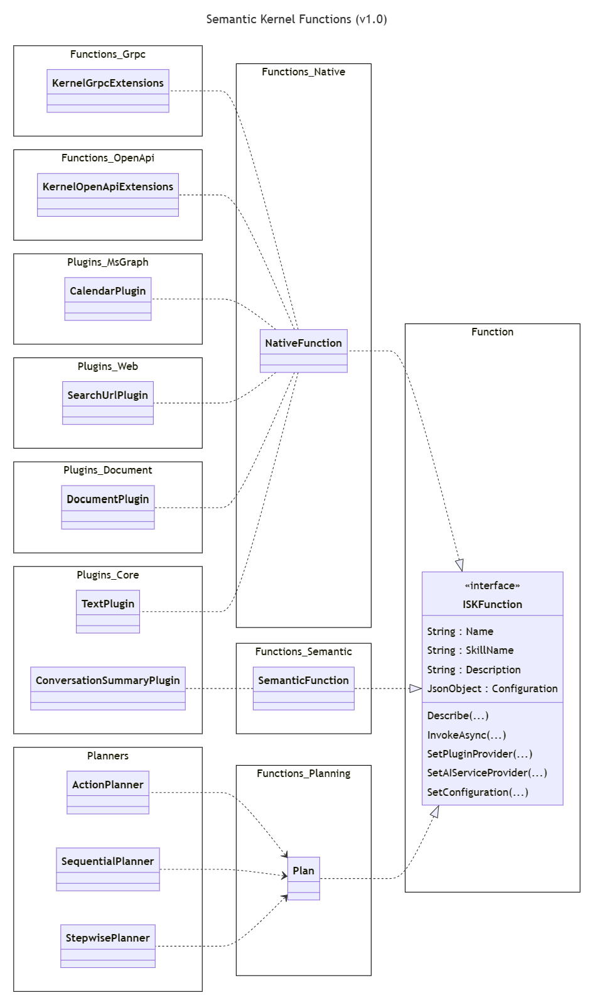
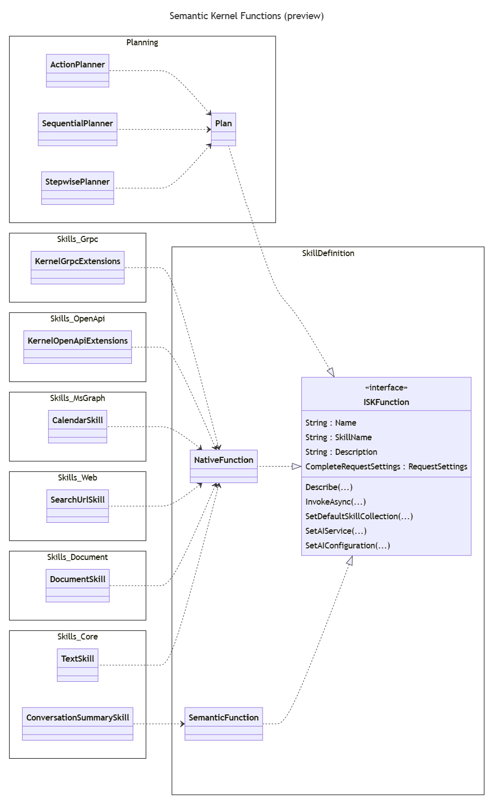

# 适用于 1.0 版本的 DotNet 项目结构

## 上下文和问题陈述

- 提供一组内聚的、定义明确的程序集，开发人员可以根据自己的需要轻松组合这些程序集。
  - Semantic Kernel 核心应仅包含与 AI 编排相关的功能
    - 删除提示模板引擎和语义函数
  - 语义内核抽象应该只支持接口、抽象类和最小类来支持这些
- 从 `Skills` NuGet 包中删除命名并替换为 `Plugins`
  - 明确区分插件实现 （） `Skills.MsGraph`和插件集成 （）`Skills.OpenAPI`
- 为程序集及其根命名空间提供一致的命名
  - 有关当前模式的示例[，请参阅 ](#naming-patterns)命名模式 部分

## 决策驱动因素

- 避免由于对程序集进行签名的影响而拥有过多的程序集，并降低复杂性
- 遵循 .Net 命名准则
  - [程序集和 DLL 的名称](https://learn.microsoft.com/en-us/dotnet/standard/design-guidelines/names-of-assemblies-and-dlls)
  - [命名空间的名称](https://learn.microsoft.com/en-us/dotnet/standard/design-guidelines/names-of-namespaces)

## 考虑的选项

- 选项 #1：新建 `planning`和 `functions` `plugins` 项目区域
- 选项 #2：文件夹命名与程序集名称匹配

在所有情况下，都将进行以下更改：

- 将非核心连接器移动到单独的存储库
- 将提示模板引擎和语义函数合并到单个包中

## 决策结果

所选选项：选项 #2：文件夹命名与程序集名称匹配，因为：

1. 它为开发人员提供了一种轻松发现特定程序集的代码位置的方法
1. 它与其他 e.g.e.， [azure-sdk-for-net 一致](https://github.com/Azure/azure-sdk-for-net)

项目的主要类别将是：

1. `Connectors`： **_连接器项目允许语义内核连接到 AI 和内存服务_**。某些现有连接器项目可能会移动到其他存储库。
1. `Planners`： **_Planner 项目提供一个或多个 Planner 实现，这些实现接受 ask 并将其转换为可执行计划以实现该 ask_**。此类别将包括当前作、顺序和逐步规划器（这些可以合并到一个项目中）。其他规划实现，例如，生成 Powershell 或 Python 代码的规划器可以作为单独的项目添加。
1. `Functions`： **_一个函数项目，使 Semantic Kernel 能够访问它将编排的函数_**。此类别将包括：
   1. 语义函数，即针对 LLM 执行的提示
   1. GRPC 远程程序，即使用 GRPC 框架远程执行的程序
   1. 开放 API 端点，即使用 HTTP 协议远程执行开放 API 定义的 REST 端点
1. `Plugins`： **_插件项目包含 Semantic Kernel 插件的实现_**。Semantic Kernel 插件包含函数的具体实现，例如，插件可能包含用于基本文本作的代码。

### 选项 #1：新建 `planning`和 `functions` `plugins` 项目区域

```text
SK-dotnet
├── samples/
└── src/
    ├── connectors/
    │   ├── Connectors.AI.OpenAI*
    │   ├── Connectors.AI.HuggingFace
    │   ├── Connectors.Memory.AzureCognitiveSearch
    │   ├── Connectors.Memory.Qdrant
    │   ├── ...
    │   └── Connectors.UnitTests
    ├── planners/
    │   ├── Planners.Action*
    │   ├── Planners.Sequential*
    │   └── Planners.Stepwise*
    ├── functions/
    │   ├── Functions.Native*
    │   ├── Functions.Semantic*
    │   ├── Functions.Planning*
    │   ├── Functions.Grpc
    │   ├── Functions.OpenAPI
    │   └── Functions.UnitTests
    ├── plugins/
    │   ├── Plugins.Core*
    │   ├── Plugins.Document
    │   ├── Plugins.MsGraph
    │   ├── Plugins.WebSearch
    │   └── Plugins.UnitTests
    ├── InternalUtilities/
    ├── IntegrationTests
    ├── SemanticKernel*
    ├── SemanticKernel.Abstractions*
    ├── SemanticKernel.MetaPackage
    └── SemanticKernel.UnitTests
```

### 变化

| 项目              | 描述                                                                                                |
| -------------------- | ---------------------------------------------------------------------------------------------------------- |
| `Functions.Native`   | 从 Semantic Kernel 核心和抽象中提取原生函数。                                       |
| `Functions.Semantic` | 从 Semantic Kernel 核心和抽象中提取语义函数。包括提示模板引擎。 |
| `Functions.Planning` | 从 Semantic Kernel 核心和抽象中提取规划。                                               |
| `Functions.Grpc`     | 旧 `Skills.Grpc` 项目                                                                                  |
| `Functions.OpenAPI`  | 旧 `Skills.OpenAPI` 项目                                                                               |
| `Plugins.Core`       | 旧 `Skills.Core` 项目                                                                                  |
| `Plugins.Document`   | 旧 `Skills.Document` 项目                                                                              |
| `Plugins.MsGraph`    | 旧 `Skills.MsGraph` 项目                                                                               |
| `Plugins.WebSearch`  | 旧 `Skills.WebSearch` 项目                                                                             |

### 语义内核技能和功能

此图说明了函数和插件如何与 Semantic Kernel 核心集成。



### 选项 #2：文件夹命名与程序集名称匹配

```text
SK-dotnet
├── samples/
└── libraries/
    ├── SK-dotnet.sln
    │
    ├── Microsoft.SemanticKernel.Connectors.AI.OpenAI*
    │   ├── src
    │   └── tests
    │ (Not shown but all projects will have src and tests subfolders)
    ├── Microsoft.SemanticKernel.Connectors.AI.HuggingFace
    ├── Microsoft.SemanticKernel.Connectors.Memory.AzureCognitiveSearch
    ├── Microsoft.SemanticKernel.Connectors.Memory.Qdrant
    │
    ├── Microsoft.SemanticKernel.Planners*
    │
    ├── Microsoft.SemanticKernel.Reliability.Basic*
    ├── Microsoft.SemanticKernel.Reliability.Polly
    │
    ├── Microsoft.SemanticKernel.TemplateEngines.Basic*
    │
    ├── Microsoft.SemanticKernel.Functions.Semantic*
    ├── Microsoft.SemanticKernel.Functions.Grpc
    ├── Microsoft.SemanticKernel.Functions.OpenAPI
    │
    ├── Microsoft.SemanticKernel.Plugins.Core*
    ├── Microsoft.SemanticKernel.Plugins.Document
    ├── Microsoft.SemanticKernel.Plugins.MsGraph
    ├── Microsoft.SemanticKernel.Plugins.Web
    │
    ├── InternalUtilities
    │
    ├── IntegrationTests
    │
    ├── Microsoft.SemanticKernel.Core*
    ├── Microsoft.SemanticKernel.Abstractions*
    └── Microsoft.SemanticKernel.MetaPackage
```

**_笔记：_**

- 最初只有一个解决方案文件。
- 项目将在解决方案中分组，即连接器、规划器、插件、函数、扩展......
- 每个项目文件夹都包含一个 `src` and `tests` 文件夹。
- 将现有单元测试移动到正确的位置将是一个渐进的过程，因为某些项目需要分解。

## 更多信息

### 当前项目结构

```text
SK-dotnet
├── samples/
└── src/
    ├── connectors/
    │   ├── Connectors.AI.OpenAI*
    │   ├── Connectors...
    │   └── Connectors.UnitTests
    ├── extensions/
    │   ├── Planner.ActionPlanner*
    │   ├── Planner.SequentialPlanner*
    │   ├── Planner.StepwisePlanner
    │   ├── TemplateEngine.PromptTemplateEngine*
    │   └── Extensions.UnitTests
    ├── InternalUtilities/
    ├── skills/
    │   ├── Skills.Core
    │   ├── Skills.Document
    │   ├── Skills.Grpc
    │   ├── Skills.MsGraph
    │   ├── Skills.OpenAPI
    │   ├── Skills.Web
    │   └── Skills.UnitTests
    ├── IntegrationTests
    ├── SemanticKernel*
    ├── SemanticKernel.Abstractions*
    ├── SemanticKernel.MetaPackage
    └── SemanticKernel.UnitTests
```

\\\* - 表示项目是 Semantic Kernel 元包的一部分

### 项目描述

| 项目                     | 描述                                                                                                      |
| --------------------------- | ---------------------------------------------------------------------------------------------------------------- |
| 连接器.AI.OpenAI        | Azure OpenAI 和 OpenAI 服务连接器                                                                       |
| 连接。。。               | 其他 AI 服务连接器的集合，其中一些将移至另一个存储库                         |
| 连接器.UnitTests        | 连接器单元测试                                                                                             |
| 规划者.行动规划师       | 作规划器的 Semantic Kernel 实现                                                              |
| Planner.SequentialPlanner   | 顺序计划程序的 Semantic Kernel 实现                                                           |
| Planner.StepwisePlanner     | 逐步规划器的 Semantic Kernel 实现                                                             |
| 模板引擎.Basic        | 提示模板引擎基本实现，仅供语义函数使用                           |
| Extensions.UnitTests        | 扩展单元测试                                                                                            |
| 内部实用程序           | 由多个 NuGet 包重复使用的内部实用程序（全部为内部）                                    |
| 技能核心                 | 为支持语义函数而提供的核心本机函数集                                    |
| Skills.Document 文档             | 用于与 Microsoft 文档交互的本机函数                                                        |
| 技能.Grpc                 | 基于 GRPC 的端点的 Semantic Kernel 集成                                                             |
| 技能.MsGraph              | 用于与 Microsoft Graph 终结点交互的本机函数                                                  |
| 技能.OpenAPI              | OpenAI 终结点的语义内核集成和参考 Azure Key Vault 实现                    |
| 技能网                  | 用于与 Web 端点交互的本机功能，例如 Bing、Google、文件下载                            |
| Skills.UnitTests            | 技能单元测试                                                                                                |
| 集成测试            | Semantic Kernel 集成测试                                                                                |
| SemanticKernel 内核              | Semantic Kernel 核心实现                                                                              |
| SemanticKernel.Abstractions | 语义内核抽象，即接口、抽象类、支持类......                          |
| SemanticKernel.MetaPackage  | 语义内核元包，即引用其他必需的语义内核 NuGet 包的 NuGet 包 |
| SemanticKernel.UnitTests    | 语义内核单元测试                                                                                       |

### 命名模式

以下是项目中使用的 Assembly 和根命名空间命名的一些不同示例。

```xml
    <AssemblyName>Microsoft.SemanticKernel.Abstractions</AssemblyName>
    <RootNamespace>Microsoft.SemanticKernel</RootNamespace>

    <AssemblyName>Microsoft.SemanticKernel.Core</AssemblyName>
    <RootNamespace>Microsoft.SemanticKernel</RootNamespace>

    <AssemblyName>Microsoft.SemanticKernel.Planning.ActionPlanner</AssemblyName>
    <RootNamespace>Microsoft.SemanticKernel.Planning.Action</RootNamespace>

    <AssemblyName>Microsoft.SemanticKernel.Skills.Core</AssemblyName>
    <RootNamespace>$(AssemblyName)</RootNamespace>
```

### 当前文件夹结构

```text
dotnet/
├── samples/
│   ├── ApplicationInsightsExample/
│   ├── KernelSyntaxExamples/
│   └── NCalcSkills/
└── src/
    ├── Connectors/
    │   ├── Connectors.AI.OpenAI*
    │   ├── Connectors...
    │   └── Connectors.UnitTests
    ├── Extensions/
    │   ├── Planner.ActionPlanner
    │   ├── Planner.SequentialPlanner
    │   ├── Planner.StepwisePlanner
    │   ├── TemplateEngine.PromptTemplateEngine
    │   └── Extensions.UnitTests
    ├── InternalUtilities/
    ├── Skills/
    │   ├── Skills.Core
    │   ├── Skills.Document
    │   ├── Skills.Grpc
    │   ├── Skills.MsGraph
    │   ├── Skills.OpenAPI
    │   ├── Skills.Web
    │   └── Skills.UnitTests
    ├── IntegrationTests/
    ├── SemanticKernel/
    ├── SemanticKerne.Abstractions/
    ├── SemanticKernel.MetaPackage/
    └── SemanticKernel.UnitTests/

```

### 语义内核技能和功能

此图显示当前技能已与 Semantic Kernel 核心集成。

**_注意：_**

- 这不是真正的类层次结构图。它显示了一些类关系和依赖关系。
- 命名空间缩写以删除 Microsoft.SemanticKernel 前缀。命名空间使用 `_` 而不是 `.`.


