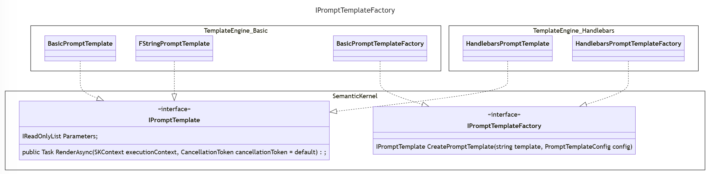

# 自定义提示模板格式

## 上下文和问题陈述

Semantic Kernel 目前支持自定义提示模板语言，该语言允许变量插值和函数执行。
Semantic Kernel 允许集成自定义提示模板格式，例如，使用 [Handlebars](https://handlebarsjs.com/) 语法的提示模板。

此 ADR 的目的是描述语义内核如何支持自定义提示模板格式。

### 当前设计

默认情况下，它使用 `Kernel` 支持 Semantic Kernel 特定模板格式的`BasicPromptTemplateEngine` 。 

#### 代码模式

下面是一个扩展示例，说明如何从使用内置 Semantic Kernel 格式的提示模板字符串创建语义函数：

```csharp
IKernel kernel = Kernel.Builder
    .WithPromptTemplateEngine(new BasicPromptTemplateEngine())
    .WithOpenAIChatCompletionService(
        modelId: openAIModelId,
        apiKey: openAIApiKey)
    .Build();

kernel.ImportFunctions(new TimePlugin(), "time");

string templateString = "Today is: {{time.Date}} Is it weekend time (weekend/not weekend)?";
var promptTemplateConfig = new PromptTemplateConfig();
var promptTemplate = new PromptTemplate(templateString, promptTemplateConfig, kernel.PromptTemplateEngine);
var kindOfDay = kernel.RegisterSemanticFunction("KindOfDay", promptTemplateConfig, promptTemplate);

var result = await kernel.RunAsync(kindOfDay);
Console.WriteLine(result.GetValue<string>());
```

我们有一个扩展方法来 `var kindOfDay = kernel.CreateSemanticFunction(promptTemplate);` 简化创建和注册语义函数的过程，但上面显示了扩展格式以突出显示对 `kernel.PromptTemplateEngine`.
此外 `BasicPromptTemplateEngine` ，它是默认的提示模板引擎，如果包可用且未指定其他提示模板引擎，则将自动加载。

这方面的一些问题：

1. `Kernel` 仅支持单个 `IPromptTemplateEngine` ，因此我们不支持同时使用多个提示模板。
1. `IPromptTemplateEngine` 是无状态的，并且必须为每个渲染执行模板的解析
1. 我们的语义函数扩展方法中继了我们的 `IPromptTemplate` （i.e.， `PromptTemplate` ） 实现，它存储模板字符串并每次都使用 to `IPromptTemplateEngine` 渲染它。注意 的实现 `IPromptTemplate` 目前是有状态的，因为它们也存储参数。

#### 性能

它使用 `BasicPromptTemplateEngine` 来 `TemplateTokenizer` 解析模板，即提取块。
然后它渲染模板，即插入变量并执行函数。这些作的一些示例计时：

| 操作        | 蜱   | 毫秒 |
| ---------------- | ------- | ------------ |
| 提取块   | 1044427 | 103          |
| 渲染变量 | 168     | 0            |

使用的示例模板是： `"{{variable1}} {{variable2}} {{variable3}} {{variable4}} {{variable5}}"`

**注意：我们将使用示例实现来支持 f-string 模板格式。**

用于 `HandlebarsDotNet` 同一用例会导致以下计时：

| 操作        | 蜱 | 毫秒 |
| ---------------- | ----- | ------------ |
| 编译模板 | 66277 | 6            |
| 渲染变量 | 4173  | 0            |

**通过将 extract blocks/compile 与 render variables作分开，只需编译一次模板就可以优化性能。**

#### 实现自定义提示模板引擎

提供了两个接口：

```csharp
public interface IPromptTemplateEngine
{
    Task<string> RenderAsync(string templateText, SKContext context, CancellationToken cancellationToken = default);
}

public interface IPromptTemplate
{
    IReadOnlyList<ParameterView> Parameters { get; }

    public Task<string> RenderAsync(SKContext executionContext, CancellationToken cancellationToken = default);
}
```

Handlebars 提示模板引擎的原型实现可能如下所示：

```csharp
public class HandlebarsTemplateEngine : IPromptTemplateEngine
{
    private readonly ILoggerFactory _loggerFactory;

    public HandlebarsTemplateEngine(ILoggerFactory? loggerFactory = null)
    {
        this._loggerFactory = loggerFactory ?? NullLoggerFactory.Instance;
    }

    public async Task<string> RenderAsync(string templateText, SKContext context, CancellationToken cancellationToken = default)
    {
        var handlebars = HandlebarsDotNet.Handlebars.Create();

        var functionViews = context.Functions.GetFunctionViews();
        foreach (FunctionView functionView in functionViews)
        {
            var skfunction = context.Functions.GetFunction(functionView.PluginName, functionView.Name);
            handlebars.RegisterHelper($"{functionView.PluginName}_{functionView.Name}", async (writer, hcontext, parameters) =>
                {
                    var result = await skfunction.InvokeAsync(context).ConfigureAwait(true);
                    writer.WriteSafeString(result.GetValue<string>());
                });
        }

        var template = handlebars.Compile(templateText);

        var prompt = template(context.Variables);

        return await Task.FromResult(prompt).ConfigureAwait(true);
    }
}
```

**注意：这只是一个原型实现，仅用于说明目的。**

一些问题：

1. 该 `IPromptTemplate` 接口未使用，并导致混淆。
1. 无法允许开发人员同时支持多种提示模板格式。

 `IPromptTemplate` 在 Semantic Kernel 核心包中提供了一个 的实现。
该 `RenderAsync` 实现只是委托给 `IPromptTemplateEngine`.
 `Parameters` 该列表 get 填充了 中定义的参数 `PromptTemplateConfig` 和模板中定义的任何缺失变量。

#### 车把注意事项

Handlebars 不支持帮助程序的动态绑定。请考虑以下代码段：

```csharp
HandlebarsHelper link_to = (writer, context, parameters) =>
{
    writer.WriteSafeString($"<a href='{context["url"]}'>{context["text"]}</a>");
};

string source = @"Click here: {{link_to}}";

var data = new
{
    url = "https://github.com/rexm/handlebars.net",
    text = "Handlebars.Net"
};

// Act
var handlebars = HandlebarsDotNet.Handlebars.Create();
handlebars.RegisterHelper("link_to", link_to);
var template = handlebars1.Compile(source);
// handlebars.RegisterHelper("link_to", link_to); This also works
var result = template1(data);
```

Handlebars 允许在编译模板之前或之后将帮助程序注册到 `Handlebars` 实例中。
最好的办法是拥有 `Handlebars` 一个特定函数集合的共享实例，并且只注册一次帮助程序。
对于 Kernel 函数集合可能已更改的用例，我们将被迫 `Handlebars` 在渲染时创建一个实例
，然后注册帮助程序。这意味着我们无法利用编译模板提供的性能改进。

## 决策驱动因素

排名不分先后：

- 支持创建没有实例的语义函数 `IKernel`。
- 支持函数的后期绑定，即在呈现提示时解析函数。
- 如果需要，支持允许仅解析（编译）一次提示模板以优化性能。
- 支持在单个实例中使用多种提示模板格式 `Kernel` 。
- 提供简单的抽象，允许第三方实现对自定义提示模板格式的支持。

## 考虑的选项

- 已过时 `IPromptTemplateEngine` ，请替换为 `IPromptTemplateFactory`。
-

### 过时 `IPromptTemplateEngine` 并替换为 `IPromptTemplateFactory`



下面是一个扩展示例，说明如何从使用内置 Semantic Kernel 格式的提示模板字符串创建语义函数：

```csharp
// Semantic function can be created once
var promptTemplateFactory = new BasicPromptTemplateFactory();
string templateString = "Today is: {{time.Date}} Is it weekend time (weekend/not weekend)?";
var promptTemplateConfig = new PromptTemplateConfig();
// Line below will replace the commented out code
var promptTemplate = promptTemplateFactory.CreatePromptTemplate(templateString, promptTemplateConfig);
var kindOfDay = ISKFunction.CreateSemanticFunction("KindOfDay", promptTemplateConfig, promptTemplate)
// var promptTemplate = new PromptTemplate(promptTemplate, promptTemplateConfig, kernel.PromptTemplateEngine);
// var kindOfDay = kernel.RegisterSemanticFunction("KindOfDay", promptTemplateConfig, promptTemplate);

// Create Kernel after creating the semantic function
// Later we will support passing a function collection to the KernelBuilder
IKernel kernel = Kernel.Builder
    .WithOpenAIChatCompletionService(
        modelId: openAIModelId,
        apiKey: openAIApiKey)
    .Build();

kernel.ImportFunctions(new TimePlugin(), "time");
// Optionally register the semantic function with the Kernel
kernel.RegisterCustomFunction(kindOfDay);

var result = await kernel.RunAsync(kindOfDay);
Console.WriteLine(result.GetValue<string>());
```

**笔记：**

- `BasicPromptTemplateFactory` 将是默认实施，并将自动在 `KernelSemanticFunctionExtensions`中提供。开发人员还将能够提供自己的实现。
- 工厂使用 new `PromptTemplateConfig.TemplateFormat` 创建相应的 `IPromptTemplate` 实例。
- 我们应该将 remove `promptTemplateConfig` 作为 的参数。 `CreateSemanticFunction`该更改超出了本 ADR 的范围。

和 `BasicPromptTemplateFactory` `BasicPromptTemplate` implementations 如下所示：

```csharp
public sealed class BasicPromptTemplateFactory : IPromptTemplateFactory
{
    private readonly IPromptTemplateFactory _promptTemplateFactory;
    private readonly ILoggerFactory _loggerFactory;

    public BasicPromptTemplateFactory(IPromptTemplateFactory promptTemplateFactory, ILoggerFactory? loggerFactory = null)
    {
        this._promptTemplateFactory = promptTemplateFactory;
        this._loggerFactory = loggerFactory ?? NullLoggerFactory.Instance;
    }

    public IPromptTemplate? CreatePromptTemplate(string templateString, PromptTemplateConfig promptTemplateConfig)
    {
        if (promptTemplateConfig.TemplateFormat.Equals(PromptTemplateConfig.SEMANTICKERNEL, System.StringComparison.Ordinal))
        {
            return new BasicPromptTemplate(templateString, promptTemplateConfig, this._loggerFactory);
        }
        else if (this._promptTemplateFactory is not null)
        {
            return this._promptTemplateFactory.CreatePromptTemplate(templateString, promptTemplateConfig);
        }

        throw new SKException($"Invalid prompt template format {promptTemplateConfig.TemplateFormat}");
    }
}

public sealed class BasicPromptTemplate : IPromptTemplate
{
    public BasicPromptTemplate(string templateString, PromptTemplateConfig promptTemplateConfig, ILoggerFactory? loggerFactory = null)
    {
        this._loggerFactory = loggerFactory ?? NullLoggerFactory.Instance;
        this._logger = this._loggerFactory.CreateLogger(typeof(BasicPromptTemplate));
        this._templateString = templateString;
        this._promptTemplateConfig = promptTemplateConfig;
        this._parameters = new(() => this.InitParameters());
        this._blocks = new(() => this.ExtractBlocks(this._templateString));
        this._tokenizer = new TemplateTokenizer(this._loggerFactory);
    }

    public IReadOnlyList<ParameterView> Parameters => this._parameters.Value;

    public async Task<string> RenderAsync(SKContext executionContext, CancellationToken cancellationToken = default)
    {
        return await this.RenderAsync(this._blocks.Value, executionContext, cancellationToken).ConfigureAwait(false);
    }

    // Not showing the implementation details
}
```

**注意：**

- 对于每个提示模板，对 的调用 `ExtractBlocks` 被延迟调用一次
- 不需要 `RenderAsync` 每次都提取块

## 决策结果

选择的选项：“Obsolete `IPromptTemplateEngine` and replace with `IPromptTemplateFactory`”，因为
满足需求并为未来提供良好的灵活性。
