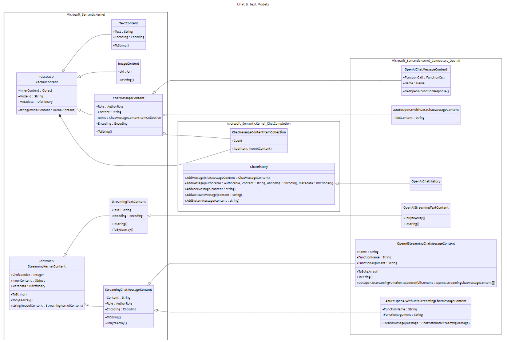

# 聊天模型

## 上下文和问题陈述

在最新的 OpenAI API 中，`content`对象的属性 `chat message` 可以接受两种类型的值 `string` 或 `array` （[Documentation](https://platform.openai.com/docs/api-reference/chat/create)）。

我们应该更新 `ChatMessageContent` class with `string Content` property 的当前实现以支持此 API。

## 决策驱动因素

1. 新设计不应与 OpenAI API 耦合，而应适用于其他 AI 提供商。
2. 类和属性的命名应一致且直观。

## 考虑的选项

一些选项变体可以组合使用。

### 选项 #1：命名更新和新数据类型 `chat message content`

由于 `chat message content` can be an object now 而不是 `string`，因此它需要保留名称以便更好地理解 domain。

1. `ChatMessageContent` 将重命名为 `ChatMessage`。（相同 `StreamingChatMessageContent`）。
2. `GetChatMessageContent` 方法将重命名为 `GetChatMessage`.
3. 新的抽象类 `ChatMessageContent` ，其属性的值 `ChatMessageContentType Type` 为 `text`， `image`。（将扩展为 `audio`、 `video` 将来）。
4. `ChatMessage` 将包含 objects 的集合 `ChatMessageContent` `IList<ChatMessageContent> Contents`。
5. 将有 `ChatMessageContent` - `ChatMessageTextContent` 和 `ChatMessageImageContent`的具体实现。

新建 _ChatMessageContentType.cs_

```csharp
public readonly struct ChatMessageContentType : IEquatable<ChatMessageContentType>
{
    public static ChatMessageContentType Text { get; } = new("text");

    public static ChatMessageContentType Image { get; } = new("image");

    public string Label { get; }

    // Implementation of `IEquatable`...
}
```

新 _ChatMessageContent.cs_

```csharp
public abstract class ChatMessageContent
{
    public ChatMessageContentType Type { get; set; }

    public ChatMessageContent(ChatMessageContentType type)
    {
        this.Type = type;
    }
}
```

更新 _ChatMessage.cs_：

```csharp
public class ChatMessage : ContentBase
{
    public AuthorRole Role { get; set; }

    public IList<ChatMessageContent> Contents { get; set; }
```

新 _ChatMessageTextContent.cs_

```csharp
public class ChatMessageTextContent : ChatMessageContent
{
    public string Text { get; set; }

    public ChatMessageTextContent(string text) : base(ChatMessageContentType.Text)
    {
        this.Text = text;
    }
}
```

新 _ChatMessageImageContent.cs_

```csharp
public class ChatMessageImageContent : ChatMessageContent
{
    public Uri Uri { get; set; }

    public ChatMessageImageContent(Uri uri) : base(ChatMessageContentType.Image)
    {
        this.Uri = uri;
    }
}
```

用法：

```csharp
var chatHistory = new ChatHistory("You are friendly assistant.");

// Construct request
var userContents = new List<ChatMessageContent>
{
    new ChatMessageTextContent("What's in this image?"),
    new ChatMessageImageContent(new Uri("https://link-to-image.com"))
};

chatHistory.AddUserMessage(userContents);

// Get response
var message = await chatCompletionService.GetChatMessageAsync(chatHistory);

foreach (var content in message.Contents)
{
    // Possibility to get content type (text or image).
    var contentType = content.Type;

    // Cast for specific content type
    // Extension methods can be provided for better usability 
    // (e.g. message GetContent<ChatMessageTextContent>()).
    if (content is ChatMessageTextContent textContent)
    {
        Console.WriteLine(textContent);
    }

    if (content is ChatMessageImageContent imageContent)
    {
        Console.WriteLine(imageContent.Uri);
    }
}
```

### 选项 #2：避免重命名和新的数据类型 `chat message content`

与选项 #1 相同，但没有命名更改。为了区分实际和 `chat message` `chat message content`：

- `Chat Message` 将是 `ChatMessageContent` （就像现在一样）。
- `Chat Message Content` 将为 `ChatMessageContentItem`。

1. 新的抽象类 `ChatMessageContentItem` ，其属性的值 `ChatMessageContentItemType Type` 为 `text`， `image`。（将扩展为 `audio`、 `video` 将来）。
2. `ChatMessageContent` 将包含 objects 的集合 `ChatMessageContentItem` `IList<ChatMessageContentItem> Items`。
3. 将有 `ChatMessageContentItem` - `ChatMessageTextContentItem` 和 `ChatMessageImageContentItem`的具体实现。

新 _ChatMessageContentItemType.cs_

```csharp
public readonly struct ChatMessageContentItemType : IEquatable<ChatMessageContentItemType>
{
    public static ChatMessageContentItemType Text { get; } = new("text");

    public static ChatMessageContentItemType Image { get; } = new("image");

    public string Label { get; }

    // Implementation of `IEquatable`...
}
```

新 _ChatMessageContentItem.cs_

```csharp
public abstract class ChatMessageContentItem
{
    public ChatMessageContentItemType Type { get; set; }

    public ChatMessageContentItem(ChatMessageContentItemType type)
    {
        this.Type = type;
    }
}
```

更新 _ChatMessageContent.cs_：

```csharp
public class ChatMessageContent : ContentBase
{
    public AuthorRole Role { get; set; }

    public IList<ChatMessageContentItem> Items { get; set; }
```

新 _ChatMessageTextContentItem.cs_

```csharp
public class ChatMessageTextContentItem : ChatMessageContentItem
{
    public string Text { get; set; }

    public ChatMessageTextContentItem(string text) : base(ChatMessageContentType.Text)
    {
        this.Text = text;
    }
}
```

新 _ChatMessageImageContent.cs_

```csharp
public class ChatMessageImageContentItem : ChatMessageContentItem
{
    public Uri Uri { get; set; }

    public ChatMessageImageContentItem(Uri uri) : base(ChatMessageContentType.Image)
    {
        this.Uri = uri;
    }
}
```

用法：

```csharp
var chatHistory = new ChatHistory("You are friendly assistant.");

// Construct request
var userContentItems = new List<ChatMessageContentItem>
{
    new ChatMessageTextContentItem("What's in this image?"),
    new ChatMessageImageContentItem(new Uri("https://link-to-image.com"))
};

chatHistory.AddUserMessage(userContentItems);

// Get response
var message = await chatCompletionService.GetChatMessageContentAsync(chatHistory);

foreach (var contentItem in message.Items)
{
    // Possibility to get content type (text or image).
    var contentItemType = contentItem.Type;

    // Cast for specific content type
    // Extension methods can be provided for better usability 
    // (e.g. message GetContent<ChatMessageTextContentItem>()).
    if (contentItem is ChatMessageTextContentItem textContentItem)
    {
        Console.WriteLine(textContentItem);
    }

    if (contentItem is ChatMessageImageContentItem imageContentItem)
    {
        Console.WriteLine(imageContentItem.Uri);
    }
}
```

### 选项 #3：向 `ChatMessageContent` - 内容项的集合添加新属性

此选项将保持 `string Content` property 不变，但会添加新 property - collection of `ContentBase` items。

更新的 _ChatMessageContent.cs_

```csharp
public class ChatMessageContent : ContentBase
{
    public AuthorRole Role { get; set; }

    public string? Content { get; set; }

    public ChatMessageContentItemCollection? Items { get; set; }
}
```

新 _ChatMessageContentItemCollection.cs_

```csharp
public class ChatMessageContentItemCollection : IList<ContentBase>, IReadOnlyList<ContentBase>
{
    // Implementation of IList<ContentBase>, IReadOnlyList<ContentBase> to catch null values.
}
```

用法：

```csharp
var chatCompletionService = kernel.GetRequiredService<IChatCompletionService>();

var chatHistory = new ChatHistory("You are a friendly assistant.");

chatHistory.AddUserMessage(new ChatMessageContentItemCollection
{
    new TextContent("What’s in this image?"),
    new ImageContent(new Uri(ImageUri))
});

var reply = await chatCompletionService.GetChatMessageContentAsync(chatHistory);

Console.WriteLine(reply.Content);
```

## 决策结果

选项 #3 是首选，因为它需要对现有层次结构进行少量更改，并为最终用户提供干净的可用性。

图：
