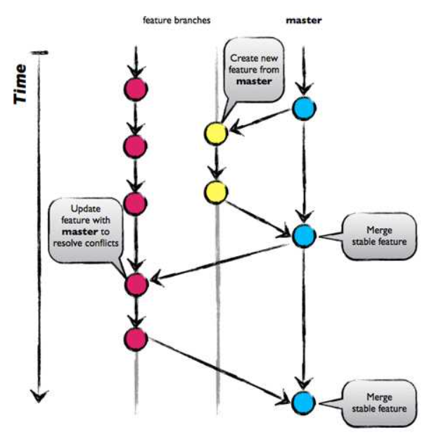
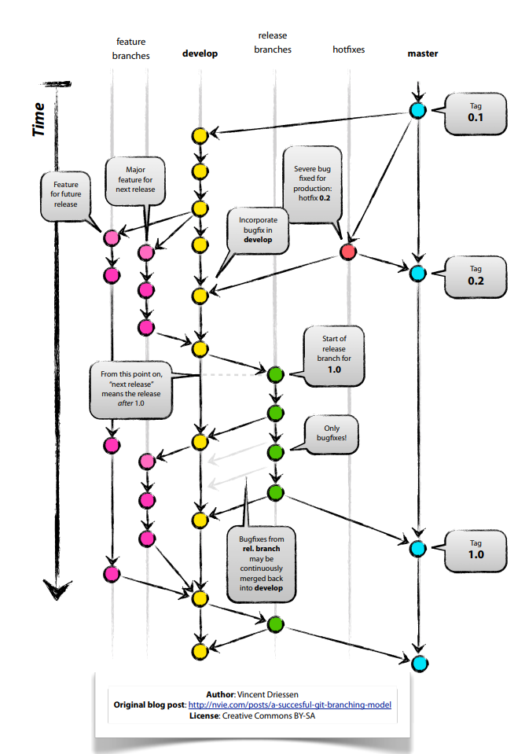
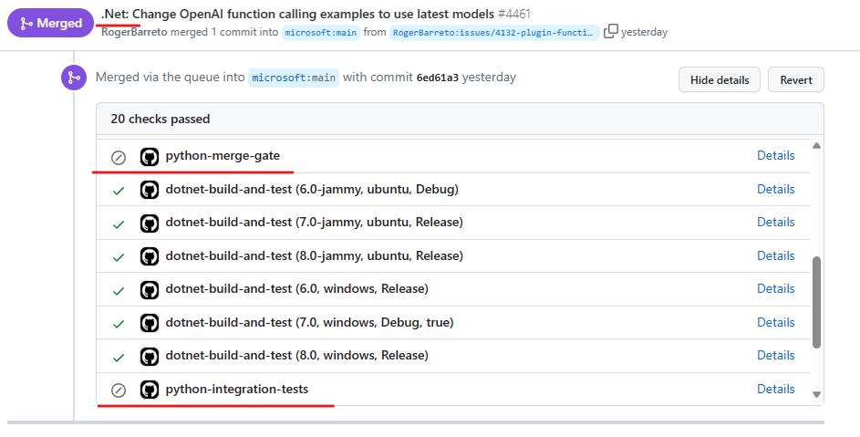

# SK 分支策略

##  行业采用的分支策略
Git 有几种行业采用的分支策略，例如 GitHub Flow、Git-Flow 和 GitLab Flow。但是，我们将只关注两个使用最广泛的：GitHub Flow 和 Git-Flow。

### GitHub 流
GitHub Flow 是一种简单的分支策略，以 “main” 分支为中心。开发人员为每个功能或错误修复创建一个新分支，进行更改，提交拉取请求，并将更改合并回“main”分支。发布直接从 “main” 分支完成，使此模型成为持续集成/部署项目的理想选择。了解有关 [GitHub Flow 的更多信息](https://docs.github.com/en/get-started/quickstart/github-flow)。

[图片来源](https://www.abtasty.com/blog/git-branching-strategies/)

优点：
- 简单明了，需要管理的分支更少，合并冲突更少。
- 没有长时间运行的开发分支。

缺点：
- 不如 Git-Flow 组织得好。
- 'main' 分支更容易变得混乱，因为它同时充当 production 和 development 分支。

### git-flow
Git-Flow 是一种分支策略，它围绕两个长期存在的主要分支“main”和“develop”以及短期功能、发布和修补程序分支组织软件开发。开发人员在功能分支中开发新功能，然后将其合并到“开发”分支中。在准备发布时，为了避免阻止未来的发布功能，会创建一个发布分支，一旦完成（测试和错误修复），它就会合并到'main'和'develop'两个部分。Git Flow 中的修补程序分支是从 'main' 分支创建的，用于解决关键 bug 修复，随后合并回 'main' 和 'develop' 分支。实际的发布（可部署工件）是从 'main' 分支完成的，它反映了实际生产价值的官方版本。了解有关 [Git-Flow 的更多信息](https://nvie.com/posts/a-successful-git-branching-model/)。

优点：
- 开发中的代码和生产就绪代码之间的明确分离。
- 高效的发布管理。

缺点：
- 比 GitHub Flow 更复杂，对于不需要那么多结构的小型团队或项目来说，这可能会让人不知所措。
- 不太适合优先考虑持续部署的项目，因为它强调更受控的发布过程。
- 由于管理多个分支的开销，因此不适合持续部署的项目。
- Git 中的意大利面条式历史 - [GitFlow 被认为是有害的](https://www.endoflineblog.com/gitflow-considered-harmful)

# SK 分支策略
目前，SK SDK 提供三种语言版本：.NET、Java 和 Python。它们都共存于同一个 Git 存储库中，组织在相应的文件夹下。但是，这些的分支策略不同。

对于 .NET 和 Python 版本，开发都在从“main”分支分支分支的短期主题分支中进行。当通过 PR 审查、单元测试和集成测试运行将功能视为可用于生产时，这些主题分支将合并回“main”分支。发布是直接从 'main' 分支执行的。这种方法与 GitHub Flow 分支策略一致，但有一个细微的偏差，即每周发布一次，而不是持续部署。

SK 的 Java 版本通过在专用开发分支中开发，从而遵循 Git-Flow 策略。主题分支是从开发分支创建的，并在单元测试和集成测试运行后通过拉取请求合并回来。发布分支也是从 development 分支创建的，当发布被视为可用于生产时，它会合并到 development 分支和 'main' 分支。这种策略与原版 Git-Flow 略有不同，因为发布工件是从 release 分支而不是 'main' 分支生成的。

## 决策驱动因素  
- 该策略应该易于实施和维护，而无需大量投资。
- 如果需要，该策略应允许并行维护多个版本。
- 理想情况下，该策略直观且简单，以便熟悉 Git 的每个人都可以采用和遵循它。
- 理想情况下，所有 SK 语言都能够采用和使用相同的分支策略。
- 能够以最小的开销持续部署新版本。
- 能够独立和按不同的计划发布语言版本。
- 允许 .Net、Java 和 Python 团队能够独立作。
- 能够修补版本（适用于所有语言）。
- 合并 PR 和 Issue 以简化分类和审查流程。

在决定 SK 的分支策略时，要考虑的另一个方面是访问权限和作范围。GitHub 不允许仅对仓库的一部分（如文件夹）实施访问限制。这意味着无法限制 SK .NET 贡献者推送 Python PR，理想情况下，这应该由相应的团队完成。但是，GitHub 确实允许为分支分配访问权限，如果选择了适当的策略选项，则可以成功利用该权限。GitHub 的必需作/状态检查也会出现类似的问题，这些检查只能在分支级别设置。考虑到 .NET 和 Python 的开发是在“main”分支中进行的，并且状态检查是按分支而不是按文件夹配置的，因此无法为 .NET 和 Python PR 配置单独的状态检查。因此，对 .NET 和 Python PR 运行相同的状态检查，即使它可能与特定语言无关。

无论选择哪种策略，都应该可以支持 SK 的多个版本。例如，在开发 v3.0.0 时，对已发布的 SK v1.1.0 和 v2.4.0 应用错误修复或安全补丁应该是可行的。实现此目的的一种方法是为每个 SK 版本创建一个发布分支。这样就可以将所需的补丁/修复推送到分支并从分支中释放。但是，用标签标记已发布的提交就足够了，因为如果需要，总是可以在需要时从标签追溯创建新分支。现有发布管道应接受源分支作为参数，从而允许从任何分支发布，而不仅仅是从“main”分支发布。

## 考虑的选项

### 每个 SK 语言的存储库
此选项建议为每种 SK 语言提供单独的 GitHub 存储库。这些仓库可以在相应的组织下创建。开发和发布将遵循 GitHub 流程，新功能和修复程序将在主题分支中开发，这些分支是从“main”分支创建的，并最终合并回来。

优点：
- 每个存储库将仅具有特定于语言的状态检查和作。
- 分支提交和发布历史记录不会包含不相关的提交或发布。
- 利用熟悉的 GitHub Flow，没有 Git-Flow 开销，从而缩短了学习曲线。
- 访问权限仅限于特定的拥有团队。

缺点：
- 设置这三个存储库会产生初始开销。
- 这三个存储库可能存在持续的维护开销。
- 密钥必须跨三个存储库进行管理，而不仅仅是一个存储库。
- 每个存储库都有一个积压工作，必须单独管理。

### 每个 SK 语言的分支
此选项涉及为每种 SDK 语言提供一个专用的、特定于语言的开发分支：“net-development”、“java-development”和“python-development”。SDK Java 已在使用此选项。开发和发布将遵循 GitHub 流程，新功能和修复在主题分支中开发，这些主题分支从相应的语言分支中分支出来，并最终合并回来。 

优点：
- 按语言分支配置的简单、特定于语言的状态检查、作和规则。
- 仅允许拥有特定于语言的分支的团队推送或合并到这些分支，而不仅仅是批准 PR。
- 分支提交历史记录不包含不相关的提交。

缺点：
- GitHub 发布历史记录包含所有语言的发布。
- 特定于语言的分支可能不容易发现/使用。

这个选项有两个子选项，定义了 'main' 分支的使用方式：  
1. “main”分支将包含常规/常见项目，例如文档、GitHub作和示例。所有语言文件夹都将从 'main' 分支中删除，并且可以将其锁定以防止意外合并。  
2. 'main' 分支将包括 dev 分支为实现可发现性目的而拥有的所有内容。将实施一个作业/作，将来自 dev 分支的提交合并到 'main' 分支。应尽量减少 SK 语言之间的常见工件数量，以减少合并冲突的可能性。在决定子选项之前，应该找到 SK Java 今天遇到的 squash 合并问题的解决方案。

第二个子选项比第一个子选项更受欢迎，因为它具有可发现性优势。在存储库中搜索内容时，无需在 GitHub UI 中选择开发分支。默认情况下，'main' 分支处于选中状态，一旦最新的位位于分支中，就可以轻松找到它们。这种直观的方法对许多人来说都很熟悉，通过要求在搜索前选择分支来更改它会使搜索体验复杂化并带来挫败感。

### “main”中的所有 SK 语言
此选项假定在 'main' 分支中维护所有 SK 语言（.NET、Java 和 Python）的代码。开发将使用典型的主题分支进行，而发布也将从 'main' 分支进行。这是 .NET 和 Python 当前采用的策略，对应于 GitHub Flow。

优点：
- 所有代码都集中在一个地方 - 'main' 分支。
- 熟悉的 GitHub Flow，没有 Git-Flow 开销 - 更短的学习曲线。

缺点：
- 分支提交/发布历史记录包含不相关的提交/发布。
- 复杂且不相关的 GitHub 状态检查/作。
- PR 可以由非所有者团队推送。

### 当前的“混合”方法
此选项保留了 SK. .NET 和 Python 开发是使用 GitHub Flow 在“main”分支中完成的，而 Java 开发是在 Git-Flow 之后的 java-development 分支中进行的。

优点：
- 无需更改。
- 每种 SK 语言都使用适合自己的策略。

缺点：
- 分支提交/发布历史记录包含不相关的提交/发布。
- 复杂且不相关的 GitHub 状态检查/作。
- PR 可以由非所有者团队推送。

## 决策结果
选择的选项：“当前的 'Hybrid' 方法”，因为它适用于轻微的低效问题（例如杂乱的发布历史记录和多语言复杂的作），并且现在不需要投资。稍后，根据团队规模和团队在“当前'混合'方法”中遇到的问题，我们可能会考虑“每个 SK 语言的存储库”选项或“每个 SK 语言的分支”选项。
