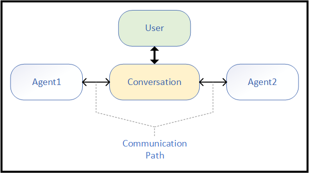
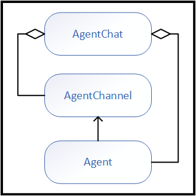
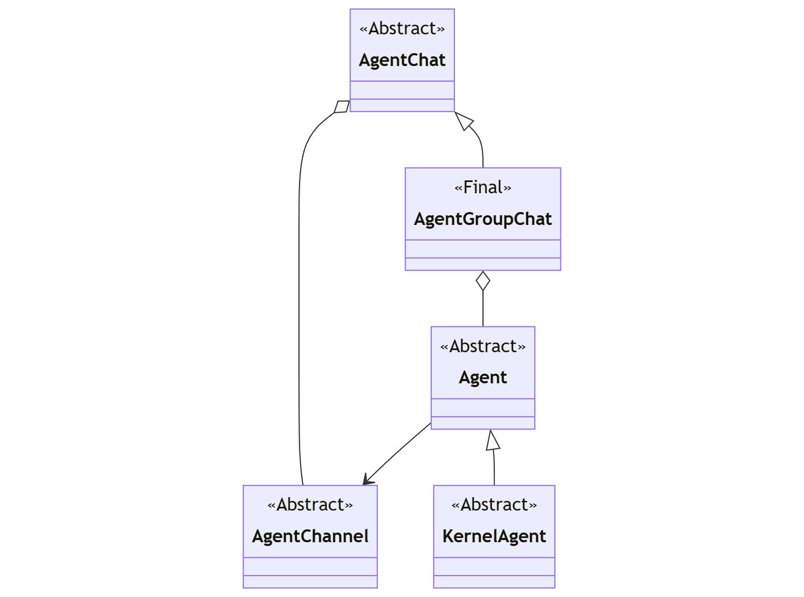
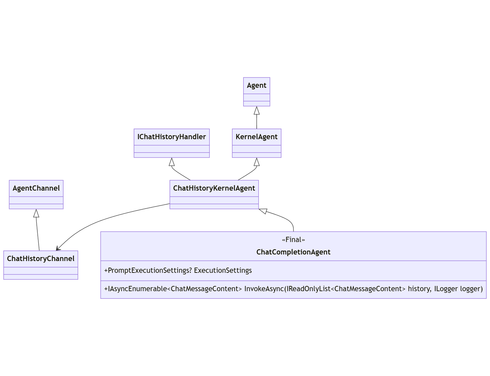
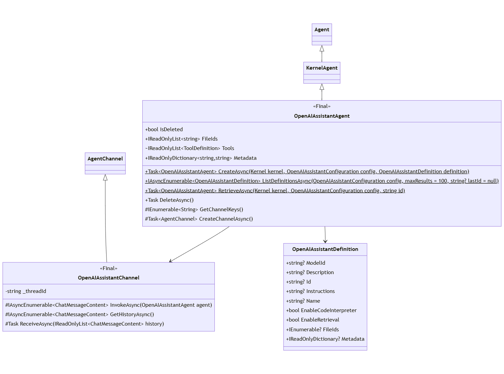

# SK Agents 概述和高级设计

## **上下文和问题陈述**
对 OpenAI Assistant API 的支持发布在一个实验包中 `*.Assistants` ，该包后来更名为该包`*.Agents`，以期转向更通用的代理框架。

最初的 `Assistants` 工作从未打算演变成一个通用 _的 Agent Framework_。

此 ADR 定义了该常规 _代理框架_。

代理应能够支持两种交互模式：

1. **直接调用 （“No Chat”）：**

    调用方可以直接调用任何单个代理，而无需任何干预机制或基础结构。
    对于使用直接调用轮流进行对话的不同代理，调用方应轮流调用每个代理。
    不同代理类型之间的协调交互也必须由调用方显式管理。

2. **代理聊天：**  

    呼叫者能够召集多个座席参与扩展对话，以实现特定目标
    （通常响应初始或迭代输入）。 参与后，座席可以轮流参与多次互动的聊天。


## **代理概述**
从根本上说，代理具有以下特征：
- 身份：允许唯一标识每个代理。
- 行为：座席参与对话的方式
- 交互：代理行为是对其他代理或输入的响应。

各种代理专业化可能包括：
- System Instructions（系统指令）：一组指导代理行为的指令。
- 工具/功能：使代理能够执行特定任务或作。
- 设置：代理特定的设置。 对于聊天完成代理，这可能包括 LLM 设置 - 例如 Temperature、TopP、StopSequence 等


### **代理模式**
代理 __ 可以是各种形式。 模式在能力和约束方面是不对称的。

- **SemanticKernel - ChatCompletion**： _ 仅基于 _SemanticKernel* 对聊天完成（例如 .NET）的支持的代理*。`ChatCompletionService`
- **OpenAI Assistants**：一个托管 _的代理_ 解决方案支持OpenAI _Assistant API_ （包括OpenAI和Azure OpenAI）。
- **自定义**：通过扩展_代理框架开发的自定义代理_。
- **未来**：尚未公布，例如 HuggingFace Assistant API（他们已经有助手，但尚未发布 API）。


## **决策驱动因素**
- _代理框架_ 应提供足够的抽象，以便能够构建可能利用任何 LLM API 的代理。
- _代理框架_ 应为最常见的代理协作类型提供足够的抽象和构建块。随着新的协作方法的出现，添加新的块应该很容易。
- _代理框架_ 应提供构建块来修改代理输入和输出，以涵盖各种自定义场景。
- _代理框架_ 应与 _SemanticKernel_ 模式保持一致：工具、DI、插件、函数调用等。
- _代理框架_ 应可扩展，以便其他库可以构建自己的代理和聊天体验。
- _代理框架_ 应尽可能简单，以便于扩展。
- _代理框架_ 应将复杂性封装在实现细节中，而不是调用模式中。
- _代理_ 体抽象应支持不同的模态（请参阅 [代理模态](#agent-modalities) 部分）。
-  __ 任何形式的代理都应能够与 _ 任何其他形式的_代理进行交互。
-  _代理_ 应能够支持其自身的模式要求。（专业化）
- _代理_ 输入和输出应与 SK 内容类型保持一致 `ChatMessageContent`。


## **设计 - 分析**

代理参与对话，通常是为了响应用户或环境输入。  

<p align="center">
<kbd></kbd>
</p>

除了 之外 `Agent`，还从此模式中确定了两个基本概念：

- 对话 - 座席交互序列的上下文。
- 通道：（图中的“通信路径”）- 代理与单个会话交互的关联状态和协议。

> 不同模式的代理必须自由地满足其模式提出的要求。 将概念形式化 `Channel` 为实现这一目标提供了一个自然的工具。
对于基于_聊天完成的_代理，这意味着拥有和管理一组特定的聊天消息（聊天历史记录）并与聊天完成 API/端点通信。
对于基于 _Open AI Assistant API_ 的代理，这意味着定义特定_线程_并作为远程服务与 Assistant API 通信。

这些概念汇集在一起，提出了以下概括：

<p align="center">
<kbd></kbd>
</p>


在与团队一起迭代这些概念后，这种概括将转换为以下高级定义：

<p align="center">
<kbd></kbd>
</p>


类名|父类|角色|形态|注意
-|-|-|-|-
代理|-|代理|抽象化|根代理抽象
内核代理|代理|代理|抽象化|包括 `Kernel` 服务和插件
代理频道|-|渠道|抽象化|代理参与聊天的渠道。
代理聊天|-|聊天|抽象化|为座席交互提供核心功能。
代理群聊|代理聊天|聊天|效用|基于策略的聊天


## **设计 - 聊天完成代理**

第一个具体代理是 `ChatCompletionAgent`。
该 `ChatCompletionAgent` implementation 能够与任何 `IChatCompletionService` implementation集成。
由于 `IChatCompletionService` 作用于 `ChatHistory`，这演示了如何 `ChatHistoryKernelAgent` 简单地实现。

代理行为（自然）根据任何 `IChatCompletionService` .
例如，不支持函数调用的连接器同样不会 `KernelFunction` 作为 _Agent 执行任何 _Interface。

<p align="center">
<kbd></kbd>
</p>

类名|父类|角色|形态|注意
-|-|-|-|-
ChatCompletionAgent|ChatHistoryKernelAgent|代理|SemanticKernel 内核|基于 _ 本地聊天历史记录的具体_代理。


## **设计 - OpenAI Assistant Agent**

下一个具体代理是 `OpenAIAssistantAgent`。
该代理基于 _OpenAI Assistant API_，并实现了自己的频道，因为聊天记录作为助理线程进行远程管理__。

<p align="center">
<kbd></kbd>
</p>

类名|父类|角色|形态|注意
-|-|-|-|-
OpenAIAssistantAgent|内核代理|代理|OpenAI 助手|基于 OpenAI Assistant API_ 的功能性代理 _
打开 AIAssistantChannel|代理频道|渠道|OpenAI 助手|关联的频道 `OpenAIAssistantAgent`
OpenAIAssistant定义|-|配置|OpenAI 助手| 枚举托管代理定义时提供的 _Open AI Assistant_ 的定义。


## **使用模式**

**1. 代理实例化：ChatCompletion**

创建 a  直接与 `ChatCompletionAgent`Agent Framework`Kernel` 外部使用 for `IChatCompletionService` 定义对象 _ 的方式保持一致_，
添加了 Provide Agent Specific Instructions 和 Identity。

（_dotnet_）
```c#
// Start with the Kernel
IKernelBuilder builder = Kernel.CreateBuilder();

// Add any IChatCompletionService
builder.AddOpenAIChatCompletion(...);

// Include desired plugins / functions    
builder.Plugins.Add(...);

// Include desired filters
builder.Filters.Add(...);

// Create the agent
ChatCompletionAgent agent =
    new()
    {
        Instructions = "instructions",
        Name = "name",
        Kernel = builder.Build()
    };
```

（_蟒蛇_）
```python
# Start with the Kernel
kernel = Kernel()

# Add any ChatCompletionClientBase
kernel.add_service(AzureChatCompletion(service_id="agent", ...))

# Include desired plugins / functions    
kernel.add_plugin(...)

# Include desired filters (via @kernel.filter decorator)

# Create the agent
agent = ChatCompletionAgent(service_id="agent", kernel=kernel, name="name", instructions="instructions")
```


**2. 代理实例化：OpenAI Assistant**

由于每个 Assistant作都是对 REST 端点的调用， `OpenAIAssistantAgent`因此顶级作是通过静态异步工厂方法实现的：

**创造：**

（_dotnet_）
```c#
// Start with the Kernel
IKernelBuilder builder = Kernel.CreateBuilder();

// Include desired plugins / functions    
builder.Plugins.Add(...);

// Create config and definition
OpenAIServiceConfiguration config = new("apikey", "endpoint");
OpenAIAssistantDefinition definition = new()
{
    Instructions = "instructions",
    Name = "name",
    Model = "gpt-4",
};

// Create the agent
OpenAIAssistantAgent agent =  
    OpenAIAssistantAgent.CreateAsync(
        builder.Build(),
        config,
        definition);
```

（_蟒蛇_）
```python
# Start with the Kernel
kernel = Kernel()

# Include desired plugins / functions    
kernel.add_plugin(...)

# Create config and definition
config = OpenAIServiceConfiguration("apikey", "endpoint")
definition = OpenAIAssistantDefinition(instructions="instructions", name="name", model="gpt-4")

agent = OpenAIAssistantAgent.create(kernel=kernel, config=config, definition=definition)
```


**检索：**

（_dotnet_）
```c#
// Start with the Kernel
Kernel kernel = ...;

// Create config
OpenAIServiceConfiguration config = new("apikey", "endpoint");

// Create the agent based on an existing definition
OpenAIAssistantAgent agent =  OpenAIAssistantAgent.RetrieveAsync(kernel, config, "agent-id");
```

（_蟒蛇_）
```python
# Start with the Kernel
kernel = Kernel()

# Create config
config = OpenAIServiceConfiguration("apikey", "endpoint")

# Create the agent based on an existing definition
agent = OpenAIAssistantAgent.retrieve(kernel = kernel, config=config, agentid="agent-id")
```


**检查：**

（_dotnet_）
```c#
// Create config
OpenAIServiceConfiguration config = new("apikey", "endpoint");

// Enumerate defined agents
IAsyncEnumerable<OpenAIAssistantDefinition> definitions = OpenAIAssistantAgent.ListDefinitionsAsync(config);
```

（_蟒蛇_）
```python
# Create config
config = OpenAIServiceConfiguration("apikey", "endpoint")

# Enumerate defined agents
definitions = await OpenAIAssistantAgent.list_definitions(config=config)
```


**3. 代理聊天：显式**

 代理 （_Agent_）  可以明确定位为 在 `AgentGroupChat`.

（_dotnet_）
```c#
// Define agents
ChatCompletionAgent agent1 = ...;
OpenAIAssistantAgent agent2 = ...;

// Create chat
AgentGroupChat chat = new();

// Provide input for chat
ChatMessageContent input = new (AuthorRole.User, "input");
await WriteMessageAsync(input);
chat.AddChatMessage(input);

// First invoke one agent, then the other, display each response.
await WriteMessagesAsync(chat.InvokeAsync(agent1));
await WriteMessagesAsync(chat.InvokeAsync(agent2));

// The entire history may be accessed.
// Agent specific history is an adaptaton of the primary history.
await WriteMessagesAsync(chat.GetHistoryAsync());
await WriteMessagesAsync(chat.GetHistoryAsync(agent1));
await WriteMessagesAsync(chat.GetHistoryAsync(agent2));
```

（_蟒蛇_）
```python
# Define agents
agent1 = ChatCompletionAgent(...)
agent2 = OpenAIAssistantAgent.create(...)

# Create chat
chat = AgentGroupChat()

# Provide input for chat
input = ChatMessageContent(AuthorRole.User, "input")
await write_message(input)
chat.add_chat_message(input)

# First invoke one agent, then the other, display each response.
await write_message(chat.invoke(agent1))
await write_message(chat.invoke(agent2))

# The entire history may be accessed.  
# Agent specific history is an adaptaton of the primary history.
await write_message(chat.get_history())
await write_message(chat.get_history(agent1))
await write_message(chat.get_history(agent2))
```


**4. 代理聊天：多回合**

_代理_ 也可以轮流为实现一个目标而努力：

（_dotnet_）
```c#
// Define agents
ChatCompletionAgent agent1 = ...;
OpenAIAssistantAgent agent2 = ...;
ChatCompletionAgent agent3 = ...;

// Create chat with two agents.
AgentGroupChat chat =
    new(agent1, agent2)
    { 
        ExecutionSettings =
        {
            // Chat will continue until it meets the termination criteria.
            TerminationionStrategy = new MyTerminationStrategy(),
        } 
    };

// Provide input for chat
ChatMessageContent input = new(AuthorRole.User, "input");
await WriteMessageAsync(input);
chat.AddChatMessage(input);

// Agent may be added to an existing chat
chat.AddAgent(agent3);

// Execute the chat until termination
await WriteMessagesAsync(chat.InvokeAsync());
```

（_蟒蛇_）
```python
# Define agents
agent1 = ChatCompletionAgent(...)
agent2 = OpenAIAssistantAgent.create(...)
agent3 = ChatCompletionAgent(...)

// Create chat with two agents.
chat =
    AgentGroupChat(agent1, agent2)
    { 
        execution_settings =
        {
            # Chat will continue until it meets the termination criteria.
            terminationion_strategy = MyTerminationStrategy(),
        } 
    }

# Provide input for chat
input = ChatMessageContent(AuthorRole.User, "input")
await write_message(input)
chat.add_chat_message(input)

# Agent may be added to an existing chat
chat.add_agent(agent3)

# Execute the chat until termination
await write_message(chat.invoke())
```
