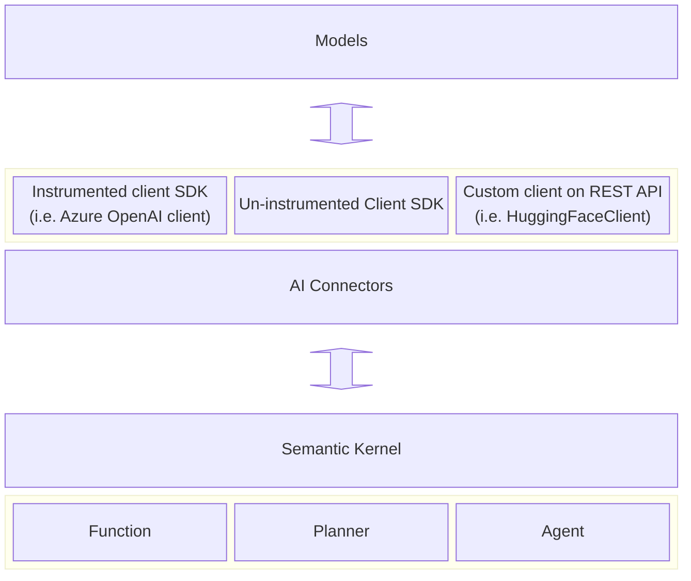

# 在 Semantic Kernel 中使用标准化词汇表和规范实现可观测性

## 上下文和问题陈述

观察 LLM 应用程序一直是客户和社区的一个巨大要求。这项工作旨在确保 SK 提供最佳的开发人员体验，同时遵守基于生成式 AI 的应用程序的可观察性行业标准。

有关更多信息，请参考此问题：https://github.com/open-telemetry/semantic-conventions/issues/327

### 语义约定

生成式 AI 的语义约定目前处于起步阶段，因此，此处概述的许多要求在未来可能会发生变化。因此，从此架构决策记录 （ADR） 派生的几个特征可能被视为实验性特征。必须保持对不断发展的行业标准的适应性和响应能力，以确保我们系统的性能和可靠性不断改进。

- [生成式 AI 的语义约定](https://github.com/open-telemetry/semantic-conventions/tree/main/docs/gen-ai)
- [通用 LLM 属性](https://github.com/open-telemetry/semantic-conventions/blob/main/docs/attributes-registry/gen-ai.md)

### 遥测要求 （实验性）

根据 [初始版本](https://github.com/open-telemetry/semantic-conventions/blob/651d779183ecc7c2f8cfa90bf94e105f7b9d3f5a/docs/attributes-registry/gen-ai.md)，语义内核应在表示单个 LLM 请求的 activity 中提供以下属性：

> `Activity` 是一个 .Net 概念，在 OpenTelemetry 之前就存在。A `span` 是一个 OpenTelemetry 概念，等效于 . `Activity`

- （必填）`gen_ai.system`
- （必填）`gen_ai.request.model`
- （推荐）`gen_ai.request.max_token`
- （推荐）`gen_ai.request.temperature`
- （推荐）`gen_ai.request.top_p`
- （推荐）`gen_ai.response.id`
- （推荐）`gen_ai.response.model`
- （推荐）`gen_ai.response.finish_reasons`
- （推荐）`gen_ai.response.prompt_tokens`
- （推荐）`gen_ai.response.completion_tokens`

以下事件将选择性地附加到活动：
| 事件名称| 属性|
|---|---|
|`gen_ai.content.prompt`|`gen_ai.prompt`|
|`gen_ai.content.completion`|`gen_ai.completion`|

> 内核必须提供配置选项来禁用这些事件，因为它们可能包含 PII。
> 有关 [ 这些属性的要求级别，请参阅](https://github.com/open-telemetry/semantic-conventions/tree/main/docs/gen-ai)生成式 AI 的语义约定。

## 我们在何处创建 activity

建立明确的职责界限至关重要，特别是因为某些服务提供商（如 Azure OpenAI SDK）已经预先存在检测。我们的目标是将我们的活动定位在尽可能接近模型级别的位置，以促进更具凝聚力和一致性的开发人员体验。



> Semantic Kernel 还支持其他类型的内存/矢量数据库连接器。我们将在单独的 ADR 中讨论这些连接器的插桩。

> 请注意，这不会改变我们对 [Planner 和 kernel Functions 的 instrumentation](./0025-planner-telemetry-enhancement.md) 方法。我们可能会修改或删除之前创建的一些计量，这将引入重大更改。

为了使 activity 尽可能接近模型级别，我们应该将它们保持在连接器级别。

### 超出范围

这些服务将在将来讨论：

- 内存/矢量数据库服务
- 音频到文本服务 （`IAudioToTextService`）
- 嵌入服务 （`IEmbeddingGenerationService`）
- 图像到文本服务 （）`IImageToTextService`
- 文本到音频服务 （`ITextToAudioService`）
- 文本到图像服务 （`ITextToImageService`）

## 考虑的选项

- 活动范围
  - 所有连接器，无论使用何种客户端 SDK。
  - 连接器在其客户端 SDK 中缺少插桩或使用自定义客户端。
  - 所有连接器，请注意，从连接器派生的活动属性与从插桩客户端 SDK 派生的活动的属性不重叠。
- 检测的实现
  - 静态类
- 用于实验功能和敏感数据收集的开关
  - 应用上下文切换

### 活动范围

#### 所有连接器，无论使用何种客户端 SDK

所有 AI 连接器都将生成 Activity，以便跟踪对模型的单个请求。每个活动都将维护一组 **一致的属性**。这种一致性保证了用户可以一致地监控他们的 LLM 请求，而不管他们的应用程序中使用的连接器是什么。但是，它引入了数据重复的潜在缺点，这会导致 **更高的成本**，因为这些活动中包含的属性将包含比客户端 SDK 生成的属性更广泛的集合（即额外的 SK 特定属性），前提是客户端 SDK 的检测同样符合语义约定。

> 在理想情况下，预计所有客户端 SDK 最终都将与语义约定保持一致。

#### 连接器在其客户端 SDK 中缺少插桩或使用自定义客户端

与无法为 LLM 请求生成活动功能的客户端 SDK 配对的 AI 连接器将负责创建此类活动。相比之下，与已生成请求活动的客户端 SDK 关联的连接器将不会受到进一步检测的约束。要求用户订阅客户端 SDK 提供的活动源，以确保对 LLM 请求的一致跟踪。这种方法有助于 **降低** 与不必要的数据重复相关的成本。但是，它可能会在 **跟踪中引入不一致**，因为并非所有 LLM 请求都会伴随着连接器生成的活动。

#### 所有连接器，请注意，从连接器派生的活动属性与从插桩的客户端 SDK 派生的活动的属性不重叠

所有连接器都将生成 activity，以便跟踪对模型的各个请求。这些连接器活动的组成（特别是包含的属性）将根据关联客户端 SDK 的检测状态来确定。目的是仅包含必要的属性以防止数据重复。最初，链接到缺少插桩的客户端 SDK 的连接器将生成包含 LLM 语义约定概述的所有潜在属性以及一些特定于 SK 的属性的活动。但是，一旦客户端 SDK 按照这些约定进行检测，连接器将停止在其活动中包含以前添加的属性，从而避免冗余。这种方法有助于为 ** 使用 SK 构建用户**提供相对一致的开发体验，同时**优化**与可观测性相关的成本。

### 插桩实现

#### 静态类 `ModelDiagnostics`

这个类将位于 `dotnet\src\InternalUtilities\src\Diagnostics`。

```C#
// Example
namespace Microsoft.SemanticKernel;

internal static class ModelDiagnostics
{
    public static Activity? StartCompletionActivity(
        string name,
        string modelName,
        string modelProvider,
        string prompt,
        PromptExecutionSettings? executionSettings)
    {
        ...
    }

    // Can be used for both non-streaming endpoints and streaming endpoints.
    // For streaming, collect a list of `StreamingTextContent` and concatenate them into a single `TextContent` at the end of the streaming.
    public static void SetCompletionResponses(
        Activity? activity,
        IEnumerable<TextContent> completions,
        int promptTokens,
        int completionTokens,
        IEnumerable<string?>? finishReasons)
    {
        ...
    }

    // Contains more methods for chat completion and other services
    ...
}
```

用法示例

```C#
public async Task<IReadOnlyList<TextContent>> GenerateTextAsync(
    string prompt,
    PromptExecutionSettings? executionSettings,
    CancellationToken cancellationToken)
{
    using var activity = ModelDiagnostics.StartCompletionActivity(
        $"text.generation {this._modelId}",
        this._modelId,
        "HuggingFace",
        prompt,
        executionSettings);

    var completions = ...;
    var finishReasons = ...;
    // Usage can be estimated.
    var promptTokens = ...;
    var completionTokens = ...;

    ModelDiagnostics.SetCompletionResponses(
        activity,
        completions,
        promptTokens,
        completionTokens,
        finishReasons);

    return completions;
}
```

### 用于实验功能和敏感数据收集的开关

#### 应用上下文切换

我们将引入两个标志，以便于显式激活跟踪 LLM 请求：

1. `Microsoft.SemanticKernel.Experimental.EnableModelDiagnostics`
   - 激活后，将允许创建表示单个 LLM 请求的活动。
2. `Microsoft.SemanticKernel.Experimental.EnableModelDiagnosticsWithSensitiveData`
   - 激活后，将允许创建表示单个 LLM 请求的活动，其中包含可能包含 PII 信息的事件。

```C#
// In application code
if (builder.Environment.IsProduction())
{
    AppContext.SetSwitch("Microsoft.SemanticKernel.Experimental.EnableModelDiagnostics", true);
}
else
{
    AppContext.SetSwitch("Microsoft.SemanticKernel.Experimental.EnableModelDiagnosticsWithSensitiveData", true);
}

// Or in the project file
<ItemGroup Condition="'$(Configuration)' == 'Release'">
    <RuntimeHostConfigurationOption Include="Microsoft.SemanticKernel.Experimental.EnableModelDiagnostics" Value="true" />
</ItemGroup>

<ItemGroup Condition="'$(Configuration)' == 'Debug'">
    <RuntimeHostConfigurationOption Include="Microsoft.SemanticKernel.Experimental.EnableModelDiagnosticsWithSensitiveData" Value="true" />
</ItemGroup>
```

## 决策结果

选择的选项：

[x] 活动范围： **选项 3** - 所有连接器，请注意，从连接器派生的活动属性与从检测的客户端 SDK 派生的活动的属性不重叠。

[x] 插桩实现： **选项 1** - 静态类

[x] 实验性切换： **选项 1** - 应用上下文切换

## 附录

### `AppContextSwitchHelper.cs`

```C#
internal static class AppContextSwitchHelper
{
    public static bool GetConfigValue(string appContextSwitchName)
    {
        if (AppContext.TryGetSwitch(appContextSwitchName, out bool value))
        {
            return value;
        }

        return false;
    }
}
```

### `ModelDiagnostics`

```C#
internal static class ModelDiagnostics
{
    // Consistent namespace for all connectors
    private static readonly string s_namespace = typeof(ModelDiagnostics).Namespace;
    private static readonly ActivitySource s_activitySource = new(s_namespace);

    private const string EnableModelDiagnosticsSettingName = "Microsoft.SemanticKernel.Experimental.GenAI.EnableOTelDiagnostics";
    private const string EnableSensitiveEventsSettingName = "Microsoft.SemanticKernel.Experimental.GenAI.EnableOTelDiagnosticsSensitive";

    private static readonly bool s_enableSensitiveEvents = AppContextSwitchHelper.GetConfigValue(EnableSensitiveEventsSettingName);
    private static readonly bool s_enableModelDiagnostics = AppContextSwitchHelper.GetConfigValue(EnableModelDiagnosticsSettingName) || s_enableSensitiveEvents;

    public static Activity? StartCompletionActivity(string name, string modelName, string modelProvider, string prompt, PromptExecutionSettings? executionSettings)
    {
        if (!s_enableModelDiagnostics)
        {
            return null;
        }

        var activity = s_activitySource.StartActivityWithTags(
            name,
            new() {
                new("gen_ai.request.model", modelName),
                new("gen_ai.system", modelProvider),
                ...
            });

        // Chat history is optional as it may contain sensitive data.
        if (s_enableSensitiveEvents)
        {
            activity?.AttachSensitiveDataAsEvent("gen_ai.content.prompt", new() { new("gen_ai.prompt", prompt) });
        }

        return activity;
    }
    ...
}
```

### 扩展

```C#
internal static class ActivityExtensions
{
    public static Activity? StartActivityWithTags(this ActivitySource source, string name, List<KeyValuePair<string, object?>> tags)
    {
        return source.StartActivity(
            name,
            ActivityKind.Internal,
            Activity.Current?.Context ?? new ActivityContext(),
            tags);
    }

    public static Activity EnrichAfterResponse(this Activity activity, List<KeyValuePair<string, object?>> tags)
    {
        tags.ForEach(tag =>
        {
            if (tag.Value is not null)
            {
                activity.SetTag(tag.Key, tag.Value);
            }
        });
    }

    public static Activity AttachSensitiveDataAsEvent(this Activity activity, string name, List<KeyValuePair<string, object?>> tags)
    {
        activity.AddEvent(new ActivityEvent(
            name,
            tags: new ActivityTagsCollection(tags)
        ));

        return activity;
    }
}
```

> 请注意，上面提供的实现只是说明性示例，代码库中的实际实现可能会进行修改。
