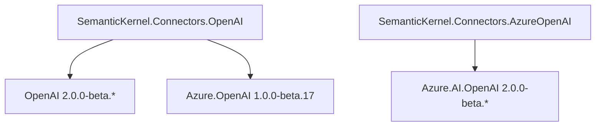
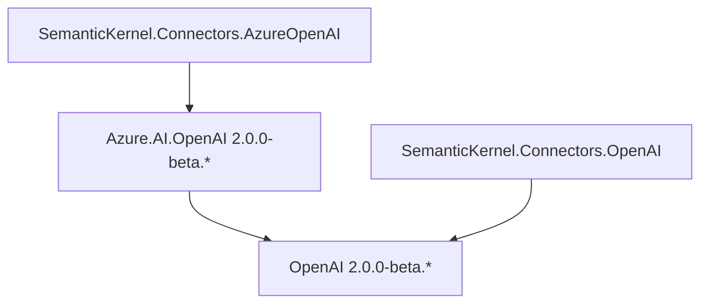

# OpenAI 和 Azure 连接器命名和结构化

## 上下文和问题陈述

最近宣布 OpenAI 和 Azure 将各自拥有自己的专用 SDK 来访问其服务。以前，OpenAI 没有官方的 SDK，我们的 OpenAI 连接器完全依赖 Azure SDK 客户端进行访问。

随着官方 OpenAI SDK 的推出，我们现在可以访问 OpenAI 提供的更多最新功能，因此使用此 SDK 而不是 Azure SDK 更有利。

此外，很明显，我们需要将 OpenAI 连接器分为两个不同的目标：一个用于 OpenAI，另一个用于 Azure OpenAI。这种分离将提高代码的清晰度，并有助于更好地了解每个目标的用法。

## 决策驱动因素

- 更新我们的连接器以使用最新版本的 OpenAI 和 Azure SDK。
- 为当前使用现有 OpenAI 连接器的开发人员最大限度地减少或消除任何重大更改。
- 所做的更改应面向未来。

## 版本控制

尽管当前软件包`Azure.AI.OpenAI`和 `OpenAI` SDK 软件包的主要版本已更新 （2.0.0），但该更改并不代表 `SemanticKernel` 重大重大中断性变更。下面提供的任何替代选项都考虑了 的新更新版本 `SemanticKernel.Connectors.OpenAI` ，并且`SemanticKernel.Connectors.AzureOpenAI`将成为所有 SemanticKernel 包的`1.N+1.0`次要版本升级。

### 元套餐策略

目前，该 `Microsoft.SemanticKernel` 包是一个 meta 包，其中包含 `SemanticKernel.Core` 和 `SemanticKernel.Connectors.OpenAI`，通过新的更改，将向 meta 包中添加一个新项目 `SemanticKernel.Connectors.AzureOpenAI` ，该包将包含新的 Azure OpenAI 连接器。

## 文档（升级路径）

将创建文档指南和示例/示例，以指导如何在需要时从当前的 OpenAI 连接器升级到新的 OpenAI 连接器。

## OpenAI SDK 限制

新的 OpenAI SDK 引入了一些需要考虑的限制，如果不通过我们的内部实施进行补救，可能会引入重大变化。

- #### ⚠️ 不支持每个请求有多个结果 （Choices）。

  **修复**：在内部发出多个请求并合并它们。
  **无修复**：从 中删除中断性变更 `ResultsPerPrompt` `OpenAIPromptExecutionSettings`。

- #### ⚠️ 不支持文本生成模式。

  **补救措施**：在内部提供一个 HttpClient，用于 `gpt-3.5-turbo-instruct` 文本生成模式。对 ， 服务模式也采取了相同的方法 `TextToImage` `AudioToText` 。
  **无修复**：重大更改删除了任何特定的 `TextGeneration` 服务实现，此更改不会影响 `ChatCompletion` 可能仍用作实现的服务 `ITextGenerationService` 。

## 改进

这也代表了一个机会，可以通过引入模式来改进当前的 OpenAI 连接器 `Configuration` ，从而对服务及其配置进行更多的灵活性和控制。

```csharp
// Before
builder.AddAzureOpenAIChatCompletion(deploymentName, endpoint, apiKey, httpClient);
// After
builder.AddAzureOpenAIChatCompletion(new
{
    DeploymentName = modelId;
    Endpoint = endpoint;
    ApiKey = apiKey;
});
```

```csharp
// Before
builder.AddAzureOpenAIChatCompletion(deploymentName, openAIClient, serviceId, modelId)
// After
builder.AddAzureOpenAIChatCompletion(new
{
    DeploymentName = deploymentName;
    ServiceId = serviceId;
    ModelId = modelId;
}, openAIClient);
```

## 潜在的依赖关系冲突

由于 `SemanticKernel.Connectors.AzureOpenAI` 和 `SemanticKernel.Connectors.OpenAI` 共享相同的 `OpenAI 2.0.0` 依赖项，如果每个 的归属 `OpenAI 2.0.0` 不同，则当两个连接器包在项目中一起使用时，可能会产生冲突。

如果发生这种情况：

1. 在更新我们的 OpenAI 连接器包之前，我们将与团队联系 `Azure.AI.OpenAI` ，以就更新的预计到达时间进行调整。

2. 调查最新的 `OpenAI` 包在与 `Azure.AI.OpenAI` 最初面向较旧版本的  SDK 一起使用时`OpenAI`是否不会导致任何中断性变更或冲突。

3. 如果存在冲突并且它们的 ETA 很小，我们可能会在短时间内保持 `OpenAI` 对 Azure `SemanticKernel.Connectors.OpenAI` 的依赖项，否则我们将评估继续进行 `OpenAI` 依赖项版本升级。

## 考虑的选项

- 选项 1 — 合并新连接器和旧版（独立连接器的缓慢过渡）。
- 选项 2 - 从一开始就使用独立的连接器。
- 选项 3 - 将 OpenAI 和 Azure 保留在同一连接器中（按原样）。

## 选项 1 — 合并新连接器和旧版（独立连接器的缓慢过渡）。

这是破坏性最小的方法，我们使用最新的 Azure SDK 将当前的旧版 OpenAI 和 AzureOpenAI API 暂时保留在连接器中 `Azure.AI.OpenAI 1.0.0-beta.17` ，并使用新的 SDK 包添加新的特定于 OpenAI 的 API `OpenAI 2.0.0-beta.*` 。

此方法还意味着，将再次为 Azure OpenAI 服务创建一个新连接器，特别是完全依赖于最新的 `Azure.AI.OpenAI 2.0.0-beta.*` SDK 包。

在稍后的阶段，我们将弃用命名空间中的所有 OpenAI 和 Azure 旧版 API`SemanticKernel.Connectors.OpenAI`，并在将来的版本中删除 Azure SDK 和这些 API，使 OpenAI 连接器完全专用于 OpenAI 服务，具体取决于 `Azure.AI.OpenAI 1.0.0-beta.17` 依赖项。`OpenAI 2.0.0-beta.*` 



我们采用新 `Options` 模式作为一种改进和措施，以避免对遗留 API 进行重大更改。

在此更改之后， `SemanticKernel.Connectors.OpenAI` `SemanticKernel.Connectors.AzureOpenAI` 将为 Azure 特定服务创建一个新连接器，使用新的 Azure SDK `Azure.AI.OpenAI 2.0.0-beta.*` 和所有新 API，使用选项方法。

### 过渡阶段

- **第 1 阶段**：将新的 OpenAI SDK API 添加到当前的 OpenAI 连接器，并保留使用最后一个 Azure SDK 的 Azure OpenAI API。
- **第 2 阶段**：
  - 使用新的 Azure SDK 为 Azure OpenAI 服务创建新连接器
  - 弃用指向新 `OpenAI` 连接器`AzureOpenAI`的连接器中的所有 Azure OpenAI API 
  - 从 OpenAI 连接器中删除 Azure SDK 依赖项。
  - 将 `AzureOpenAI` connector 添加到 `Microsoft.SemanticKernel` meta 包中。
- **第 3 阶段**：弃用连接器`OpenAI APIs`中 `OpenAI` 指向新 `Options` API 的所有旧版。
- **第 4 阶段**：从 OpenAI 连接器中删除所有旧版 API。

### 冲击

优点：

- 对于使用当前 OpenAI 连接器的开发人员来说，重大更改最少。
- OpenAI 和 Azure OpenAI 连接器之间的关注点明确分离。

缺点：

- 由于 `SemanticKernel.Connectors.AzureOpenAI` 和 `SemanticKernel.Connectors.OpenAI` 共享不同版本的相同依赖项，因此不能在同一项目中使用这两个包，因此在部署这两个连接器时需要一个策略。
- 添加了 `Azure OpenAI 1.0-beta17` 和 的依赖项`OpenAI 2.0-beta1`。

### 依赖项管理策略

1. 在同一项目中仅使用其中一个连接器，则需要进行一些修改以适应 `Concepts` 共享 OpenAI 和 AzureOpenAI 示例的其他项目。
2. 请保留 AzureOpenAI 连接器实现，直到我们准备好中断（排除）OpenAI 连接器中的所有 Azure API。
3. 部署具有新命名空间的新项目 `Azure.AI.OpenAI.Legacy 1.0.0-beta.17` ，并更新我们的 `SemanticKernel.Connectors.OpenAI` 项目以使用此新命名空间，以避免命名空间上的版本冲突 `Azure.AI.OpenAI` 。

## 选项 2 - 从一开始就使用独立的连接器。

此选项从一开始就专注于为 OpenAI 和 Azure OpenAI 服务创建完全独立的连接器，以及实现这一目标所需的所有重大更改。



冲击：

-  `Azure`所有相关逻辑都将被删除 `SemanticKernel.Connectors.OpenAI` ，以避免与新版本中引入的相同名称发生任何冲突`SemanticKernel.Connectors.AzureOpenAI`，并向开发人员发送一致的信息，即 OpenAI 连接器仅专注于 OpenAI 服务。

### 冲击

优点：

- OpenAI 和 Azure OpenAI 连接器之间的关注点明确分离。
- 对于专注于 OpenAI 特定 API 的开发人员来说，小的突破性变化。
- 更快地过渡到新的 OpenAI SDK 和 Azure OpenAI SDK。

缺点：

- 对于使用当前适用于 Azure 的 OpenAI 连接器的开发人员，存在重大重大中断性变更。
- [如果团队不更新其包](#potential-dependency-conflicts)，则可能会出现`Azure.AI.OpenAI`潜在的依赖关系冲突。

## 选项 3 - 将 OpenAI 和 Azure 保留在同一连接器中（按原样）。

此选项完全专注于尽可能减少影响，将 Azure 和 OpenAI SDK 依赖项合并到一个连接器中，方法与当前连接器相同。

变化：

1. 更新所有当前的 OpenAI 特定服务和客户端以使用新的 OpenAI SDK
2. 更新 Azure 特定服务和客户端以使用最新的 Azure OpenAI SDK。
3. （可选）将 `Options` 模式新 API 添加到连接器服务并弃用旧 API。

### 冲击

优点：

- 对于使用当前 OpenAI 连接器的开发人员来说，重大更改最少。
- 重大更改将仅限于我们如何处理上述 [OpenAI SDK 限制中提到的要点](#openai-sdk-limitations)。
-  和 `Azure.AI.OpenAI` SDK`OpenAI` 之间不会有依赖关系冲突。

缺点：

- 我们将受限于最新包使用的 OpenAI SDK 版本 `Azure.AI.OpenAI` ，该版本可能不是可用的最新版本。
- 使用直接 Azure 或 OpenAI 特定服务时，开发人员不希望在其选项和依赖项池中看到其他特定于提供商的服务。

## 决策结果

### 选项 2 - 从一开始就使用独立的连接器。

此选项是过渡到 SDK 的潜在 1.0 正式版的更快方法 `OpenAI` 。

此选项从一开始就在 OpenAI 和 Azure OpenAI 连接器之间提供了明确的关注点分离。

防止任何混淆，就我们拆分`OpenAI`和 `AzureOpenAI` 组件的意图发出明确的信息。

#### OpenAI SDK 限制：

- [多个结果](#openai-sdk-limitations)： **不修正**。
- [不支持文本生成模式](#openai-sdk-limitations)： **不修正**。
