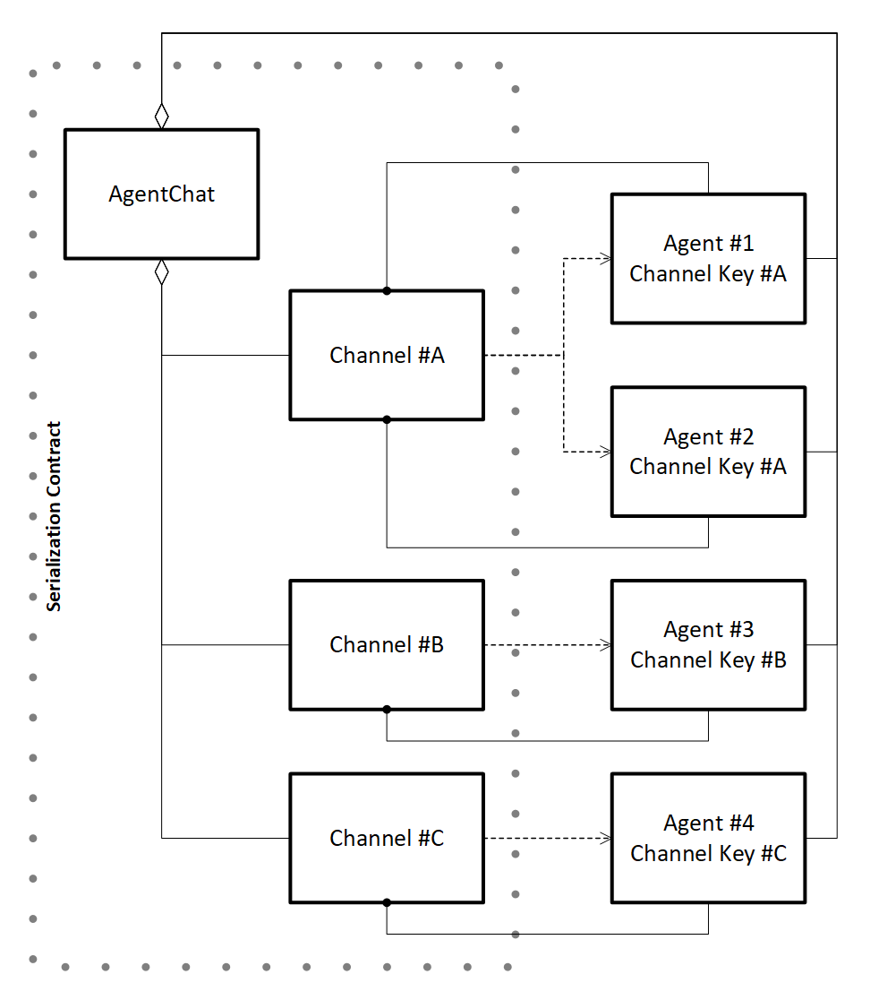
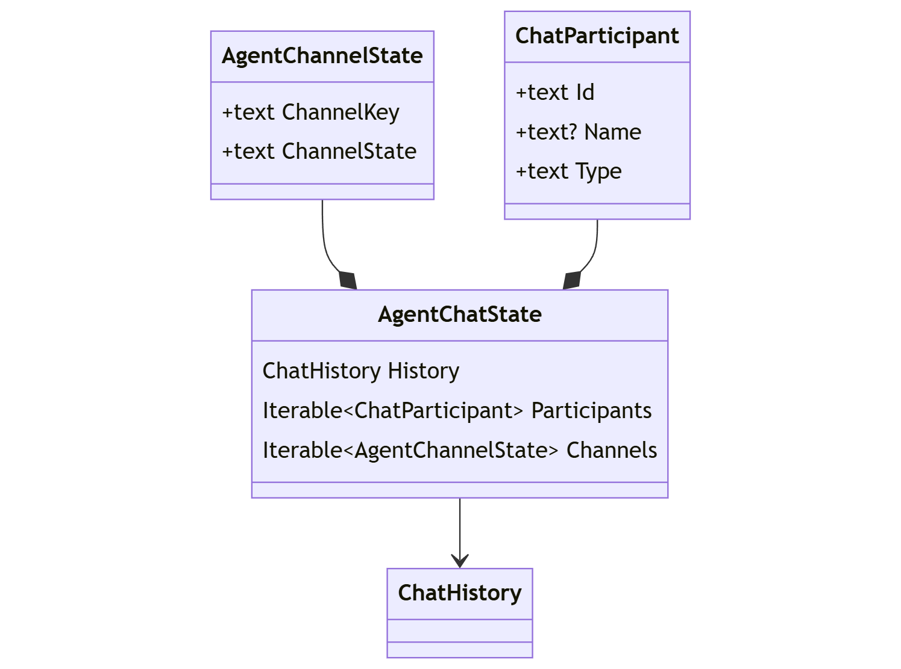

# `AgentChat` 序列化 / 反序列化

## 上下文和问题陈述
代理框架_的用户 _ 在使用 来协调交互时，无法存储和稍后检索对话状态 `AgentChat` `Agent` 。 这会限制代理对话的单次使用能力，因为必须使用启动对话的进程的内存来维护它。

正式化支持任何类的序列化和反序列化的机制 `AgentChat` ，提供了一种跨多个会话以及计算边界捕获和还原状态的途径。

#### 目标
- **捕获和恢复主要聊天历史**： `AgentChat` 必须捕获并恢复主要历史以获得完全的保真度。
- **捕获和恢复频道状态**：除了主要的聊天历史外， `AgentChannel` `AgentChat` 还必须捕获并恢复每个频道的状态。
- **捕获代理元数据**：在序列化时捕获代理标识符、名称和类型提供了有关如何 `AgentChat` 在反序列化期间恢复 的指导。


#### 非目标
- **管理代理定义：** `Agent` 不应将定义捕获为对话状态的一部分。  `Agent` 在反序列化类的 state 时，不会生成实例 `AgentChat` 。
- **管理 Secrets 或 api-keys：** 生成实例时需要 Secrets/api-keys `Agent` 。 出于安全考虑，管理此类敏感数据超出了范围。


## 问题

- 序列化 （Serialized`ChatHistory`）  必须在各个平台/语言之间等效，以实现互作性

## 例
还原 时 `AgentChat`，应用程序还必须重新创建 `Agent` 参与聊天的实例（不受反序列化过程的控制）。 这为以下情况创造了机会：

#### 1. **等效：** 恢复的聊天中可用的所有原始代理类型（频道）。
这将导致原始聊天的完全保真恢复。

|源聊天|Target 聊天|
|---|---|
|`ChatCompletionAgent`|`ChatCompletionAgent`|
|`OpenAIAssistantAgent`|`OpenAIAssistantAgent`|
|`ChatCompletionAgent` & `OpenAIAssistantAgent`|`ChatCompletionAgent` & `OpenAIAssistantAgent`|

#### 2. **增强：** 恢复的聊天中可用的其他原始代理类型（频道）。
这也将导致原始聊天的完全保真恢复。
任何新的代理类型（频道）在恢复后都将同步到聊天（与将新的代理类型添加到正在进行的聊天相同）。

|源聊天|Target 聊天|
|---|---|
|`ChatCompletionAgent`|`ChatCompletionAgent` & `OpenAIAssistantAgent`|
|`OpenAIAssistantAgent`|`ChatCompletionAgent` & `OpenAIAssistantAgent`|

#### 3. **减少：** 恢复的聊天中可用的原始代理类型（渠道）的子集。
这也将导致原始聊天完全保真地恢复到可用频道。 恢复后引入缺失的代理类型 （通道） 将
将渠道与当前聊天同步（与向正在进行的聊天添加新的代理类型相同）。

|源聊天|Target 聊天|
|---|---|
|`ChatCompletionAgent` & `OpenAIAssistantAgent`|`ChatCompletionAgent`|
|`ChatCompletionAgent` & `OpenAIAssistantAgent`|`OpenAIAssistantAgent`|

#### 4. **空：** 恢复的聊天中没有可用的代理。
这将导致立即异常 （fail-fast），以强烈指示
聊天尚未恢复。 聊天可能会添加代理以尝试成功恢复，或单独使用。 也就是说， `AgentChat` 实例不会失效。

#### 5. **无效：** 聊天已经形成历史记录或频道状态。
这将导致立即异常 （fail-fast），以强烈指示
聊天尚未恢复。 聊天可以继续使用，因为 `AgentChat` 实例不会失效。

#### 笔记：

> 还原后，其他 `Agent` 实例可以加入 `AgentChat`，与任何实例没有什么不同 `AgentChat` 。


## 分析

#### 关系：

 下图说明了`AgentChat` any `Agent`、 `AgentChannel` 参与会话的实例以及关联的管道之间的关系：

<p align="center">
<kbd></kbd>
</p>

而 an `AgentChat` manage a primary `ChatHistory`，每个 each `AgentChannel` 都管理该历史记录如何适应特定 `Agent` 模式。 例如， `AgentChannel` 基于 Open AI Assistant API `Agent` 的  for an 会跟踪关联的 _thread-id_。 而 a `ChatCompletionAgent` 管理自己的改编 `ChatHistory` 实例。

这意味着从逻辑上讲，`AgentChat`除了每个 state 的适当 state 之外`ChatHistory`，state 还必须保留 primary `AgentChannel`：


#### 逻辑状态：

这些关系转换为以下逻辑状态定义：

<p align="center">
<kbd></kbd>
</p>


#### 序列化状态：

```javascript 
{
     // Serialized ChatHistory
    "history": [
        { "role": "user", "items": [ /* ... */ ] },
        { "role": "assistant", "name": "John", "items": [ /* ... */ ] },
        // ...
    ],
     // Serialized Participants
    "participants": [
        {
            "id": "01b6a120-7fef-45e2-aafb-81cf4a90d931",
            "name": "John",
            "type": "ChatCompletionAgent"
        },
        // ...
    ],
     // Serialized AgentChannel state
    "channels": [
        {
            "channelkey": "Vdx37EnWT9BS+kkCkEgFCg9uHvHNw1+hXMA4sgNMKs4=",
            "channelstate": "...",  // Serialized state for an AgentChannel
        },
        // ...
    ]
}
```


## 选项

#### 1. JSON 序列化器：

主要的序列化模式是使用 dotnet `JsonSerializer`. 这是 _Semantic Kernel_ 内容类型所依赖的方法。

**序列化示例：**

（_dotnet_）
```c#
// Create the agents
ChatCompletionAgent agent1 = ...;
OpenAIAssistantAgent agent2 = ...;

// Create the agent-chat
AgentGroupChat chat = new(agent1, agent2);

// Serialize the chat object to JSON
string chatState = JsonSerializer.Serialize(chat);
```

（_蟒蛇_）
```python
# Create the agents
agent1 = ChatCompletionAgent(...)
agent2 = OpenAIAssistantAgent(...)

# Create the agent-chat
chat = AgentGroupChat(agent1, agent2)

# Serialize the chat to JSON
chat_state = chat.model_dump()
```

**Deserialize 示例：**

（_dotnet_）
```c#
// Deserialize JSON
AgentGroupChat chat = JsonSerializer.Deserialize<AgentGroupChat>(chatState);
```

（_蟒蛇_）
```python
# Deserialize JSON
def agent_group_chat_decoder(obj) -> AgentGroupChat:
    pass
    
chat = json.loads(chat_state, object_hook=agent_group_chat_decoder)
```

**优点：**
- 不需要了解特定于_代理框架的序列化模式_。

**缺点：**
- 两者都 `AgentChat` `AgentChannel` 不是作为服务类设计的，而不是数据传输_对象_ （DTO）。 意味着破坏性重构。（想想：完全重写）
- 要求调用方解决复杂性以支持未知 `AgentChannel` 类和 `AgentChat` 子类的序列化。
- 限制在恢复聊天时进行后处理的能力（例如频道同步）。
-  `Agent` 反序列化中缺少实例会干扰恢复任何 `AgentChannel`.


#### 2. `AgentChat` 序列化器： 

引入具有特定 Contract 知识的序列化程序 `AgentChat` 可以简化序列化和反序列化。

（_dotnet_）
```c#
class AgentChatSerializer
{
    // Captures chat state to the provided stream
    static async Task SerializeAsync(AgentChat chat, Stream stream)

    // Reads chat state from the provided stream and returns serializer
    static async Task<AgentChatSerializer> DeserializeAsync(AgentChat chat, Stream stream)

    // Provides list of participants
    IReadOnlyList<ChatParticipant> GetParticipants();

    // Restores the chat state
    Task RestoreAsync(AgentChat chat);
}
```

（_蟒蛇_）
```python
class AgentChatSerializer:

    # Captures chat state to the provided stream
    @staticmethod
    async def serialize(chat: AgentChat, stream);
        pass

    # Reads chat state from the provided stream and returns serializer
    @staticmethod
    async def deserialize(chat: AgentChat, stream) -> AgentChatSerializer:
        pass

    # Provides list of participants
    def get_participants(self) -> list[ChatParticipant]:
        pass

    # Restores the chat state
    async def restore(self, chat: AgentChat):
        pass
```

**优点：**
- 能够明确定义聊天状态，独立于聊天 _服务_ 要求。
- 支持 any `AgentChat` 和 `AgentChannel` subclass。
- 能够在恢复聊天时支持后处理（例如频道同步）。
- 允许在 `AgentChat` 反序列化之前正确初始化 any。
- 允许检查 `ChatParticipant` 元数据。

**缺点：**
- 需要了解特定于 _Agent Framework 的序列化模式_。

**序列化示例：**

（_dotnet_）
```c#
// Create agents
ChatCompletionAgent agent1 = ...;
OpenAIAssistantAgent agent2 = ...;

// Create agent-chat
AgentGroupChat chat = new(agent1, agent2);

// Initiate conversation
await chat.InvokeAsync();

// Initialize the serialization stream
async using Stream stream = ...;

// Capture agent-chat
await AgentChatSerializer.SerializeAsync(chat, stream);
```

（_蟒蛇_）
```python
# Create agents
agent1 = ChatCompletionAgent(...)
agent2 = OpenAIAssistantAgent(...)

# Create agent-chat
chat = AgentGroupChat(agent1, agent2)

# Initiate conversation
await chat.invoke()

# Initialize the serialization stream
async with ... as stream:

# Capture agent-chat
await AgentChatSerializer.serialize(chat, stream)
```

**Deserialize 示例：**

（_dotnet_）
```c#
// Create agents
ChatCompletionAgent agent1 = ...;
OpenAIAssistantAgent agent2 = ...;

Dictionary<string, Agent> agents =
    new()
    {
        { agent1.Id, agent1 },
        { agent2.Id, agent2 },
    }

// Initialize the deserialization stream
async using Stream stream = ...;
AgentChatSerializer serializer = AgentChatSerializer.Deserialize(stream);

// Create agent-chat
AgentGroupChat chat = new();

// Restore agents
foreach (ChatParticipant participant in serializer.GetParticipants())
{
    chat.AddAgent(agents[participant.Id]);
}

// Restore chat
serializer.Deserialize(chat);

// Continue chat
await chat.InvokeAsync();
```

（_蟒蛇_）
```python
# Create agents
agent1 = ChatCompletionAgent(...)
agent2 = OpenAIAssistantAgent(...)

agents = {
    agent1.id: agent1,
    agent2.id: agent2,
}

# Initialize the serialization stream
async with ... as stream:
serializer = await AgentChatSerializer.serialize(stream)

# Create agent-chat
chat = AgentGroupChat(agent1, agent2)

# Restore agents
for participant in serializer.get_participants():
    chat.add_agent(agents[participant.id])
    
# Restore agent-chat
await serializer.deserialize(chat)

# Continue chat
await chat.invoke();
```

#### 3. 编码状态 

此选项与第二个选项相同;但是，每个离散状态都经过 Base64 编码，以防止修改/作捕获的状态。

**优点：**
- 阻碍检查和修改的能力。

**缺点：**
- 掩盖了检查的能力。
- 仍然能够解码检查和修改。

**序列化状态：**
```javascript
{
    "history": "VGhpcyBpcyB0aGUgcHJpbWFyeSBjaGF0IGhpc3Rvcnkg...",
    "participants": [
        {
            "aId37EnWT9BS+kkCkEgFCg9uHvHNw1+hXMA4sgNMKs4...",
            // ...
        },
    ],
    "channels": [
        {
            "channelkey": "Vdx37EnWT9BS+kkCkEgFCg9uHvHNw1+hXMA4sgNMKs4=",
            "channelstate": "VGhpcyBpcyBhZ2VudCBjaGFubmVsIHN0YXRlIGV4YW1wbG..."
        },
        // ...
    ]
}
```


## 结果

待定