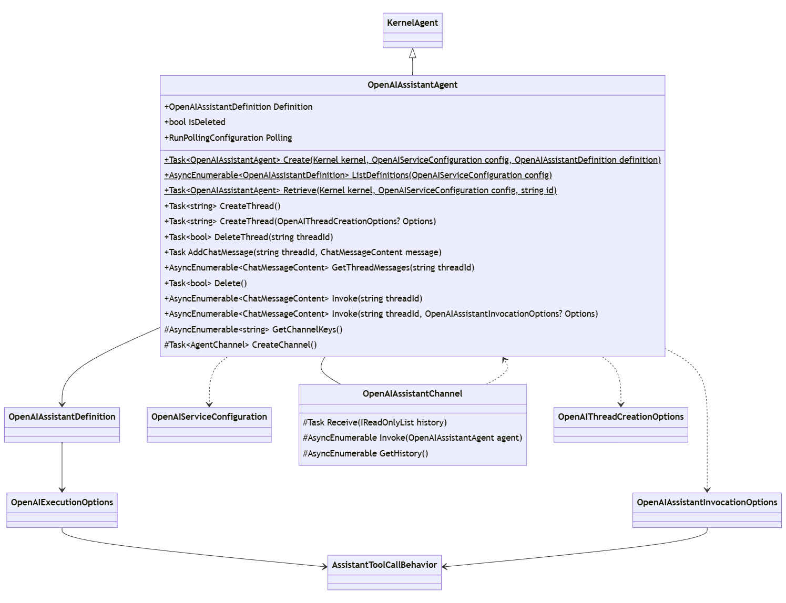
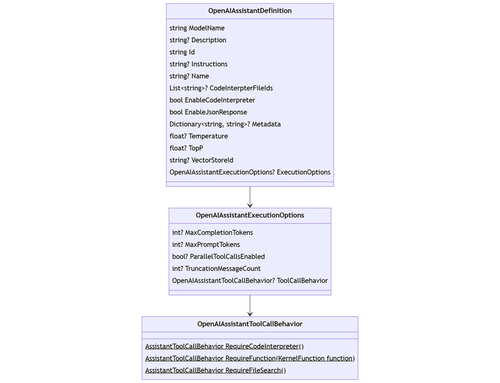
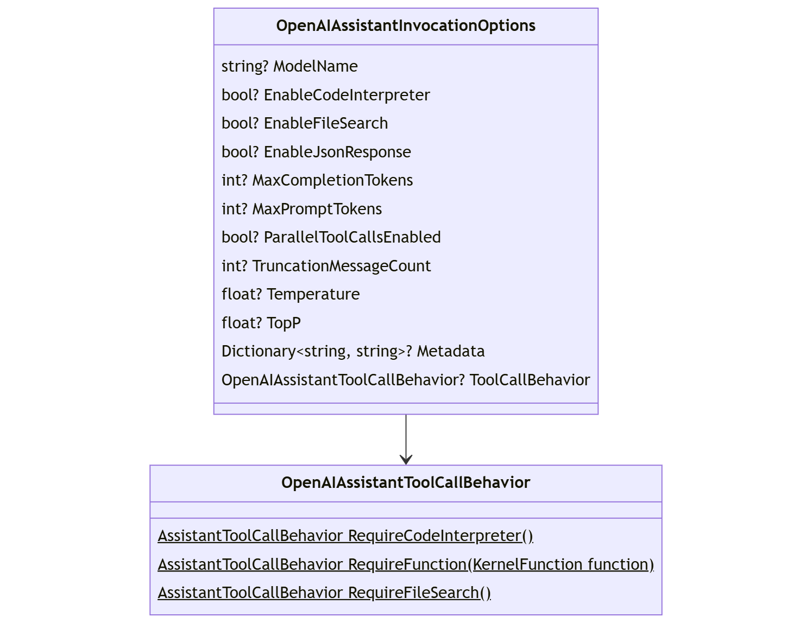
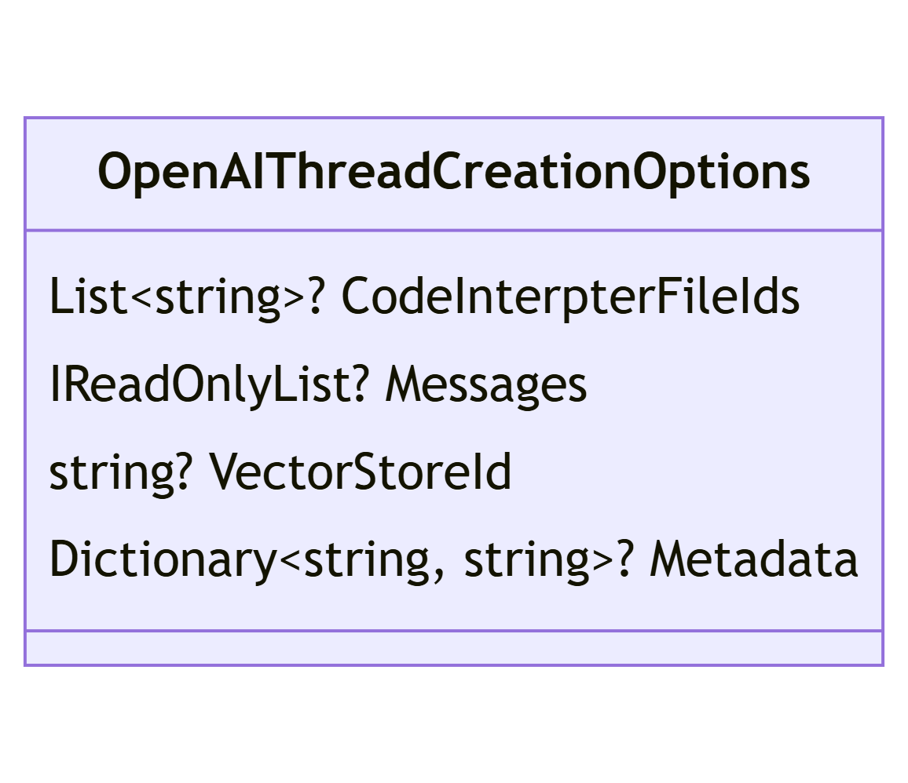
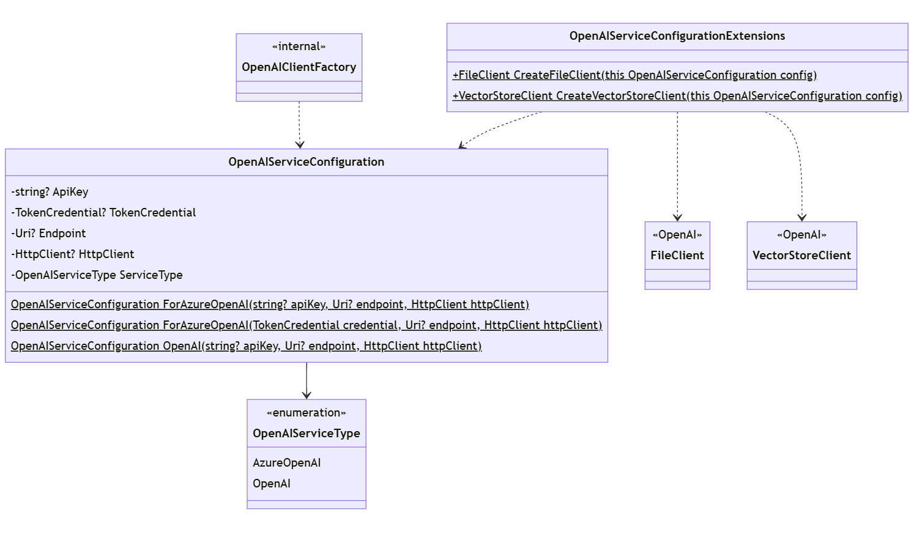

# 代理框架 - Assistant V2 迁移

## 上下文和问题陈述

Open AI 发布了 _Assistants V2_ API。 这建立在 V1 _助手_概念之上，但也使某些 V1 功能无效。 此外， _ 支持 _Assistant V2 功能的 _dotnet_ API 在当前使用的 SDK`Azure.AI.OpenAI.Assistants` 上完全不同。

### 未解决的问题
- **流式处理：** 作为离散特征寻址

## 设计

迁移到 Assistant V2 API 是对现有包的重大更改，因为：
- 基础功能差异（例如 `file-search` vs `retrieval`）
- 底层 V2 SDK 版本与 V1 不兼容（`OpenAI` 和 `Azure.AI.OpenAI`）

### 代理实现

该 `OpenAIAssistant` 代理大致相当于其 V1 形式，但以下方面除外：

- 支持_助手_、_线程_和_运行的选项_
- 代理定义转移到属性 `Definition` 
- 生成 OpenAI 客户端的便捷方法

以前，代理定义通过直接属性公开，例如：

- `FileIds`
- `Metadata`

这一切都已通过`Definition`用于创建和查询助手的`OpenAIAssistantDefinition`相同类型的属性 （） 进行了转移和扩展。

<kbd></kbd>

下表描述了 `OpenAIAssistantAgent`.

|方法名称|描述|
---|---
**创造**|创建新的助理代理
**ListDefinitions**|列出现有助手定义
**取回**|检索现有助手
**创建线程**|创建助理线程
**删除线程**|删除助理线程
**AddChatMessage**|向 Assistant 线程添加消息
**GetThreadMessages**|从助理线程检索所有消息
**删除**|删除助理代理的定义（将代理置于最终状态）
**调用**|调用助理代理 （无聊天）
**GetChannelKeys**|继承自 `Agent`
**CreateChannel**|继承自 `Agent`

### 类库存
本部分提供本 ADR 中描述的所有公共外围应用的概述/清单。

|类名|描述|
---|---
**OpenAIAssistantAgent**|基于 `Agent` Open AI Assistant API
**打开 AIAssistantChannel**|的 'AgentChannel' `OpenAIAssistantAgent` （与 _thread-id 关联_.）
**OpenAIAssistant定义**|Open AI Assistant 的所有元数据/定义。 由于实施约束，无法使用 _Open AI API_ 模型（构造函数未公开）。
**OpenAIAssistantExecutionOptions**|影响 _运行_但为代理/助理全局定义的选项。
**OpenAIAssistantInvocationOptions**|绑定到离散运行的选项，用于直接（无聊天）调用。
**OpenAIThreadCreationOptions**|用于创建优先于助手定义的线程的选项 （如果指定）。
**OpenAIServiceConfiguration**|描述服务连接并用于创建 `OpenAIClient`

### 运行处理

支持 _助理_ 代理的核心是创建和处理 `Run`.

A `Run` 实际上是 _ （或对话）_ 上的离散助手`Thread`交互。

- https://platform.openai.com/docs/api-reference/runs
- https://platform.openai.com/docs/api-reference/run-steps

此`Run`处理在 OpenAI 代理框架_中作为内部逻辑实现 _ ，概述如下：

使用以下方法启动处理： 

- `agent` -> `OpenAIAssistantAgent`
- `client` -> `AssistantClient`
- `threadid` -> `string`
- `options` -> `OpenAIAssistantInvocationOptions` （可选）

执行处理：

- 验证 `agent` 未删除
- 定义 `RunCreationOptions`
- 创建 `run` （基于 `threadid` 和 `agent.Id`）
- 处理运行：

    做

    - 轮询 `run` 状态直到未 _排队_、 _正在进行_或 _正在取消_
    - 如果状态为 `run`expired_、_failed_ 或 _cancelled_，则引发 _
    - 查询 `steps` `run`

    - 如果 `run` Status 为 _Requires-Action_
        
        - process 函数 `steps`

        - POST 函数结果

    - foreach （`step` 已完成）

        - if （`step` is tool-call） 生成并生成工具内容

        - else if （`step` is message） 生成并生成消息内容

    while （`run` 状态为 Not completed）

### Vector Store 支持

_需要 Vector Store_ 支持才能使用该工具 `file-search` 。 

与 的 V2 流式处理一致`FileClient`，调用方也可以直接从 `VectorStoreClient` _OpenAI SDK 进行定向_。

### 定义 / 选项类

引入了特定的配置/选项类，以支持在每个支持的关节点（即_助手_、_线程_和_运行）定义助手行为_的能力。

|类|目的|
|---|---|
|`OpenAIAssistantDefinition`|助手的定义。 在创建新助手、检查 assistant-agent 实例或查询助手定义时使用。|
|`OpenAIAssistantExecutionOptions`|影响运行执行的选项，在 Assistant 范围内定义。|
|`OpenAIAssistantInvocationOptions`|指定时，优先于辅助定义（如果）的运行级别选项。|
|`OpenAIAssistantToolCallBehavior`|通知关联范围的工具调用行为：assistant 或 run。|
|`OpenAIThreadCreationOptions`|线程范围的选项，如果指定，则优先于助手定义。|
|`OpenAIServiceConfiguration`|通知要定位的服务以及如何定位。|

#### 辅助定义

以前 `OpenAIAssistantDefinition` 仅在枚举已存储代理列表时使用。 它已发展为还可用作 creating 和 agent 的输入，并作为实例的 discrete 属性公开 `OpenAIAssistantAgent` 。

这包括 `ExecutionOptions` 定义默认_运行_行为的 optional  。 由于这些执行选项不是远程助手定义的一部分，因此在检索现有代理时，它们将保留在助手元数据中。 作为`OpenAIAssistantToolCallBehavior`执行选项_的一部分包含在_内，并与 `ToolCallBehavior` _AI 连接器关联的建模_保持一致。

> 注意：目前不支持手动函数调用 `OpenAIAssistantAgent` ，并 `AgentChat` 计划作为增强功能解决。 引入此支持后， `OpenAIAssistantToolCallBehavior` 将确定函数调用行为（也与 `ToolCallBehavior`AI 连接器_关联一致_）。

**另类（未来？**

已创作一个待处理的更改，该更改作为 `FunctionChoiceBehavior` base / abstract `PromptExecutionSettings` 的属性引入 。 一旦实现，就有必要评估此模式的集成 `OpenAIAssistantAgent`。 这也可能意味着 `PromptExecutionSettings` for both `OpenAIAssistantExecutionOptions` 和 `OpenAIAssistantInvocationOptions` 的继承关系（下一节）。

**决策**：在实现`tool_choice`之前`FunctionChoiceBehavior`不支持。

<kbd></kbd>

#### Assistant 调用选项

直接调用（ `OpenAIAssistantAgent` 无聊天）时，可以指定仅适用于离散运行的定义。 这些定义被定义为 `OpenAIAssistantInvocationOptions` 并优先于任何相应的辅助或螺纹定义。

> 注意：这些定义也受 `ToolCallBehavior` / `FunctionChoiceBehavior` 窘境的影响。

<kbd></kbd>

#### 线程创建选项

 `OpenAIAssistantAgent`直接  （no-chat） 调用时，必须显式管理线程。 执行此作时，可以指定特定于线程的选项。 这些选项定义为 `OpenAIThreadCreationOptions` 并优先于任何相应的辅助定义。

<kbd></kbd>

#### 服务配置

它 `OpenAIServiceConfiguration` 定义了如何连接到特定的远程服务，无论是 OpenAI、Azure 还是代理。 这样就无需为每个调用站点定义多个重载，从而连接到远程 API 服务（即创建_客户端）。_

> 注意：这以前称为 `OpenAIAssistantConfiguration`，但不一定特定于 助手。

<kbd></kbd>

