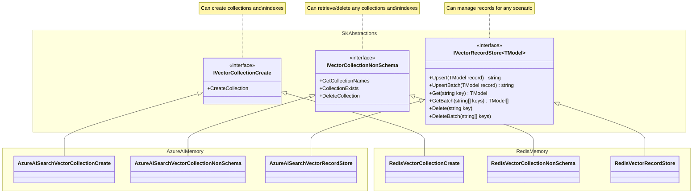

# 更新的内存连接器设计

## 上下文和问题陈述

Semantic Kernel 具有一组指向常用 Vector 数据库的连接器，例如 Azure AI Search、Chroma、Milvus 等
每个内存连接器都实现了由 Semantic Kernel 定义的内存抽象，并允许开发人员轻松地将 Vector 数据库集成到他们的应用程序中。
当前的抽象是实验性的，此 ADR 的目的是推进抽象的设计，以便它们可以升级到非实验状态。

### 当前设计的问题

1. 该 `IMemoryStore` 接口有四个具有不同基数的职责。有些是架构感知的，有些是架构无关的。
2. 该 `IMemoryStore` 接口仅支持用于数据存储、检索和搜索的固定架构，这限制了客户对现有数据集的可用性。
2. 这些 `IMemoryStore` 实施是围绕密钥编码/解码和集合名称清理而固执己见的，这限制了客户对现有数据集的可用性。

责任：

|功能范围|基数|对 Semantic Kernel 的意义|
|-|-|-|
|集合/索引创建|每个商店类型和模型的实现|在构建商店和添加数据时很有价值|
|集合/索引列表名称、exists 和 delete|每个商店类型的实现|在构建商店和添加数据时很有价值|
|数据存储和检索|每个商店类型的实现|在构建商店和添加数据时很有价值|
|向量搜索|每个商店类型、模型和搜索类型的实现|对于许多场景都有价值，包括 RAG、根据用户输入查找矛盾的事实、查找要合并的相似记忆等。|


### 今天的内存存储
```cs
interface IMemoryStore
{
    // Collection / Index Management
    Task CreateCollectionAsync(string collectionName, CancellationToken cancellationToken = default);
    IAsyncEnumerable<string> GetCollectionsAsync(CancellationToken cancellationToken = default);
    Task<bool> DoesCollectionExistAsync(string collectionName, CancellationToken cancellationToken = default);
    Task DeleteCollectionAsync(string collectionName, CancellationToken cancellationToken = default);

    // Data Storage and Retrieval
    Task<string> UpsertAsync(string collectionName, MemoryRecord record, CancellationToken cancellationToken = default);
    IAsyncEnumerable<string> UpsertBatchAsync(string collectionName, IEnumerable<MemoryRecord> records, CancellationToken cancellationToken = default);
    Task<MemoryRecord?> GetAsync(string collectionName, string key, bool withEmbedding = false, CancellationToken cancellationToken = default);
    IAsyncEnumerable<MemoryRecord> GetBatchAsync(string collectionName, IEnumerable<string> keys, bool withVectors = false, CancellationToken cancellationToken = default);
    Task RemoveAsync(string collectionName, string key, CancellationToken cancellationToken = default);
    Task RemoveBatchAsync(string collectionName, IEnumerable<string> keys, CancellationToken cancellationToken = default);

    // Vector Search
    IAsyncEnumerable<(MemoryRecord, double)> GetNearestMatchesAsync(
        string collectionName,
        ReadOnlyMemory<float> embedding,
        int limit,
        double minRelevanceScore = 0.0,
        bool withVectors = false,
        CancellationToken cancellationToken = default);

    Task<(MemoryRecord, double)?> GetNearestMatchAsync(
        string collectionName,
        ReadOnlyMemory<float> embedding,
        double minRelevanceScore = 0.0,
        bool withEmbedding = false,
        CancellationToken cancellationToken = default);
}
```

### 行动

1.  `IMemoryStore` 应将其拆分为不同的接口，以便将架构感知作和架构不可知作分开。
2.  **Data Storage and Retrieval** 和 **Vector Search** 区域应允许对数据进行键入访问，并支持客户数据存储中当前可用的任何架构。
3. 集合/索引创建功能应允许开发人员使用作为抽象一部分的通用定义来创建集合。
4. 集合/索引列表/存在/删除功能应允许管理任何集合，而不管架构如何。
5. 从连接器中删除固执己见的行为。固执己见的行为限制了这些连接器与预先存在的矢量数据库一起使用的能力。这些行为应该尽可能地移动到装饰器中或可注入。 固执己见的行为示例：
    1. AzureAISearch 连接器在存储密钥之前对密钥进行编码，在检索后对密钥进行解码，因为 Azure AI 搜索中的密钥支持一组有限的字符。
    2. AzureAISearch 连接器在使用集合名称之前会对其进行清理，因为 Azure AI 搜索支持一组有限的字符。
    3. Redis 连接器在存储记录之前将集合名称添加到键的前面，并将集合名称注册为要由索引索引的记录的前缀。

### 新连接器的非功能性要求
1. 确保所有连接器都一致地引发相同的异常，并以一致的方式提供有关所发出请求的数据。
2. 为所有连接器添加一致的遥测数据。
3. 集成测试应尽可能可在 build server 上运行。

### 新设计

集合/索引管理和记录管理之间的分离。



如何将自己的架构与核心 sk 功能一起使用。

```mermaid
classDiagram
    note for IVectorRecordStore "Can manage records\nfor any scenario"
    note for IVectorCollectionCreate "Can create collections\nan dindexes"
    note for IVectorCollectionNonSchema "Can retrieve/delete any\ncollections and indexes"
    note for CustomerHistoryVectorCollectionCreate "Creates history collections and indices\nusing Customer requirements"
    note for CustomerHistoryVectorRecordStore "Decorator class for IVectorRecordStore that maps\nbetween the customer model to our model"

    namespace SKAbstractions{
        class IVectorCollectionCreate{
            <<interface>>
            +CreateCollection
        }

        class IVectorCollectionNonSchema{
            <<interface>>
            +GetCollectionNames
            +CollectionExists
            +DeleteCollection
        }

        class IVectorRecordStore~TModel~{
            <<interface>>
            +Upsert(TModel record) string
            +Get(string key) TModel
            +Delete(string key) string
        }

        class ISemanticTextMemory{
            <<interface>>
            +SaveInformationAsync()
            +SaveReferenceAsync()
            +GetAsync()
            +DeleteAsync()
            +SearchAsync()
            +GetCollectionsAsync()
        }
    }

    namespace CustomerProject{
        class CustomerHistoryModel{
            +string text
            +float[] vector
            +Dictionary~string, string~ properties
        }

        class CustomerHistoryVectorCollectionCreate{
            +CreateCollection
        }

        class CustomerHistoryVectorRecordStore{
            -IVectorRecordStore~CustomerHistoryModel~ _store
            +Upsert(ChatHistoryModel record) string
            +Get(string key) ChatHistoryModel
            +Delete(string key) string
        }
    }

    namespace SKCore{
        class SemanticTextMemory{
            -IVectorRecordStore~ChatHistoryModel~ _VectorRecordStore
            -IMemoryCollectionService _collectionsService
            -ITextEmbeddingGenerationService _embeddingGenerationService
        }

        class ChatHistoryPlugin{
            -ISemanticTextMemory memory
        }

        class ChatHistoryModel{
            +string message
            +float[] embedding
            +Dictionary~string, string~ metadata
        }
    }

    IVectorCollectionCreate <|-- CustomerHistoryVectorCollectionCreate

    IVectorRecordStore <|-- CustomerHistoryVectorRecordStore
    IVectorRecordStore <.. CustomerHistoryVectorRecordStore
    CustomerHistoryModel <.. CustomerHistoryVectorRecordStore
    ChatHistoryModel <.. CustomerHistoryVectorRecordStore

    ChatHistoryModel <.. SemanticTextMemory
    IVectorRecordStore <.. SemanticTextMemory
    IVectorCollectionCreate <.. SemanticTextMemory

    ISemanticTextMemory <.. ChatHistoryPlugin
```



### Vector Store Cross Store 支持 - 一般功能

商店实施存储功能以帮助推动决策的不同方式的比较：

|特征|Azure AI 搜索|维维亚特|雷迪斯|色度|费斯|松果|LLamaIndex的|PostgreSQL 的|Qdrant|米尔沃斯|
|-|-|-|-|-|-|-|-|-|-|-|
|获取项目支持|Y|Y|Y|Y||Y||Y|Y|Y|
|批量作支持|Y|Y|Y|Y||Y||||Y|
|批量作的每项结果|Y|Y|Y|N||N|||||
|更新插入记录的 Key|Y|Y|注<sup>3</sup>|注<sup>3</sup>||注<sup>3</sup>||||Y|
|已删除记录的键|Y||注<sup>3</sup>|N||N||||注<sup>3</sup>|
|获取的检索字段选择|Y||Y<sup>4 号<sup>|第<sup>2 页</sup>||N||Y|Y|Y|
|包含/排除 get 的嵌入|第<sup>1 页</sup>|Y|Y<sup>4,1 号<sup>|Y||N||第<sup>1 页</sup>|Y|N|
|批处理部分失败时的失败原因|Y|Y|Y|N||N|||||
|Key 是否独立于数据|N|Y|Y|Y||Y||N|Y|N|
|可以生成 ID|N|Y|N|N||Y||Y|N|Y|
|可以生成嵌入|尚无法通过 API 使用|Y|N|客户端抽象|||||N||

脚注：
- P = 部分支撑
- <sup>1</sup> 仅当您有架构时，才能选择相应的字段。
- <sup>2</sup> 仅支持广泛的字段类别。
- <sup>3</sup> 请求中需要 ID，因此可以在需要时返回。
- <sup>4</sup> 指定字段列表时不支持强类型。

### Vector Store Cross Store 支持 - 字段、类型和索引

|特征|Azure AI 搜索|维维亚特|雷迪斯|色度|费斯|松果|LLamaIndex的|PostgreSQL 的|Qdrant|米尔沃斯|
|-|-|-|-|-|-|-|-|-|-|-|
|字段差异化|领域|键、props、向量|键、字段|键、文档、元数据、向量||键、元数据、SparseValues、向量||领域|键、props（payload）、向量|领域|
|每个记录支持多个向量|Y|Y|Y|N||[N](https://docs.pinecone.io/guides/data/upsert-data#upsert-records-with-metadata)||Y|Y|Y|
|集合索引|1 比 1|1 比 1|1 对多|1 比 1|-|1 比 1|-|1 比 1|1 比 1|1 比 1|
|ID 类型|字符串|UUID 的|带有集合名称前缀的字符串|字符串||字符串|UUID 的|64 位 Int / UUID / ULID|64 位无符号 Int / UUID|Int64 / varchar|
|支持的向量类型|[集合（Edm.Byte） / 集合（Edm.Single） / 集合（Edm.Half） / 集合（Edm.Int16） / 集合（Edm.SByte）](https://learn.microsoft.com/en-us/rest/api/searchservice/supported-data-types)|浮点数32|FLOAT32 和 FLOAT64|||[锈 f32](https://docs.pinecone.io/troubleshooting/embedding-values-changed-when-upserted)||[单精度（4 字节浮点数）/ 半精度（2 字节浮点数）/ 二进制（1 位）/ 稀疏向量（4 字节）](https://github.com/pgvector/pgvector?tab=readme-ov-file#pgvector)|UInt8 / 浮点数 32|二进制 / Float32 / Float16 / BFloat16 / SparseFloat|
|支持的距离函数|[余弦 / 点 prod / 欧几里得距离 （l2 范数）](https://learn.microsoft.com/en-us/azure/search/vector-search-ranking#similarity-metrics-used-to-measure-nearness)|[余弦距离 / 点积 / 平方 L2 距离 / 汉明（差值数） / 曼哈顿距离](https://weaviate.io/developers/weaviate/config-refs/distances#available-distance-metrics)|[欧几里得距离 （L2） / 内积 （IP） / 余弦距离](https://redis.io/docs/latest/develop/interact/search-and-query/advanced-concepts/vectors/)|[平方 L2 / 内积 / 余弦相似度](https://docs.trychroma.com/guides#changing-the-distance-function)||[余弦 sim / 欧几里得 dist / dot prod](https://docs.pinecone.io/reference/api/control-plane/create_index)||[L2 dist / inner prod / cosine dist / L1 dist / Hamming dist / Jaccard dist （注意：在查询时指定，而不是在索引创建时指定）](https://github.com/pgvector/pgvector?tab=readme-ov-file#pgvector)|[点 prod / 余弦 sim / 欧几里得 dist （L2） / Manhattan dist](https://qdrant.tech/documentation/concepts/search/)|[余弦模拟 / 欧几里得距离 / 内积](https://milvus.io/docs/index-vector-fields.md)|
|支持的索引类型|[穷举式 KNN （FLAT） / HNSW](https://learn.microsoft.com/en-us/azure/search/vector-search-ranking#algorithms-used-in-vector-search)|[HNSW / 平面 / 动态](https://weaviate.io/developers/weaviate/config-refs/schema/vector-index)|[HNSW / FLAT](https://redis.io/docs/latest/develop/interact/search-and-query/advanced-concepts/vectors/#create-a-vector-field)|[HNSW 不可配置](https://cookbook.chromadb.dev/core/concepts/#vector-index-hnsw-index)||[美国职业高尔夫球协会](https://www.pinecone.io/blog/hnsw-not-enough/)||[HNSW / IVFFlat](https://github.com/pgvector/pgvector?tab=readme-ov-file#indexing)|[HNSW 表示密集](https://qdrant.tech/documentation/concepts/indexing/#vector-index)|<p>[内存中：FLAT / IVF_FLAT / IVF_SQ8 / IVF_PQ / HNSW / SCANN](https://milvus.io/docs/index.md)</p><p>[磁盘上：DiskANN](https://milvus.io/docs/disk_index.md)</p><p>[GPU：GPU_CAGRA / GPU_IVF_FLAT / GPU_IVF_PQ / GPU_BRUTE_FORCE](https://milvus.io/docs/gpu_index.md)</p>|

脚注：
- HNSW = 分层可导航小世界（HNSW 执行 [近似最近邻 （ANN）](https://learn.microsoft.com/en-us/azure/search/vector-search-overview#approximate-nearest-neighbors) 搜索）
- KNN = k-最近邻（执行扫描整个向量空间的暴力搜索）
- IVFFlat = 平面压缩的倒排文件（此索引类型使用近似最近邻搜索 （ANNS） 来提供快速搜索）
- Weaviate Dynamic = 从平坦开始，如果对象数量超过限制，则切换到 HNSW
- PGA = [松果图算法](https://www.pinecone.io/blog/hnsw-not-enough/)

### Vector Store Cross Store 支持 - 搜索和筛选

|特征|Azure AI 搜索|维维亚特|雷迪斯|色度|费斯|松果|LLamaIndex的|PostgreSQL 的|Qdrant|米尔沃斯|
|-|-|-|-|-|-|-|-|-|-|-|
|Index 允许文本搜索|Y|Y|Y|Y（默认为 On Metadata）||[仅与 Vector 结合使用](https://docs.pinecone.io/guides/data/understanding-hybrid-search)||Y （带 TSVECTOR 字段）|Y|Y|
|文本搜索查询格式|[简单或完整 Lucene](https://learn.microsoft.com/en-us/azure/search/search-query-create?tabs=portal-text-query#choose-a-query-type-simple--full)|[通配符](https://weaviate.io/developers/weaviate/search/filters#filter-text-on-partial-matches)|通配符 & 模糊|[包含 & 不包含](https://docs.trychroma.com/guides#filtering-by-document-contents)||纯文本||[通配符和二进制运算符](https://www.postgresql.org/docs/16/textsearch-controls.html#TEXTSEARCH-PARSING-QUERIES)|[纯文本](https://qdrant.tech/documentation/concepts/filtering/#full-text-match)|[通配符](https://milvus.io/docs/single-vector-search.md#Filtered-search)|
|多字段向量搜索支持|Y|[N](https://weaviate.io/developers/weaviate/search/similarity)||N（不支持多向量）||N||[由于 order by 语法而不清楚](https://github.com/pgvector/pgvector?tab=readme-ov-file#querying)|[N](https://qdrant.tech/documentation/concepts/search/)|[Y]（https://milvus.io/api-reference/restful/v2.4.x/v2/Vector%20（v2）/Hybrid%20Search.md）|
|目标多字段文本搜索支持|Y|[Y](https://weaviate.io/developers/weaviate/search/hybrid#set-weights-on-property-values)|[Y](https://redis.io/docs/latest/develop/interact/search-and-query/advanced-concepts/query_syntax/#field-modifiers)|N（仅在文档上）||N||Y|Y|Y|
|用于搜索的每个向量字段的向量|Y|不适用||不适用|||不适用||不适用|不适用|[Y](https://milvus.io/docs/multi-vector-search.md#Step-1-Create-Multiple-AnnSearchRequest-Instances)|
|将文本搜索查询与向量分开|Y|[Y](https://weaviate.io/developers/weaviate/search/hybrid#specify-a-search-vector)|Y|Y||Y||Y|Y|[Y]（https://milvus.io/api-reference/restful/v2.4.x/v2/Vector%20（v2）/Hybrid%20Search.md）|
|允许筛选|Y|Y|Y （在 TAG 上）|Y（默认为 On Metadata）||[Y](https://docs.pinecone.io/guides/indexes/configure-pod-based-indexes#selective-metadata-indexing)||Y|Y|Y|
|允许筛选条件分组|Y （Odata）|[Y](https://weaviate.io/developers/weaviate/search/filters#nested-filters)||[Y](https://docs.trychroma.com/guides#using-logical-operators)||Y||Y|[Y](https://qdrant.tech/documentation/concepts/filtering/#clauses-combination)|[Y](https://milvus.io/docs/get-and-scalar-query.md#Use-Basic-Operators)|
|允许设置标量索引字段|Y|Y|Y|N||Y||Y|Y|Y|
|需要设置标量索引字段以进行筛选|Y|Y|Y|N||N（默认情况下对 all 启用）||N|N|N（可以在没有索引的情况下进行筛选）|

### 支持不同的映射器

数据模型和存储模型之间的映射也可能需要自定义逻辑，具体取决于所涉及的数据模型和存储模型的类型。

因此，我建议我们允许每个实例都可以注入 mapper `VectorStoreCollection` 。这些的接口会有所不同
在每个向量存储使用的存储模型以及每个向量存储可能具有的任何独特功能上，例如 qdrant 可以在  或`single`
`multiple named vector` modes，这意味着映射器需要知道是设置单个向量还是填充向量映射。

除此之外，我们还应该为每个向量存储构建第一方映射器，这将满足内置的通用模型或使用元数据来执行映射。

### 支持不同的存储架构

不同的存储在数据组织方式方面在许多方面有所不同。
- 有些只存储带有字段的记录，其中字段可以是键、数据字段或向量，它们的类型在集合创建时确定。
- 其他方法在与 api 交互时按类型分隔字段，例如，您必须显式指定一个键，将元数据放入元数据字典中，并将向量放入向量数组中。

我建议我们允许两种方式来提供在消费者数据模型和存储数据模型之间映射数据所需的信息。
首先是一组用于捕获每个字段类型的配置对象。第二个是一组可用于装饰模型本身的属性
并且可以转换为 Configuration 对象，从而允许单个执行路径。
可以根据需要为每种类型的字段轻松添加其他配置属性，例如 IsFilterable 或 IsFullTextSearchable，从而允许我们还从提供的配置创建索引。

我还建议，即使其他系统中已经存在类似的属性，例如 System.ComponentModel.DataAnnotations.KeyAttribute，我们也要创建自己的属性。
我们可能需要对现有属性当前不支持的所有这些属性添加其他属性，例如字段是 或
应该是可过滤的。要求用户稍后切换到新属性将造成中断。

以下是属性的外观以及示例用例。

```cs
sealed class VectorStoreRecordKeyAttribute : Attribute
{
}
sealed class VectorStoreRecordDataAttribute : Attribute
{
    public bool HasEmbedding { get; set; }
    public string EmbeddingPropertyName { get; set; }
}
sealed class VectorStoreRecordVectorAttribute : Attribute
{
}

public record HotelInfo(
    [property: VectorStoreRecordKey, JsonPropertyName("hotel-id")] string HotelId,
    [property: VectorStoreRecordData, JsonPropertyName("hotel-name")] string HotelName,
    [property: VectorStoreRecordData(HasEmbedding = true, EmbeddingPropertyName = "DescriptionEmbeddings"), JsonPropertyName("description")] string Description,
    [property: VectorStoreRecordVector, JsonPropertyName("description-embeddings")] ReadOnlyMemory<float>? DescriptionEmbeddings);
```

以下是配置对象的外观。

```cs
abstract class VectorStoreRecordProperty(string propertyName);

sealed class VectorStoreRecordKeyProperty(string propertyName): Field(propertyName)
{
}
sealed class VectorStoreRecordDataProperty(string propertyName): Field(propertyName)
{
    bool HasEmbedding;
    string EmbeddingPropertyName;
}
sealed class VectorStoreRecordVectorProperty(string propertyName): Field(propertyName)
{
}

sealed class VectorStoreRecordDefinition
{
    IReadOnlyList<VectorStoreRecordProperty> Properties;
}
```

### 与现有接口相比，方法签名发生了显著变化

IMemoryStore 上当前存在的所有方法都将移植到新接口中，但在某些地方，我建议我们进行更改以改进
一致性和可扩展性。

1. `RemoveAsync` 并 `RemoveBatchAsync` 重命名为 `DeleteAsync` 和 `DeleteBatchAsync`，因为 record 实际上已被删除，这也与用于 collections 的动词匹配。
2. `GetCollectionsAsync` 重命名为 `GetCollectionNamesAsync`，因为我们只检索名称，而不检索有关集合的其他信息。
3. `DoesCollectionExistAsync` 重命名为 `CollectionExistsAsync` ，因为它更短，并且更常用于其他 API。

### 与其他 AI 框架的比较

|标准|当前的 SK 实现|建议的 SK 实施|Spring AI|骆驼指数|Langchain 语言链|
|-|-|-|-|-|-|
|支持自定义架构|N|Y|N|N|N|
|商店命名|内存存储|VectorStore、VectorStoreCollection|矢量存储|矢量存储|矢量存储|
|MultiVector 支持|N|Y|N|N|N|
|通过 SDK 参数支持多个集合|Y|Y|N（通过应用程序配置）|Y|Y|

## 决策驱动因素

来自 GitHub Issue：
- API 界面必须易于使用和直观
- 与 SK 中的其他模式对齐
- - 设计必须允许 Memory Plugins 使用任何连接器轻松实例化
- 设计必须支持所有 Kernel 内容类型
- 设计必须允许数据库特定的配置
- 所有要做好生产准备的 NFR 都已实现（有关详细信息，请参阅路线图）
- 必须支持基本的 CRUD作，以便可以多态方式使用连接器
- 必须在可用的情况下使用官方数据库客户端
- 必须支持动态数据库架构
- 必须支持依赖关系注入
- 必须支持 Azure-ML YAML 格式
- 必须支持破窗场景

## 考虑的问题

1. 组合收集和记录管理与分离。
2. 装饰器或主类中的集合名称和键值规范化。
3. 集合名称作为方法 param 或构造函数 param。
4. 如何在支持不同类型的不同向量存储中规范化 ID。
5. Store 接口/类命名

### 问题 1：收集和记录管理相结合与分离。

#### 选项 1 - 组合收集和记录管理

```cs
interface IVectorRecordStore<TRecord>
{
    Task CreateCollectionAsync(CollectionCreateConfig collectionConfig, CancellationToken cancellationToken = default);
    IAsyncEnumerable<string> ListCollectionNamesAsync(CancellationToken cancellationToken = default);
    Task<bool> CollectionExistsAsync(string name, CancellationToken cancellationToken = default);
    Task DeleteCollectionAsync(string name, CancellationToken cancellationToken = default);

    Task UpsertAsync(TRecord data, CancellationToken cancellationToken = default);
    IAsyncEnumerable<string> UpsertBatchAsync(IEnumerable<TRecord> dataSet, CancellationToken cancellationToken = default);
    Task<TRecord> GetAsync(string key, bool withEmbedding = false, CancellationToken cancellationToken = default);
    IAsyncEnumerable<TRecord> GetBatchAsync(IEnumerable<string> keys, bool withVectors = false, CancellationToken cancellationToken = default);
    Task DeleteAsync(string key, CancellationToken cancellationToken = default);
    Task DeleteBatchAsync(IEnumerable<string> keys, CancellationToken cancellationToken = default);
}

class AzureAISearchVectorRecordStore<TRecord>(
    Azure.Search.Documents.Indexes.SearchIndexClient client,
    Schema schema): IVectorRecordStore<TRecord>;

class WeaviateVectorRecordStore<TRecord>(
    WeaviateClient client,
    Schema schema): IVectorRecordStore<TRecord>;

class RedisVectorRecordStore<TRecord>(
    StackExchange.Redis.IDatabase database,
    Schema schema): IVectorRecordStore<TRecord>;
```

#### 选项 2 - 使用固执己见的创建实现将收集和记录管理分开

```cs

interface IVectorCollectionStore
{
    virtual Task CreateChatHistoryCollectionAsync(string name, CancellationToken cancellationToken = default);
    virtual Task CreateSemanticCacheCollectionAsync(string name, CancellationToken cancellationToken = default);

    IAsyncEnumerable<string> ListCollectionNamesAsync(CancellationToken cancellationToken = default);
    Task<bool> CollectionExistsAsync(string name, CancellationToken cancellationToken = default);
    Task DeleteCollectionAsync(string name, CancellationToken cancellationToken = default);
}

class AzureAISearchVectorCollectionStore: IVectorCollectionStore;
class RedisVectorCollectionStore: IVectorCollectionStore;
class WeaviateVectorCollectionStore: IVectorCollectionStore;

// Customers can inherit from our implementations and replace just the creation scenarios to match their schemas.
class CustomerCollectionStore: AzureAISearchVectorCollectionStore, IVectorCollectionStore;

// We can also create implementations that create indices based on an MLIndex specification.
class MLIndexAzureAISearchVectorCollectionStore(MLIndex mlIndexSpec): AzureAISearchVectorCollectionStore, IVectorCollectionStore;

interface IVectorRecordStore<TRecord>
{
    Task<TRecord?> GetAsync(string key, GetRecordOptions? options = default, CancellationToken cancellationToken = default);
    Task DeleteAsync(string key, DeleteRecordOptions? options = default, CancellationToken cancellationToken = default);
    Task<string> UpsertAsync(TRecord record, UpsertRecordOptions? options = default, CancellationToken cancellationToken = default);
}

class AzureAISearchVectorRecordStore<TRecord>(): IVectorRecordStore<TRecord>;
```

#### 选项 3 - 将集合和记录管理分开，将集合创建与其他作分开。

向量存储与选项 2 相同，因此为简洁起见，无需重复。

```cs

interface IVectorCollectionCreate
{
    virtual Task CreateCollectionAsync(string name, CancellationToken cancellationToken = default);
}

// Implement a generic version of create that takes a configuration that should work for 80% of cases.
class AzureAISearchConfiguredVectorCollectionCreate(CollectionCreateConfig collectionConfig): IVectorCollectionCreate;

// Allow custom implementations of create for break glass scenarios for outside the 80% case.
class AzureAISearchChatHistoryVectorCollectionCreate: IVectorCollectionCreate;
class AzureAISearchSemanticCacheVectorCollectionCreate: IVectorCollectionCreate;

// Customers can create their own creation scenarios to match their schemas, but can continue to use our get, does exist and delete class.
class CustomerChatHistoryVectorCollectionCreate: IVectorCollectionCreate;

interface IVectorCollectionNonSchema
{
    IAsyncEnumerable<string> ListCollectionNamesAsync(CancellationToken cancellationToken = default);
    Task<bool> CollectionExistsAsync(string name, CancellationToken cancellationToken = default);
    Task DeleteCollectionAsync(string name, CancellationToken cancellationToken = default);
}

class AzureAISearchVectorCollectionNonSchema: IVectorCollectionNonSchema;
class RedisVectorCollectionNonSchema: IVectorCollectionNonSchema;
class WeaviateVectorCollectionNonSchema: IVectorCollectionNonSchema;

```

#### 选项 4 - 将集合和记录管理分开，将集合创建与其他作分开，集合管理聚合类位于顶部。

选项 3 的变体。 

```cs

interface IVectorCollectionCreate
{
    virtual Task CreateCollectionAsync(string name, CancellationToken cancellationToken = default);
}

interface IVectorCollectionNonSchema
{
    IAsyncEnumerable<string> ListCollectionNamesAsync(CancellationToken cancellationToken = default);
    Task<bool> CollectionExistsAsync(string name, CancellationToken cancellationToken = default);
    Task DeleteCollectionAsync(string name, CancellationToken cancellationToken = default);
}

// DB Specific NonSchema implementations
class AzureAISearchVectorCollectionNonSchema: IVectorCollectionNonSchema;
class RedisVectorCollectionNonSchema: IVectorCollectionNonSchema;

// Combined Create + NonSchema Interface
interface IVectorCollectionStore: IVectorCollectionCreate, IVectorCollectionNonSchema {}

// Base abstract class that forwards non-create operations to provided implementation.
abstract class VectorCollectionStore(IVectorCollectionNonSchema collectionNonSchema): IVectorCollectionStore
{
    public abstract Task CreateCollectionAsync(string name, CancellationToken cancellationToken = default);
    public IAsyncEnumerable<string> ListCollectionNamesAsync(CancellationToken cancellationToken = default) { return collectionNonSchema.ListCollectionNamesAsync(cancellationToken); }
    public Task<bool> CollectionExistsAsync(string name, CancellationToken cancellationToken = default) { return collectionNonSchema.CollectionExistsAsync(name, cancellationToken); }
    public Task DeleteCollectionAsync(string name, CancellationToken cancellationToken = default) { return collectionNonSchema.DeleteCollectionAsync(name, cancellationToken); }
}

// Collections store implementations, that inherit from base class, and just adds the different creation implementations.
class AzureAISearchChatHistoryVectorCollectionStore(AzureAISearchVectorCollectionNonSchema nonSchema): VectorCollectionStore(nonSchema);
class AzureAISearchSemanticCacheVectorCollectionStore(AzureAISearchVectorCollectionNonSchema nonSchema): VectorCollectionStore(nonSchema);
class AzureAISearchMLIndexVectorCollectionStore(AzureAISearchVectorCollectionNonSchema nonSchema): VectorCollectionStore(nonSchema);

// Customer collections store implementation, that uses the base Azure AI Search implementation for get, doesExist and delete, but adds its own creation.
class ContosoProductsVectorCollectionStore(AzureAISearchVectorCollectionNonSchema nonSchema): VectorCollectionStore(nonSchema);

```

#### 选项 5 - 将集合和记录管理分开，将集合创建与其他作分开，将整体聚合类置于顶部。

与选项 3 / 4 相同，加上：

```cs

interface IVectorStore : IVectorCollectionStore, IVectorRecordStore
{    
}

// Create a static factory that produces one of these, so only the interface is public, not the class.
internal class VectorStore<TRecord>(IVectorCollectionCreate create, IVectorCollectionNonSchema nonSchema, IVectorRecordStore<TRecord> records): IVectorStore
{
}

```

#### 选项 6 - 集合存储充当记录存储的工厂。

`IVectorStore` 充当 的工厂 `IVectorStoreCollection`，并且任何与模式无关的多集合作都保留在 上 `IVectorStore`。


```cs
public interface IVectorStore
{
    IVectorStoreCollection<TKey, TRecord> GetCollection<TKey, TRecord>(string name, VectorStoreRecordDefinition? vectorStoreRecordDefinition = null);
    IAsyncEnumerable<string> ListCollectionNamesAsync(CancellationToken cancellationToken = default));
}

public interface IVectorStoreCollection<TKey, TRecord>
{
    public string Name { get; }

    // Collection Operations
    Task CreateCollectionAsync();
    Task<bool> CreateCollectionIfNotExistsAsync();
    Task<bool> CollectionExistsAsync();
    Task DeleteCollectionAsync();

    // Data manipulation
    Task<TRecord?> GetAsync(TKey key, GetRecordOptions? options = default, CancellationToken cancellationToken = default);
    IAsyncEnumerable<TRecord> GetBatchAsync(IEnumerable<TKey> keys, GetRecordOptions? options = default, CancellationToken cancellationToken = default);
    Task DeleteAsync(TKey key, DeleteRecordOptions? options = default, CancellationToken cancellationToken = default);
    Task DeleteBatchAsync(IEnumerable<TKey> keys, DeleteRecordOptions? options = default, CancellationToken cancellationToken = default);
    Task<TKey> UpsertAsync(TRecord record, UpsertRecordOptions? options = default, CancellationToken cancellationToken = default);
    IAsyncEnumerable<TKey> UpsertBatchAsync(IEnumerable<TRecord> records, UpsertRecordOptions? options = default, CancellationToken cancellationToken = default);
}
```


#### 决策结果

选项 1 本身就有问题，因为我们必须允许使用者为 break glass 场景创建 collection create 的自定义实现。跟
像这样的单个接口，它将要求他们实现许多他们不想改变的方法。选项4和5，给了我们更多的灵活性，同时
仍然保留选项 1 中所述的聚合接口的易用性。

选项 2 没有为我们提供破窗场景所需的灵活性，因为它只允许创建某些类型的集合。它还意味着
每次需要新的集合类型时，它都会引入一个重大更改，因此这不是一个可行的选择。

由于集合创建和配置以及可能的选项在不同数据库类型中差异很大，因此我们需要支持一个简单的
使用 Break Glass 方案创建集合。虽然我们能够开发一个基本的可配置创建选项，但对于复杂的创建场景
用户将需要实现自己的。我们还需要支持多个开箱即用的创建实现，例如使用
我们自己的配置，创建重新创建当前模型以实现向后兼容性的实现，创建使用其他配置的实现
作为输入，例如 Azure-ML YAML。因此，将 create（可能有许多实现）与 exists、list 和 delete（每个数据库类型只需要一个实现）分开是有用的。
选项 3 为我们提供了这种分离，但选项 4 + 5 建立在此之上，并允许我们将不同的实现组合在一起以简化
消费。

选项： 6

- 易于使用，并且类似于许多 SDk 实现。
- 可以传递单个对象以进行集合和记录访问。

###  问题 2：在 store、decorator 或通过注入实现集合名称和键值规范化。

#### 选项 1 - 主记录存储中的规范化

- 优点： 简单
- 缺点： 规范化需要与记录存储分开，因此这是行不通的

```cs
    public class AzureAISearchVectorStoreCollection<TRecord> : IVectorStoreCollection<TRecord>
    {
        ...

        // On input.
        var normalizedCollectionName = this.NormalizeCollectionName(collectionName);
        var encodedId = AzureAISearchMemoryRecord.EncodeId(key);

        ...

        // On output.
        DecodeId(this.Id)

        ...
    }
```

#### 选项 2 - 装饰器中的规范化

- 优点：允许规范化与记录存储分开变化。
- 优点：当不需要规范化时，不执行代码。
- 优点： 易于将匹配的编码器/解码器打包在一起。
- 优点： 编码/规范化作为一个概念更容易过时。
- 缺点：不是一个主要的缺点，但需要实现完整的 VectorStoreCollection 接口，而不是例如，如果我们选择选项 3，则只提供两个转换函数。
- 缺点：很难有一个可以与任何模型一起使用的通用实现，而无需在 upsert 上更改所提供对象中的数据或以昂贵的方式进行克隆。

```cs
    new KeyNormalizingAISearchVectorStoreCollection<MyModel>(
        "keyField",
         new AzureAISearchVectorStoreCollection<MyModel>(...));
```

#### 选项 3 - 通过可选函数参数对 record store 构造函数进行规范化

- 优点：允许规范化与记录存储分开变化。
- 优点：无需实现完整的 VectorStoreCollection 接口。
- 优点：可以在 序列化时修改值，而无需更改传入记录（如果 DB SDK 支持）。
- 缺点： 更难将匹配的编码器/解码器打包在一起。

```cs
public class AzureAISearchVectorStoreCollection<TRecord>(StoreOptions options);

public class StoreOptions
{
    public Func<string, string>? EncodeKey { get; init; }
    public Func<string, string>? DecodeKey { get; init; }
    public Func<string, string>? SanitizeCollectionName { get; init; }
}
```

#### 选项 4 - 通过自定义映射器进行归一化

如果开发人员想要更改任何值，他们可以通过创建自定义映射器来实现。

- 缺点： 如果开发人员想要进行规范化，则需要实现 mapper。
- 缺点：开发人员无法在映射过程中更改集合名称。
- 优点：不需要新的扩展点来支持规范化。
- 优点：开发人员可以更改记录中的任何字段。

#### 决策结果

选择选项 3，因为它类似于我们进行 mapper 注入的方式，并且在 python 中也能很好地工作。

选项 1 不起作用，因为例如，如果数据是使用其他工具写入的，则不太可能使用与此处支持的相同机制对其进行编码
因此，此功能可能不合适。开发人员应该有能力不使用此功能或
提供自己的编码/解码行为。

###  问题 3：集合名称为方法 param 或通过构造函数，或者

#### 选项 1 - 集合名称作为方法 param

```cs
public class MyVectorStoreCollection()
{
    public async Task<TRecord?> GetAsync(string collectionName, string key, GetRecordOptions? options = default, CancellationToken cancellationToken = default);
}
```

#### 选项 2 - 通过构造函数创建集合名称

```cs
public class MyVectorStoreCollection(string defaultCollectionName)
{
    public async Task<TRecord?> GetAsync(string key, GetRecordOptions? options = default, CancellationToken cancellationToken = default);
}
```

#### 选项 3 - 通过任一集合名称

```cs
public class MyVectorStoreCollection(string defaultCollectionName)
{
    public async Task<TRecord?> GetAsync(string key, GetRecordOptions? options = default, CancellationToken cancellationToken = default);
}

public class GetRecordOptions
{
    public string CollectionName { get; init; };
}
```

#### 决策结果

选择选项 2.其他选项都不适用于问题 1 的决策结果，因为该设计需要 `VectorStoreCollection` 将 绑定到单个集合实例。

### 问题 4：如何在支持不同类型的不同向量存储中规范化 ID。

#### 选项 1 - 获取字符串并转换为在构造函数上指定的类型

```cs
public async Task<TRecord?> GetAsync(string key, GetRecordOptions? options = default, CancellationToken cancellationToken = default)
{
    var convertedKey = this.keyType switch
    {
        KeyType.Int => int.parse(key),
        KeyType.GUID => Guid.parse(key)
    }

    ...
}
```

- 随着时间的推移，不需要额外的重载，因此没有中断性变更。
- 大多数数据类型都可以轻松地以字符串形式表示，并相互转换。

#### 选项 2 - 获取对象并强制转换为在构造函数上指定的类型。

```cs
public async Task<TRecord?> GetAsync(object key, GetRecordOptions? options = default, CancellationToken cancellationToken = default)
{
    var convertedKey = this.keyType switch
    {
        KeyType.Int => key as int,
        KeyType.GUID => key as Guid
    }

    if (convertedKey is null)
    {
        throw new InvalidOperationException($"The provided key must be of type {this.keyType}")
    }

    ...
}

```

- 随着时间的推移，不需要额外的重载，因此没有中断性变更。
- 任何数据类型都可以表示为 object。

#### 选项 3 - 多个重载，我们在可能的情况下进行转换，在不可能时引发。

```cs
public async Task<TRecord?> GetAsync(string key, GetRecordOptions? options = default, CancellationToken cancellationToken = default)
{
    var convertedKey = this.keyType switch
    {
        KeyType.Int => int.Parse(key),
        KeyType.String => key,
        KeyType.GUID => Guid.Parse(key)
    }
}
public async Task<TRecord?> GetAsync(int key, GetRecordOptions? options = default, CancellationToken cancellationToken = default)
{
    var convertedKey = this.keyType switch
    {
        KeyType.Int => key,
        KeyType.String => key.ToString(),
        KeyType.GUID => throw new InvalidOperationException($"The provided key must be convertible to a GUID.")
    }
}
public async Task<TRecord?> GetAsync(GUID key, GetRecordOptions? options = default, CancellationToken cancellationToken = default)
{
    var convertedKey = this.keyType switch
    {
        KeyType.Int => throw new InvalidOperationException($"The provided key must be convertible to an int.")
        KeyType.String => key.ToString(),
        KeyType.GUID => key
    }
}
```

- 如果在新连接器上发现新的密钥类型，则随着时间的推移需要额外的重载，从而导致中断性变更。
- 当类型不受支持时，您仍然可以调用导致运行时错误的方法。

#### 选项 4 - 将密钥类型添加为接口的通用

```cs
interface IVectorRecordStore<TRecord, TKey>
{
    Task<TRecord?> GetAsync(TKey key, GetRecordOptions? options = default, CancellationToken cancellationToken = default);
}

class AzureAISearchVectorRecordStore<TRecord, TKey>: IVectorRecordStore<TRecord, TKey>
{
    public AzureAISearchVectorRecordStore()
    {
        // Check if TKey matches the type of the field marked as a key on TRecord and throw if they don't match.
        // Also check if keytype is one of the allowed types for Azure AI Search and throw if it isn't.
    }
}

```

- 构建后没有运行时问题。
- 更繁琐的界面。

#### 决策结果

选择选项 4，因为它向前兼容我们可能需要支持的任何复杂密钥类型，但仍允许
如果矢量数据库仅支持某些密钥类型，则每个实现都会对允许的密钥类型进行硬编码。

### 问题 5：存储接口/类命名。

#### 选项 1 - VectorDB

```cs
interface IVectorDBRecordService {}
interface IVectorDBCollectionUpdateService {}
interface IVectorDBCollectionCreateService {}
```

#### 选项 2 - 内存

```cs
interface IMemoryRecordService {}
interface IMemoryCollectionUpdateService {}
interface IMemoryCollectionCreateService {}
```

### 选项 3 - VectorStore

```cs
interface IVectorRecordStore<TRecord> {}
interface IVectorCollectionNonSchema {}
interface IVectorCollectionCreate {}
interface IVectorCollectionStore {}: IVectorCollectionCreate, IVectorCollectionNonSchema
interface IVectorStore<TRecord> {}: IVectorCollectionStore, IVectorRecordStore<TRecord>
```

### 选项 4 - VectorStore + VectorStoreCollection

```cs
interface IVectorStore
{
    IVectorStoreCollection GetCollection()
}
interface IVectorStoreCollection
{
    Get()
    Delete()
    Upsert()
}
```

#### 决策结果

已选择选项 4.memory 这个词足够宽泛，可以包含任何数据，因此使用它似乎很随意。所有竞争对手都在使用术语 vector store，因此使用类似的东西有利于识别。
选项 4 也符合我们在问题 1 中选择的设计。

## 使用示例

### DI 框架：.net 8 键控服务

```cs
class CacheEntryModel(string prompt, string result, ReadOnlyMemory<float> promptEmbedding);

class SemanticTextMemory(IVectorStore configuredVectorStore, VectorStoreRecordDefinition? vectorStoreRecordDefinition): ISemanticTextMemory
{
    public async Task SaveInformation<TDataType>(string collectionName, TDataType record)
    {
        var collection = vectorStore.GetCollection<TDataType>(collectionName, vectorStoreRecordDefinition);
        if (!await collection.CollectionExists())
        {
            await collection.CreateCollection();
        }
        await collection.UpsertAsync(record);
    }
}

class CacheSetFunctionFilter(ISemanticTextMemory memory); // Saves results to cache.
class CacheGetPromptFilter(ISemanticTextMemory memory);   // Check cache for entries.

var builder = Kernel.CreateBuilder();

builder
    // Existing registration:
    .AddAzureOpenAITextEmbeddingGeneration(textEmbeddingDeploymentName, azureAIEndpoint, apiKey, serviceId: "AzureOpenAI:text-embedding-ada-002")

    // Register an IVectorStore implementation under the given key.
    .AddAzureAISearch("Cache", azureAISearchEndpoint, apiKey, new Options() { withEmbeddingGeneration = true });

// Add Semantic Cache Memory for the cache entry model.
builder.Services.AddTransient<ISemanticTextMemory>(sp => {
    return new SemanticTextMemory(
        sp.GetKeyedService<IVectorStore>("Cache"),
        cacheRecordDefinition);
});

// Add filter to retrieve items from cache and one to add items to cache.
// Since these filters depend on ISemanticTextMemory<CacheEntryModel> and that is already registered, it should get matched automatically.
builder.Services.AddTransient<IPromptRenderFilter, CacheGetPromptFilter>();
builder.Services.AddTransient<IFunctionInvocationFilter, CacheSetFunctionFilter>();
```

## 路线图

### 记录管理

1. 发布适用于 Azure AI 搜索、Qdrant 和 Redis 的 VectorStoreCollection 公共接口和实现。
2. 添加了对向 SK 容器注册记录存储的支持，以允许自动依赖项注入。
3. 为其余存储添加 VectorStoreCollection 实现。

### 集合管理

4. 适用于 Azure AI 搜索、Qdrant 和 Redis 的发布集合管理公共接口和实现。
5. 添加了对向 SK 容器注册集合管理的支持，以允许自动依赖项注入。
6. 为其余商店添加 Collection Management 实现。

### 集合创建

7. 发布集合创建公共接口。
8. 创建支持常见功能的跨数据库集合创建配置，并按支持此配置的数据库实现创建配置。
9. 添加了对向 SK 容器注册集合创建的支持，以允许自动依赖项注入。

### 第一方内存功能和众所周知的模型支持

10. 为旧版 SK MemoryStore 接口添加模型和映射器，以便使用它的使用者可以升级到新的内存存储堆栈。
11. 为流行的加载程序系统（如 Kernel Memory 或 LlamaIndex）添加模型和映射器。
11. 探索为常见场景添加第一方实现，例如语义缓存。具体待定。

### 横切要求

所有功能都需要满足以下条件：

- 单元测试
- 集成测试
- 日志记录 / 遥测
- 常见异常处理
- 示例，包括：
  - 使用自定义模型和配置的集合创建进行集合和记录管理的使用方案。
  - 一个简单的使用示例，如语义缓存，具体 TBD。
  - 添加您自己的集合创建实现。
  - 添加您自己的自定义模型映射器。
- 文档，包括：
  - 如何创建模型并注释/描述它们以用于存储系统。
  - 如何定义使用通用 create 实现创建集合的配置。
  - 如何使用记录和集合管理 API。
  - 如何实现自己的集合创建实现 break glass 场景。
  - 如何实现自己的 mapper。
  - 如何从当前存储系统升级到新存储系统。
