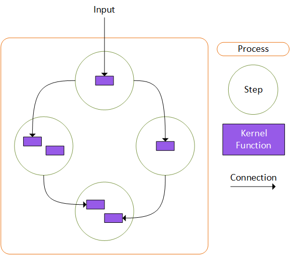

# 使用 Semantic Kernel 执行业务流程

## 上下文和问题陈述

我们从许多客户那里听说，他们需要企业级解决方案来自动化 AI 集成的业务流程。
概括地说，业务流程的结构是：

- 从外部事件开始
- 包含结构化活动或任务的集合
- 这些任务的定义序列，用于生成可增加价值的服务或产品
- 服务于业务目标

用技术术语来说，过程是可以表示为图形的东西，其中图形中的节点表示工作单元，节点之间的边表示可能携带也可能不携带数据的因果激活。有许多基于图形的工作流引擎示例，这些引擎适用于处理传统的企业流程。示例包括GitHub Actions & Workflows，Argo Workflows，Dapr Workflows等等。但是，与 AI 集成的额外要求增加了这些框架可能无法充分支持的新要求。这些功能包括支持图中的循环、动态创建的节点和边缘、支持 AI 驱动场景的节点和边缘级元数据，以及与 AI 编排的简化集成，这些都是这些不完全支持的功能。

## 决策驱动因素

- 客户应该能够利用他们在 Semantic Kernel 的所有支持语言中的现有投资。
- ```

  ```

- 客户应该能够利用他们在基础设施方面的现有投资。
- 客户应该能够与他们的业务流程对等方协作，以构建可组合的流程。
- 客户应该能够使用 AI 来增强和简化其业务流程中的步骤。
- 客户应该能够以定义和可重复的方式控制工艺流程。
- 客户应该能够轻松建模可能需要周期和动态边缘的典型 AI 驱动场景。
- 流程应该能够支持短期瞬态业务流程以及长期业务流程。
- 进程应该能够在本地运行、部署为单个进程或部署到分布式服务。
- 进程应该能够在本地运行和调试，而无需额外的软件或基础设施。
- 进程应该是有状态的，并且能够从暂停状态或可恢复错误中恢复。
- 受监管客户应该能够端到端地审计当前正在运行或已完成的流程。

## 考虑的选项

### 选项 #1：

**_在现有工作流框架的基础上构建现有示例_**：
此选项已通过 Dapr Workflows、Argo、Durable Tasks 等框架进行探索。在可以支持上面列出的技术要求的子集或这些选项中，主要关注的是使用它们所需的开销量。其中许多框架需要大量代码和基础设施才能启动和运行，并且需要特殊的仿真器在本地运行，这是不可取的。需要注意的是，此选项与其他选项并不互斥，即使我们也选择采用不同的路线，我们也可以选择构建显示 SK 与其他工作流引擎集成的示例。

### 选项 #2：

**_在现有工作流框架中构建 SK Process 库_**：
在探索的所有框架中，少数几个似乎最接近满足上面列出的技术要求的框架是基于 [Durable Tasks](https://github.com/Azure/durabletask) 的。这包括 Dapr 工作流、Azure Durable Functions 或 Durable Tasks Framework 本身等内容。尝试在这些框架上构建工作解决方案会导致基本方案的界面尴尬，因为 Durable Tasks 的底层结构是无状态的，只有中央业务流程协调程序是有状态的。虽然许多 AI 驱动的工作流程很可能可以在这种类型的系统中建模，但从可用性的角度来看，我们的探索并没有产生我们满意的东西。

### 选项 #3：

**_使用自定义构建工作流引擎构建 SK Process 库_**：
构建自定义工作流引擎可能会提供最干净的集成，但需要大量资源和时间，而我们没有。分布式工作流引擎本身就是产品。

### 选项 #4：

**_使用现有工作流框架的连接器构建与平台无关的 SK Process 库_**：
这是选定的选项。

## 决策结果

**_所选选项 - #4_**：使用现有工作流框架的连接器构建与平台无关的 SK Process 库。
这是满足所有技术和场景驱动要求的唯一选择。此选项应该允许将简单且良好集成的接口集成到 Semantic Kernel 中，并能够支持许多现有的分布式运行时，这将使我们的客户能够灵活地使用其现有的基础设施和专业知识。

### Process 库的组件

拟议的 Process 架构基于图形执行模型，其中节点（我们称为 Steps）通过调用用户定义的 Kernel Functions 来执行工作。图形中的边缘是从事件驱动的角度定义的，并携带有关事件的元数据以及包含 Kernel Function 调用输出的数据有效负载。

从头开始，流程的组成部分是：

1.  **_KernelFunctions_**：我们的客户已经知道和使用的相同 KernelFunctions。这里没什么新鲜事。
1.  **_步骤_**：步骤将一个或多个 KernelFunctions 组合到一个具有可选用户定义状态的对象中。一个步骤表示流程中的一个工作单元。步骤通过发出事件，使其工作的输出对流程中的其他步骤可见。这种基于事件的结构允许创建步骤，而无需知道它们在哪个流程中使用，从而允许它们在多个流程中重复使用。
1.  **_流程_**：流程将多个步骤组合在一起，并定义输出从步骤到步骤的流程方式。该进程提供了一些方法，允许开发人员通过指定应接收事件的步骤和关联的 KernelFunctions 来定义步骤发出的事件的路由。



让我们看看创建简单流程所需的代码。

#### 第 1 步 - 定义步骤：

需要执行从 abstract 类型继承`KernelStepBase`的步骤，该类型允许选择性地实现激活和停用生命周期方法。

```csharp
// Define UserInputStep with no state
public class UserInputStep : KernelStepBase
{
    public override ValueTask ActivateAsync()
    {
        return ValueTask.CompletedTask;
    }

    [KernelFunction()]
    public string GetUserInput(string userMessage)
    {
        return $"User: {userMessage}";
    }
}

```

 `UserInputStep` 上面显示的是具有一个 KernelFunction 且没有状态管理的步骤的最小实现。此步骤中的代码不会显式发出任何事件，但是，执行 将自动 `PrintUserMessage` 发出一个事件，指示执行成功并带有关联的结果，或执行失败并带有关联的错误。

让我们创建第二个步骤来获取用户输入并从 LLM 获取响应。此步骤将是有状态的，以便它可以维护 `ChatHistory`.首先定义用于跟踪状态的类：

```csharp
public class ChatBotState
{
    public ChatHistory ChatMessages { get; set; } = new();
}

```

接下来定义步骤：

```csharp
// Define ChatBotResponseStep with state of type ChatBotState
public class ChatBotResponseStep : KernelStepBase<ChatBotState>
{
    private readonly Kernel _kernel;
    internal ChatBotState? _state;

    public ChatBotResponseStep(Kernel kernel)
    {
        _kernel = kernel;
    }

    public override ValueTask ActivateAsync(ChatBotState state)
    {
        _state = state;
        _state.ChatMessages ??= new();
        return ValueTask.CompletedTask;
    }

    [KernelFunction()]
    public async Task GetChatResponse(KernelStepContext context, string userMessage)
    {
        _state!.ChatMessages.Add(new(AuthorRole.User, userMessage));
        IChatCompletionService chatService = _kernel.Services.GetRequiredService<IChatCompletionService>();
        ChatMessageContent response = await chatService.GetChatMessageContentAsync(_state.ChatMessages);
        if (response != null)
        {
            _state.ChatMessages.Add(response!);
        }

        // emit event: assistantResponse
        context.PostEvent(new CloudEvent { Id = ChatBotEvents.AssistantResponseGenerated, Data = response });
    }
}

```

这 `ChatBotResponseStep` 比 `UserInputStep` 和 显示以下功能更现实：

**_状态管理_**：首先要注意的是，状态对象是由 Process 自动创建的，并注入到方法中 `ActivateAsync` 。Process 将在成功执行该步骤的任何 KernelFunctions 后立即自动保留 state 对象。进程使用 JSON 序列化来持久保存和解除冻结状态对象，因此我们要求这些类型具有默认构造函数，并且仅包含 JSON 可序列化的对象。

**_步骤上下文_**： `GetChatResponse` KernelFunction 具有 `KernelStepContext` 由 Process 自动提供的 type 参数。此对象提供允许步骤显式发出事件的功能，例如 `ChatBotEvents.AssistantResponseGenerated` 在这种情况下。步骤上下文还可以为高级方案提供功能，例如使用持久计时器和动态地向流程添加新步骤。

**_云事件_**：步骤和流程中的事件使用 [Cloud Events](https://github.com/cloudevents/spec)。Cloud Events 提供了一个开源的行业标准规范，用于以通用格式描述事件数据，从而提供跨服务、平台和系统的互作性。这将允许 Processes 向外部系统发送/接收事件，而无需自定义连接器或映射中间件。

#### 第 2 步 - 定义流程：

现在我们已经定义了我们的步骤，我们可以继续定义我们的流程。首先要做的是将步骤添加到流程中...

```csharp

KernelProcess process = new("ChatBot");

var userInputStep = process.AddStepFromType<UserInputStep>(isEntryPoint: true);
var responseStep = process.AddStepFromType<ChatBotResponseStep>();

```

上面创建的两个步骤已添加到我们的新流程中 `ChatBot` ，并且 `UserInputStep` 已声明为入口点。这意味着该进程收到的任何事件都将被转发到此步骤。现在，我们需要通过描述步骤中的事件触发了哪些作来定义流程的流程。

```csharp

// When the userInput step completes, send the output to the llm response step
userInputStep
    .OnFunctionResult(nameof(UserInputStep.GetUserInput))
    .SendOutputTo(responseStep, nameof(ChatBotResponseStep.GetChatResponse), "userMessage");

```

在上面的代码中， `userInputStep.OnFunctionResult(nameof(UserInputStep.GetUserInput))` 选择进程在引用 `GetUserInput` 的步骤实例中成功执行 KernelFunction `userInputStep` 时由进程发出的事件。然后，它返回一个构建器类型对象，该对象根据上下文提供作。在这种情况下，该 `SendOutputTo(responseStep, nameof(ChatBotResponseStep.GetChatResponse), "userMessage")`作用于将事件数据转发到 `userMessage` 引用的步骤实例上的 KernelFunction `GetChatResponse` 参数`responseStep`。

这里的一个关键要点是，可以选择给定步骤发出的事件，并将其转发到另一个步骤中**_特定 KernelFunction 的特定参数_**。发送到 KernelFunctions 参数的事件数据将排队，直到函数的所有必需参数都收到输入，此时将调用该函数。

#### 第 3 步 - 从进程获取输出：

现在我们已经定义了我们的流程，我们想检查它产生的最终结果。在许多情况下，该过程的结果将被写入数据库、队列或其他一些内部系统，这就是所需的全部内容。但是，在某些情况下，例如，由于同步 REST 调用而在服务器中运行的进程，需要从已完成的进程中提取结果，以便将其返回给调用方。在这些情况下，可以在要由特定事件触发的进程上注册处理程序函数。

让我们连接上面的过程，以便在步骤完成时运行处理程序函数 `ChatBotResponseStep` 。

```csharp

process.OnEvent(ChatBotEvents.AssistantResponseGenerated).Run((CloudEvent e) =>
{
    result = (int)e.Data!;
    Console.WriteLine($"Result: {result}");
});

```

需要注意的关键是，进程内发出的事件 `ChatBotResponseStep` 也是从进程本身发出的，这允许我们为其注册一个处理程序。进程中的所有事件都将从进程中冒出来，到达父进程，父进程可能是运行该进程的程序，也可能是另一个进程。此模式允许嵌套流程，其中现有流程可用作另一个流程中的步骤。

#### 步骤 4 - 流程对象模型：

 `KernelProcess` 我们创建的实例只不过是一个描述底层图的对象模型。它包含一个步骤集合，而这些步骤又包含一组边缘。此对象模型设计为可序列化为人类可读格式（如 Json/Yaml），因为允许将流程定义与运行流程的系统分离。

```json
{
  "EntryPointId": "efbfc9ca0c1942a384d21402c9078784",
  "Id": "19f669adfa5b40688e818e400cb9750c",
  "Name": "NestedChatBot",
  "StepType": "SemanticKernel.Processes.Core.KernelProcess, SemanticKernel.Processes.Core, Version=1.0.0.0, Culture=neutral, PublicKeyToken=null",
  "StateType": "SemanticKernel.Processes.Core.DefaultState, SemanticKernel.Processes.Core, Version=1.0.0.0, Culture=neutral, PublicKeyToken=null",
  "OutputEdges": {},
  "StepProxies": [
    {
      "Id": "6fa2d6b513464eb5a4daa9b5ebc1a956",
      "Name": "UserInputStep",
      "StepType": "SkProcess.Orleans.Silo.UserInputStep, SkProcess.Orleans.Silo, Version=1.0.0.0, Culture=neutral, PublicKeyToken=null",
      "StateType": "SkProcess.Orleans.Silo.UserInputState, SkProcess.Orleans.Silo, Version=1.0.0.0, Culture=neutral, PublicKeyToken=null",
      "OutputEdges": {
        "UserInputStep_6fa2d6b513464eb5a4dxa9b5ebc1a956.exit": [
          {
            "SourceId": "6fa2d6b513464eb5a4dxa9b5ebc1a956",
            "OutputTargets": [
              {
                "StepId": "End",
                "FunctionName": "",
                "ParameterName": ""
              }
            ]
          }
        ],
        "UserInputStep_6fa2d6b513464eb5a4dxa9b5ebc1a956.userInputReceived": [
          {
            "SourceId": "6fa2d6b513464eb5a4daa9b5ebc1a956",
            "OutputTargets": [
              {
                "StepId": "5035d41383314343b99ebf6e1a1a1f99",
                "FunctionName": "GetChatResponse",
                "ParameterName": "userMessage"
              }
            ]
          }
        ]
      }
    },
    {
      "Id": "5035d41383314343b99ebf6e1a1a1f99",
      "Name": "AiResponse",
      "StepType": "SemanticKernel.Processes.Core.KernelProcess, SemanticKernel.Processes.Core, Version=1.0.0.0, Culture=neutral, PublicKeyToken=null",
      "StateType": "SemanticKernel.Processes.Core.DefaultState, SemanticKernel.Processes.Core, Version=1.0.0.0, Culture=neutral, PublicKeyToken=null",
      "OutputEdges": {
        "AiResponse_5035d41383314343b99ebf6e1a1a1f99.TransformUserInput.OnResult": [
          {
            "SourceId": "5035d41383314343b99ebf6e1a1a1f99",
            "OutputTargets": [
              {
                "StepId": "6fa2d6b513464eb5a4daa9b5ebc1a956",
                "FunctionName": "GetUserInput",
                "ParameterName": ""
              }
            ]
          }
        ]
      }
    }
  ]
}
```

#### 第 5 步 - 运行进程：

运行进程需要使用指向受支持的运行时的“连接器”。作为核心包的一部分，我们将包括一个进程内运行时，它能够在开发机器或服务器中本地运行进程。此运行时最初将使用基于内存或文件的持久性，并允许轻松进行开发和调试。

此外，我们还将支持基于 [Orleans](https://learn.microsoft.com/en-us/dotnet/orleans/overview) 和 [Dapr Actor 的](https://docs.dapr.io/developing-applications/building-blocks/actors/actors-overview/)运行时，这将使客户能够轻松地将流程部署为分布式且高度可扩展的基于云的系统。

### 包

将为 Processes 创建以下包：

- **_Microsoft.SemanticKernel.Process.Abstractions_**

  包含所有其他包使用的公共接口和 DTO。

- **_Microsoft.SemanticKernel.Process.Core_**

  包含用于定义步骤和流程的核心功能。

- **_Microsoft.SemanticKernel.Process.Server_**

  包含进程内运行时。

- **_Microsoft.SemanticKernel.Process_**

  包含 Microsoft.SemanticKernel.Process.Abstractions、Microsoft.SemanticKernel.Process.Core 和 Microsoft.SemanticKernel.Process.Server

- **_Microsoft.SemanticKernel.Process.Orleans_**

  包含基于 Orleans 的运行时。

- **_Microsoft.SemanticKernel.Process.Dapr_**

  包含基于 Dapr 的运行时。

## 更多信息

### 进程运行时架构：

在验证建议的解决方案时，创建了两个运行时，一个用于本地/服务器方案，另一个用于使用 Orleans 的分布式执行组件方案。这两个实现都基于 [Pregel 算法](https://kowshik.github.io/JPregel/pregel_paper.pdf) 进行大规模图形处理。此算法经过充分测试，非常适合单机场景以及分布式系统。有关 Pregel 算法工作原理的更多信息，请访问以下链接。

<!-- [Pregel - The Morning Paper](https://blog.acolyer.org/2015/05/26/pregel-a-system-for-large-scale-graph-processing/) -->
<!-- [Pregel - Distributed Algorithms and Optimization](https://web.stanford.edu/~rezab/classes/cme323/S15/notes/lec8.pdf) -->
