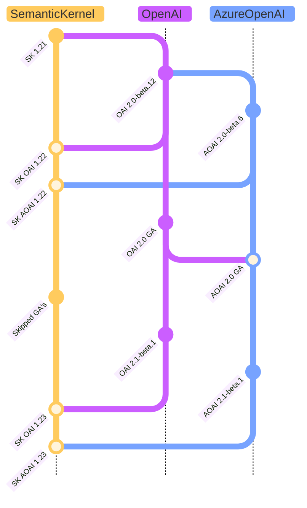
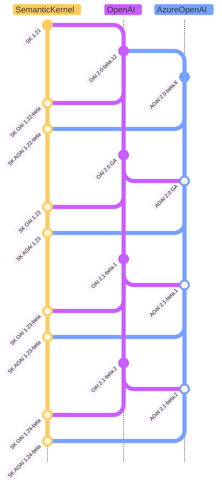
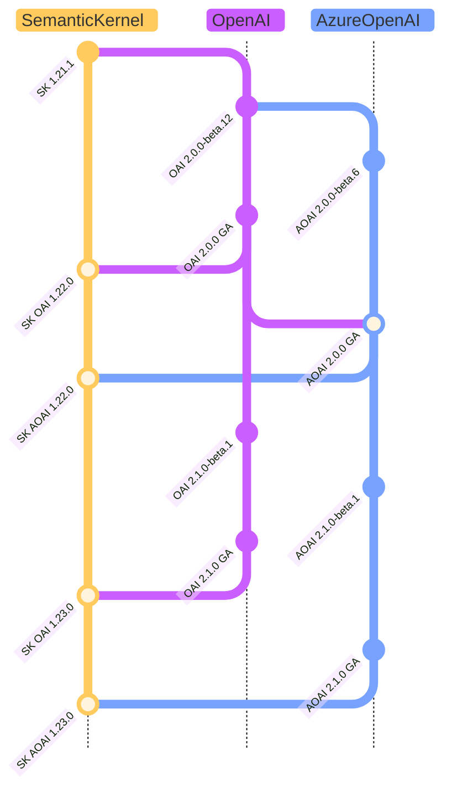

# 底层 SDK 的连接器版本控制策略

## 上下文和问题陈述

本周 （2024 年 10 月 1 日） OpenAI 和 Azure OpenAI 发布了他们的第一个稳定版本，我们需要就如何推进下一版本的连接器的版本控制策略提供一些选项 `OpenAI` `AzureOpenAI` ，这也将为其他连接器和提供商的版本控制策略奠定前进的道路。

这个 ADR 带来了不同的选择，我们如何向前思考对用户的影响，以及如何在我们的策略上保持明确的信息。

目前，Azure Open AI GA 包与我们预期的选择相反，从其第一个 GA 版本中删除了以前在预览包中提供的许多功能。

这也要求我们重新考虑如何为以下版本的连接器实施策略。

| 名字                | SDK 命名空间   | 语义内核 NameSpace                       |
| ------------------- | --------------- | ----------------------------------------------- |
| OpenAI （OAI）        | 开放人工智能          | Microsoft.SemanticKernel.Connectors.OpenAI      |
| Azure OpenAI （AOAI） | Azure.AI.OpenAI | Microsoft.SemanticKernel.Connectors.AzureOpenAI |

## 决策驱动因素

- 最大限度地减少客户的影响
- 允许客户使用 OpenAI 和 Azure.AI.OpenAI 包的 GA 或 Beta 版本
- 明确说明我们的战略
- 保持与以前版本的兼容性
- 我们的包版本控制应该清楚地表明我们依赖哪个版本的 OpenAI 或 Azure.AI.OpenAI 包
- 遵循语义内核版本控制策略，使其能够很好地适应其他 SDK 版本策略。

## 考虑的选项

1. **按原样保留** - 仅定位预览包。
2. **预览版 + GA 版本控制** （在 Azure OpenAI 和 OpenAI 连接器之间并排创建新版本（GA + 预发布版））。
3. **停止定位预览包**，仅定位 GA 包。

## 1. 保持原样 - 仅定位预览包

此选项将保留当前仅面向预览包的策略，这将保持与以前版本和新 GA 目标版本和管道的兼容性。此选项对我们的用户和我们的管道策略的影响最小。

目前，所有已在使用 Azure OpenAI 连接器的客户都将其管道配置为使用预览包。

优点：

- 策略没有变化。（对客户的影响最小）
- 保持与以前版本和新的 GA 目标版本和管道的兼容性。
- 与我们之前以预览包为目标的策略兼容。
- Azure 和 OpenAI SDK 将始终与新的 GA 版本同步，从而使我们能够使用最新的 GA 补丁保留定位预览。

缺点：

- 不会有面向 OpenAI 或 AzureOpenAI 的稳定 GA 包的 SK 连接器版本。
- 如果新客户了解并仅以 GA 可用功能为目标，并且严格要求依赖软件包也要为 GA，则新客户将无法使用 SK 连接器。（我们没有估计值，但与过去 18 个月中已经同意使用预览版 Azure SDK OpenAI SDK 的客户数量相比，这可能非常小）
- OpenAI 和 Azure.AI.OpenAI beta 版本引入的潜在意外中断性变更，由于它们的依赖关系，我们最终可能会传递这些变更。

## 2. 预览版 + GA 版本控制

此选项我们将介绍连接器的预发布版本：

1. 连接器的正式发布 （GA） 版本将面向 SDK 的 GA 版本。
2. 连接器的预发布版本将面向 SDK 的预发布版本。

对于在管道上严格仅针对 GA 包，同时使用基础 SDK GA 版本上不再可用的预览功能的客户，此选项会有一些影响。

SDK 中不可用的所有仅预览功能都将在 Semantic kernel connectors 中使用 Experimental `SKEXP0011` 专用标识符属性进行注释，以识别和阐明尝试移动到包时的潜在影响 `GA` 。
一旦这些注释在 SDK 的 GA 版本上得到正式支持，它们就会被删除。

优点：

- 我们向前发出了一个明确的信息，即 Azure 和 OpenAI 认为哪些是稳定的，哪些不是，在我们之前认为是 GA 可用功能中仅公开这些 SDK 的稳定功能。
- 对依赖软件包也有 GA 严格要求的新客户将能够使用 SK 连接器。
- 我们将能够为尚未正式发布的新功能提供连接器的预览版，而不会影响连接器的正式发布版本。

缺点：

- 这改变了我们的版本控制策略，需要对第一个版本进行一些明确的澄清和沟通，以减轻影响或顺利过渡。
- 使用 `OpenAI` 和 `AzureOpenAI` 仅预览以前 SK GA 包中提供的功能的客户需要更新其管道，以仅面向未来的 SK 预发布版本。
- Small 开销，用于维护两个版本的连接器。

### 版本和分支策略

为连接器的目标版本创建一个特殊的发布分支 `GA` ，将其保存在该版本的记录中，其中包含所有其他项目为使用稳定版本而需要进行的所有修改/删除，这也将是关于何时何地从 API 示例中添加/删除异常的重要指南 `SKEXP0011` 。

我们将遵循自己的版本节奏， `beta` 为基础 `beta` SDK 的版本添加前缀。

| 序列 | OpenAI 版本 | Azure OpenAI 版本 | 语义内核版本1 | 分支          |
| --- | -------------- | -------------------- | ----------------------------------- | --------------- |
| 1   | 2.0.0          | 2.0.0                | 1.25.0                              | 版本/1.25.0 |
| 2   | 2.1.0-beta.1 版本   | 2.1.0-beta.1 版本         | 1.26.0-测试版                         | 主要            |
| 3   | 2.1.0-beta.3 版   | 2.1.0-beta.2 版本         | 1.27.0-测试版                         | 主要            |
| 4   | 无变化     | 无变化           | 1.27.1-测试版**2**         | 主要            |
| 5   | 2.1.0          | 2.1.0                | 1.28.0                              | 版本/1.28.0 |
| 6   | 2.2.0-beta.1 版本   | 2.1.0-beta.1 版本         | 1.29.0-测试版                         | 主要            |

1. 版本适用于 **Connectors 包** 和 **Semantic Kernel 元包**。
2. SDK 没有变化，但对语义内核代码库进行了其他细微的更改，需要更新版本。

### 可选的平滑过渡

为了顺利过渡并减轻对使用 SK GA 包上的预览功能的客户的影响，我们将提供一个通知期，让客户有时间适应 `preview` `GA` 连接器包的未来版本。而在通知期限内，我们会在切换到 **Preview + GA versioning** 选项之前，使用 **Keep As-Is** 选项来维护我们的策略。

## 3. 停止定位预览包

> [!警告]不建议使用此选项，但需要考虑此选项。
> 
此选项将停止以预览包为目标，严格执行我们的 1.0 GA 策略，不会让我们的客户接触到非 GA SDK 功能。

由于 Azure 助手等重要功能仍处于预览阶段，因此，如果我们的客户面向尚未正式发布的代理框架和其他重要功能，则此选项将对我们的客户产生重大影响。在此处描述 

> Assistants、Audio Generation、Batch、Files、Fine-Tuning 和 Vector Store 尚未包含在 GA Surface 中;它们将继续在预览库版本和原始 Azure OpenAI 服务 api 版本标签中提供。

优点：

- 由于我们只部署了连接器的 GA 版本，因此严格来说，我们将遵循负责任的仅 GA 方法，使用 GA SK 包，而不会将客户作为 GA 功能公开预览功能。

缺点：

- 对以预览功能为目标而没有选项求助于连接器预览版的客户产生重大影响。
- 此策略将导致将语义内核与 Azure 中的助手和任何其他预览功能一起使用变得不切实际。

## 决策结果

已选择选项： **保持原样**

由于 SDK 的当前 AI 环境是一个快速变化的环境，我们需要能够更新，同时尽可能避免混合我们当前的版本控制策略，同时最大限度地减少对客户的影响。我们目前决定使用**“保持原样**”选项，将来可能会重新考虑“**预览版 + GA”版本控制**选项，前提是该决定不会因缺少客户群已使用的重要功能而产生重大影响。
