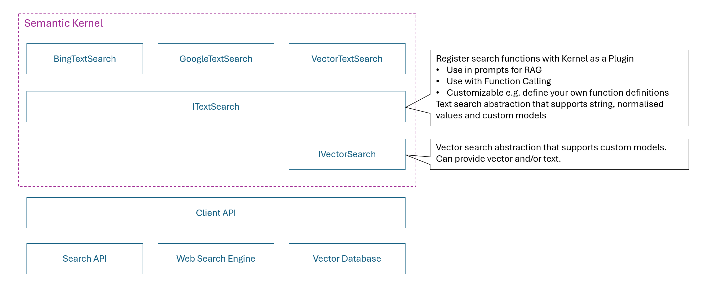
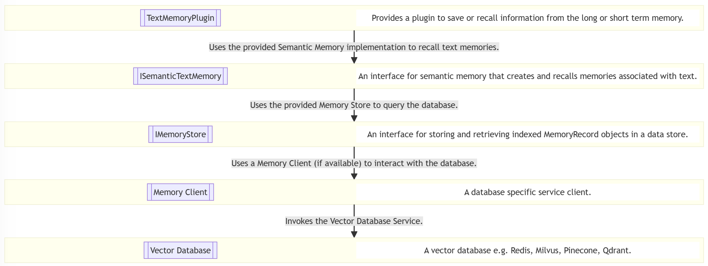
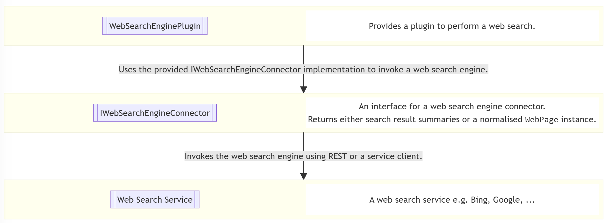

# 文本搜索抽象

## 上下文和问题陈述

Semantic Kernel 支持使用流行的 Vector 数据库（如 Azure AI Search、Chroma、Milvus）以及 Web 搜索引擎（如 Bing、Google）进行搜索。
有两组抽象和插件，具体取决于开发人员是要对 Vector 数据库还是 Web 搜索引擎执行搜索。
当前的抽象是实验性的，此 ADR 的目的是推进抽象的设计，以便它们可以升级到非实验状态。

我们需要支持两个主要用例：

1. 使 Prompt Engineers 能够轻松地在提示中插入接地信息，即支持 Retrieval-Augmented Generation 场景。
2. 使开发人员能够注册搜索插件，LLM 可以调用这些插件来检索响应用户请求所需的其他数据，即支持函数调用场景。

这两种方案的共同点是，我们需要 `KernelPlugin` 从搜索服务生成一个，并将其注册以用于 `Kernel`.

### 检索增强生成场景

检索增强生成 （RAG） 是优化 LLM 输出的过程，因此在生成响应时，它会引用可能不是其训练数据一部分的权威数据。这降低了幻觉的可能性，并且还允许提供最终用户可以用来独立验证 LLM 的响应的引文。RAG 的工作原理是检索与 use 查询相关的其他数据，然后在发送到 LLM 之前使用此数据扩充提示。

请考虑以下示例，其中排名靠前的 Bing 搜索结果作为附加数据包含在提示中。

```csharp
// Create a kernel with OpenAI chat completion
IKernelBuilder kernelBuilder = Kernel.CreateBuilder();
kernelBuilder.AddOpenAIChatCompletion(
        modelId: TestConfiguration.OpenAI.ChatModelId,
        apiKey: TestConfiguration.OpenAI.ApiKey,
        httpClient: httpClient);
Kernel kernel = kernelBuilder.Build();

// Create a text search using the Bing search service
var textSearch = new BingTextSearch(new(TestConfiguration.Bing.ApiKey));

// Build a text search plugin with Bing search service and add to the kernel
var searchPlugin = textSearch.CreateKernelPluginWithTextSearch("SearchPlugin");
kernel.Plugins.Add(searchPlugin);

// Invoke prompt and use text search plugin to provide grounding information
var query = "What is the Semantic Kernel?";
KernelArguments arguments = new() { { "query", query } };
Console.WriteLine(await kernel.InvokePromptAsync("{{SearchPlugin.Search $query}}. {{$query}}", arguments));
```

此示例的工作原理如下：

1. 创建 `BingTextSearch` 可执行 Bing 搜索查询的 Bing。
2. 将 `BingTextSearch` 包装为 可在渲染提示时调用的插件。
3. 插入对插件的调用，该插件使用 user 查询执行搜索。
4. 提示将使用顶部搜索结果中的摘要进行扩充。

**注：** 在这种情况下，搜索结果中的摘要是提示中唯一包含的数据。
如果 LLM 认为相关，则应使用此数据，但没有向用户提供允许的反馈机制
它们来验证数据的来源。

以下示例显示了此问题的解决方案。

```csharp
// Create a kernel with OpenAI chat completion
IKernelBuilder kernelBuilder = Kernel.CreateBuilder();
kernelBuilder.AddOpenAIChatCompletion(
        modelId: TestConfiguration.OpenAI.ChatModelId,
        apiKey: TestConfiguration.OpenAI.ApiKey,
        httpClient: httpClient);
Kernel kernel = kernelBuilder.Build();

// Create a text search using the Bing search service
var textSearch = new BingTextSearch(new(TestConfiguration.Bing.ApiKey));

// Build a text search plugin with Bing search service and add to the kernel
var searchPlugin = textSearch.CreateKernelPluginWithGetSearchResults("SearchPlugin");
kernel.Plugins.Add(searchPlugin);

// Invoke prompt and use text search plugin to provide grounding information
var query = "What is the Semantic Kernel?";
string promptTemplate = @"
{{#with (SearchPlugin-GetSearchResults query)}}  
  {{#each this}}  
    Name: {{Name}}
    Value: {{Value}}
    Link: {{Link}}
    -----------------
  {{/each}}  
{{/with}}  

{{query}}

Include citations to the relevant information where it is referenced in the response.
";

KernelArguments arguments = new() { { "query", query } };
HandlebarsPromptTemplateFactory promptTemplateFactory = new();
Console.WriteLine(await kernel.InvokePromptAsync(
    promptTemplate,
    arguments,
    templateFormat: HandlebarsPromptTemplateFactory.HandlebarsTemplateFormat,
    promptTemplateFactory: promptTemplateFactory
));
```

此示例的工作原理如下：

1. 创建一个 `BingTextSearch` 可以执行必应搜索查询并将响应转换为规范化格式的响应。
2. 规范化格式是一个 Semantic Kernel 抽象，它 `TextSearchResult` 包括每个搜索结果的名称、值和链接。
3. 将 `BingTextSearch` 包装为 可在渲染提示时调用的插件。
4. 插入对插件的调用，该插件使用 user 查询执行搜索。
5. 提示将增加顶部搜索结果中的名称、值和链接。
6. 该提示还指示 LLM 在响应中包含对相关信息的引用。

示例响应如下所示：

```
The Semantic Kernel (SK) is a lightweight and powerful SDK developed by Microsoft that integrates Large Language Models (LLMs) such as OpenAI, Azure OpenAI, and Hugging Face with traditional programming languages like C#, Python, and Java ([GitHub](https://github.com/microsoft/semantic-kernel)). It facilitates the combination of natural language processing capabilities with pre-existing APIs and code, enabling developers to add large language capabilities to their applications swiftly ([What It Is and Why It Matters](https://techcommunity.microsoft.com/t5/microsoft-developer-community/semantic-kernel-what-it-is-and-why-it-matters/ba-p/3877022)).

The Semantic Kernel serves as a middleware that translates the AI model's requests into function calls, effectively bridging the gap between semantic functions (LLM tasks) and native functions (traditional computer code) ([InfoWorld](https://www.infoworld.com/article/2338321/semantic-kernel-a-bridge-between-large-language-models-and-your-code.html)). It also enables the automatic orchestration and execution of tasks using natural language prompting across multiple languages and platforms ([Hello, Semantic Kernel!](https://devblogs.microsoft.com/semantic-kernel/hello-world/)).

In addition to its core capabilities, Semantic Kernel supports advanced functionalities like prompt templating, chaining, and planning, which allow developers to create intricate workflows tailored to specific use cases ([Architecting AI Apps](https://devblogs.microsoft.com/semantic-kernel/architecting-ai-apps-with-semantic-kernel/)).

By describing your existing code to the AI models, Semantic Kernel effectively marshals the request to the appropriate function, returns results back to the LLM, and enables the AI agent to generate a final response ([Quickly Start](https://learn.microsoft.com/en-us/semantic-kernel/get-started/quick-start-guide)). This process brings unparalleled productivity and new experiences to application users ([Hello, Semantic Kernel!](https://devblogs.microsoft.com/semantic-kernel/hello-world/)).

The Semantic Kernel is an indispensable tool for developers aiming to build advanced AI applications by seamlessly integrating large language models with traditional programming frameworks ([Comprehensive Guide](https://gregdziedzic.com/understanding-semantic-kernel-a-comprehensive-guide/)).
```

**注意：** 在这种情况下，有一个指向相关信息的链接，以便最终用户可以点击这些链接来验证响应。

下一个示例显示了使用 Bing 文本搜索和内置结果类型的替代解决方案。

```csharp
// Create a kernel with OpenAI chat completion
IKernelBuilder kernelBuilder = Kernel.CreateBuilder();
kernelBuilder.AddOpenAIChatCompletion(
        modelId: TestConfiguration.OpenAI.ChatModelId,
        apiKey: TestConfiguration.OpenAI.ApiKey,
        httpClient: httpClient);
Kernel kernel = kernelBuilder.Build();

// Create a text search using the Bing search service
var textSearch = new BingTextSearch(new(TestConfiguration.Bing.ApiKey));

// Build a text search plugin with Bing search service and add to the kernel
var searchPlugin = textSearch.CreateKernelPluginWithGetBingWebPages("SearchPlugin");
kernel.Plugins.Add(searchPlugin);

// Invoke prompt and use text search plugin to provide grounding information
var query = "What is the Semantic Kernel?";
string promptTemplate = @"
{{#with (SearchPlugin-GetBingWebPages query)}}  
  {{#each this}}  
    Name: {{Name}}
    Snippet: {{Snippet}}
    Link: {{DisplayUrl}}
    Date Last Crawled: {{DateLastCrawled}}
    -----------------
  {{/each}}  
{{/with}}  

{{query}}

Include citations to and the date of the relevant information where it is referenced in the response.
";
KernelArguments arguments = new() { { "query", query } };
HandlebarsPromptTemplateFactory promptTemplateFactory = new();
Console.WriteLine(await kernel.InvokePromptAsync(
    promptTemplate,
    arguments,
    templateFormat: HandlebarsPromptTemplateFactory.HandlebarsTemplateFormat,
    promptTemplateFactory: promptTemplateFactory
));
```

此示例的工作原理如下：

1. 创建 `BingTextSearch` 可执行 Bing 搜索查询的 Bing。
2. 默认格式是 Bing 特定类，该类包括 `BingWebPage` 名称、代码段、显示 URL 和上次为每个搜索结果爬网的日期。
3. 将 `BingTextSearch` 包装为 可在渲染提示时调用的插件。
4. 插入对插件的调用，该插件使用 user 查询执行搜索。
5. 提示将添加名称、代码段、显示 URL 和上次从顶部搜索结果中抓取的日期。
6. 该提示还指示 LLM 在回复中包含相关信息的引文和日期。

示例响应如下所示：

```
Semantic Kernel is an open-source development kit designed to facilitate the integration of advanced AI models into existing C#, Python, or Java codebases. It serves as an efficient middleware that enables rapid delivery of enterprise-grade AI solutions (Microsoft Learn, 2024-08-14).

One of the standout features of Semantic Kernel is its lightweight SDK, which allows developers to blend conventional programming languages with Large Language Model (LLM) AI capabilities through prompt templating, chaining, and planning (Semantic Kernel Blog, 2024-08-10).

This AI SDK uses natural language prompting to create and execute semantic AI tasks across multiple languages and platforms, offering developers a simple yet powerful programming model to add large language capabilities to their applications in a matter of minutes (Microsoft Developer Community, 2024-08-13).

Semantic Kernel also leverages function calling—a native feature of most LLMs—enabling the models to request specific functions to fulfill user requests, thereby streamlining the planning process (Microsoft Learn, 2024-08-14).

The toolkit is versatile and extends support to multiple programming environments. For instance, Semantic Kernel for Java is compatible with Java 8 and above, making it accessible to a wide range of Java developers (Semantic Kernel Blog, 2024-08-14).

Additionally, Sketching an architecture with Semantic Kernel can simplify business automation using models from platforms such as OpenAI, Azure OpenAI, and Hugging Face (Semantic Kernel Blog, 2024-08-14).

For .NET developers, Semantic Kernel is highly recommended for working with AI in .NET applications, offering a comprehensive guide on incorporating Semantic Kernel into projects and understanding its core concepts (Microsoft Learn, 2024-08-14).

Last but not least, Semantic Kernel has an extension for Visual Studio Code that facilitates the design and testing of semantic functions, enabling developers to efficiently integrate and test AI models with their existing data (GitHub, 2024-08-14).

References:
- Microsoft Learn. "Introduction to Semantic Kernel." Last crawled: 2024-08-14.
- Semantic Kernel Blog. "Hello, Semantic Kernel!" Last crawled: 2024-08-10.
- Microsoft Developer Community. "Semantic Kernel: What It Is and Why It Matters." Last crawled: 2024-08-13.
- Microsoft Learn. "How to quickly start with Semantic Kernel." Last crawled: 2024-08-14.
- Semantic Kernel Blog. "Introducing Semantic Kernel for Java." Last crawled: 2024-08-14.
- Microsoft Learn. "Semantic Kernel overview for .NET." Last crawled: 2024-08-14.
- GitHub. "microsoft/semantic-kernel." Last crawled: 2024-08-14.
```

在前面的示例中，网页中的一段文本用作相关信息。完整页面内容的 URL 也可用，因此可以下载和使用完整页面。可能还有其他搜索实现不包含任何相关信息，只包含一个链接，下一个示例将介绍如何处理这种情况。

```csharp
// Build a text search plugin with Bing search service and add to the kernel
var searchPlugin = KernelPluginFactory.CreateFromFunctions("SearchPlugin", null, [CreateGetFullWebPages(textSearch)]);
kernel.Plugins.Add(searchPlugin);

// Invoke prompt and use text search plugin to provide grounding information
var query = "What is the Semantic Kernel?";
string promptTemplate = @"
{{#with (SearchPlugin-GetFullWebPages query)}}  
  {{#each this}}  
    Name: {{Name}}
    Value: {{Value}}
    Link: {{Link}}
    -----------------
  {{/each}}  
{{/with}}  

{{query}}

Include citations to the relevant information where it is referenced in the response.
";
KernelArguments arguments = new() { { "query", query } };
HandlebarsPromptTemplateFactory promptTemplateFactory = new();
Console.WriteLine(await kernel.InvokePromptAsync(
    promptTemplate,
    arguments,
    templateFormat: HandlebarsPromptTemplateFactory.HandlebarsTemplateFormat,
    promptTemplateFactory: promptTemplateFactory
));
```

在此示例中，我们调用 `BingSearchExample.CreateGetFullWebPagesOptions(textSearch)` 以创建定义搜索插件的选项。

此方法的代码如下所示：

```csharp
private static KernelFunction CreateGetFullWebPages(ITextSearch<BingWebPage> textSearch, BasicFilterOptions? basicFilter = null)
{
    async Task<IEnumerable<TextSearchResult>> GetFullWebPagesAsync(Kernel kernel, KernelFunction function, KernelArguments arguments, CancellationToken cancellationToken)
    {
        arguments.TryGetValue("query", out var query);
        if (string.IsNullOrEmpty(query?.ToString()))
        {
            return [];
        }

        var parameters = function.Metadata.Parameters;

        arguments.TryGetValue("count", out var count);
        arguments.TryGetValue("skip", out var skip);
        SearchOptions searchOptions = new()
        {
            Count = (count as int?) ?? 2,
            Offset = (skip as int?) ?? 0,
            BasicFilter = basicFilter
        };

        var result = await textSearch.SearchAsync(query.ToString()!, searchOptions, cancellationToken).ConfigureAwait(false);
        var resultList = new List<TextSearchResult>();

        using HttpClient client = new();
        await foreach (var item in result.Results.WithCancellation(cancellationToken).ConfigureAwait(false))
        {
            string? value = item.Snippet;
            try
            {
                if (item.Url is not null)
                {
                    value = await client.GetStringAsync(new Uri(item.Url), cancellationToken);
                    value = ConvertHtmlToPlainText(value);
                }
            }
            catch (HttpRequestException)
            {
            }

            resultList.Add(new() { Name = item.Name, Value = value, Link = item.Url });
        }

        return resultList;
    }

    var options = new KernelFunctionFromMethodOptions()
    {
        FunctionName = "GetFullWebPages",
        Description = "Perform a search for content related to the specified query. The search will return the name, full web page content and link for the related content.",
        Parameters =
        [
            new KernelParameterMetadata("query") { Description = "What to search for", IsRequired = true },
            new KernelParameterMetadata("count") { Description = "Number of results", IsRequired = false, DefaultValue = 2 },
            new KernelParameterMetadata("skip") { Description = "Number of results to skip", IsRequired = false, DefaultValue = 0 },
        ],
        ReturnParameter = new() { ParameterType = typeof(KernelSearchResults<string>) },
    };

    return KernelFunctionFactory.CreateFromMethod(GetFullWebPagesAsync, options);
}
```

自定义 `CreateGetFullWebPages` 将产生一个搜索插件，其中包含一个名为 的函数 `GetFullWebPages`，此方法的工作原理如下：

1. 它使用 `BingTextSearch` 实例来检索指定查询的首页。
2. 对于每个网页，使用 url 读取完整的 HTML 内容，然后转换为纯文本表示形式。

下面是响应的示例：

```
    The Semantic Kernel (SK) is an open-source development kit from Microsoft designed to facilitate the integration of large language models (LLMs) into AI applications. It acts as middleware, enabling the rapid development of enterprise-grade solutions by providing a flexible, modular, and extensible programming model that supports multiple languages like C#, Python, and Java [^1^][^4^].

### Key Features:

1. **AI Service Integration**:
   - The Semantic Kernel supports popular AI models from providers like OpenAI, Azure OpenAI, and Hugging Face. It abstracts the complexity of these services, making it easier to integrate them into applications using traditional programming languages [^1^][^3^][^5^].
   
2. **Extensibility and Modularity**:
   - Semantic Kernel leverages plugins and OpenAPI specifications to integrate seamlessly with existing codebases. This enables developers to maximize their current investments while extending functionalities through connectors and new AI capabilities [^1^][^2^][^5^].

3. **Orchestrating AI Tasks**:
   - Semantic Kernel uses "planners" to orchestrate the execution of functions, prompts, and API calls as needed. The planners coordinate multi-step processes to fulfill complex tasks based on a user's request, using predefined or dynamic execution plans [^2^][^7^].

4. **Memory and Context Management**:
   - It employs various types of memory such as local storage, key-value pairs, and vector (or semantic) search to maintain the context of interactions. This helps in preserving coherence and relevance in the outputs generated by the AI models [^8^].

5. **Responsible AI and Observability**:
   - The toolkit includes built-in logging, telemetry, and filtering support to enhance security and enable responsible AI deployment at scale. This ensures adherence to ethical guidelines and helps monitor the AI agents’ performance [^1^][^4^].

6. **Flexible Integration with Traditional Code**:
   - Developers can create native functions and semantic functions using SQL and other data manipulation techniques to extend the capabilities of the Semantic Kernel. This hybrid integration of AI and conventional code supports complex, real-world applications [^6^].

### Practical Uses:

- **Chatbots and Conversational Agents**:
   - By combining natural language prompting with API capabilities, Semantic Kernel allows the creation of intelligent chatbots that can interact dynamically with users [^6^].
   
- **Automation of Business Processes**:
   - AI agents built with SK can automate various business operations by interpreting natural language requests and executing corresponding actions through API integrations [^2^].

- **Enhanced Search and Data Retrieval**:
   - By using semantic memory and vector databases, SK facilitates advanced search functionalities that go beyond simple keyword matching, providing more accurate and contextually relevant search results [^8^].

### Getting Started:

Developers can get started with Semantic Kernel by following quick start guides and tutorials available on Microsoft Learn and GitHub [^3^][^4^][^5^].

For more detailed information, visit the official [Microsoft Learn page](https://learn.microsoft.com/en-us/semantic-kernel/overview/) or the [GitHub repository](https://github.com/microsoft/semantic-kernel).

[^1^]: [Introduction to Semantic Kernel | Microsoft Learn](https://learn.microsoft.com/en-us/semantic-kernel/overview/)
[^2^]: [Semantic Kernel: What It Is and Why It Matters | Microsoft Tech Community](https://techcommunity.microsoft.com/t5/microsoft-developer-community/semantic-kernel-what-it-is-and-why-it-matters/ba-p/3877022)
[^3^]: [How to quickly start with Semantic Kernel | Microsoft Learn](https://learn.microsoft.com/en-us/semantic-kernel/get-started/quick-start-guide)
[^4^]: [Understanding the kernel in Semantic Kernel | Microsoft Learn](https://learn.microsoft.com/en-us/semantic-kernel/concepts/kernel)
[^5^]: [Hello, Semantic Kernel! | Semantic Kernel](https://devblogs.microsoft.com/semantic-kernel/hello-world/)
[^6^]: [How to Get Started using Semantic Kernel .NET | Semantic Kernel](https://devblogs.microsoft.com/semantic-kernel/how-to-get-started-using-semantic-kernel-net/)
[^7^]: [Understanding Semantic Kernel](https://valoremreply.com/post/understanding-semantic-kernel/)
[^8^]: [Semantic Kernel: A bridge between large language models and your code | InfoWorld](https://www.infoworld.com/article/2338321/semantic-kernel-a-bridge-between-large-language-models-and-your-code.html)
```

**注意：** 如果使用完整的网页，则令牌使用量会显著增加。
在上面的示例中，将令牌总数 `26836` 与 `1081` 使用网页代码段时进行比较。


### 函数调用场景

函数调用允许您将 LLM 连接到外部工具和系统。
此功能可用于使 LLM 能够检索所需的相关信息，以便返回对用户查询的响应。
在本次讨论的上下文中，我们希望允许 LLM 执行搜索以返回相关信息。
我们还希望使开发人员能够轻松自定义搜索作，以提高 LLM 检索最相关信息的能力。

我们需要支持以下使用案例：

1. 使开发人员能够将任意文本搜索实现改编为搜索插件，LLM 可以调用该插件来执行搜索。
   - 搜索结果可以作为文本或规范化格式返回，也可以是与文本搜索实现关联的专有格式。
1. 使开发人员能够轻松自定义搜索插件，典型的自定义将包括：
   - 更改搜索函数元数据，即名称、描述、参数详细信息
   - 更改插件中包含的搜索功能
   - 更改搜索函数的行为

请考虑以下示例，其中 LLM 可以调用 Bing 搜索来帮助它响应用户请求。

```csharp
// Create a kernel with OpenAI chat completion
IKernelBuilder kernelBuilder = Kernel.CreateBuilder();
kernelBuilder.AddOpenAIChatCompletion(
        modelId: TestConfiguration.OpenAI.ChatModelId,
        apiKey: TestConfiguration.OpenAI.ApiKey,
        httpClient: httpClient);
Kernel kernel = kernelBuilder.Build();

// Create a search service with Bing search service
var textSearch = new BingTextSearch(new(TestConfiguration.Bing.ApiKey));

// Build a text search plugin with Bing search service and add to the kernel
var searchPlugin = textSearch.CreateKernelPluginWithTextSearch("SearchPlugin");
kernel.Plugins.Add(searchPlugin);

// Invoke prompt and use text search plugin to provide grounding information
OpenAIPromptExecutionSettings settings = new() { ToolCallBehavior = ToolCallBehavior.AutoInvokeKernelFunctions };
KernelArguments arguments = new(settings);
Console.WriteLine(await kernel.InvokePromptAsync("What is the Semantic Kernel?", arguments));
```

此示例的工作原理如下：

1. 创建可执行必应搜索查询的 BingTextSearch。
1. 将 BingTextSearch 包装为可通告给 LLM 的插件。
1. 启用自动函数调用，这允许 LLM 调用 Bing 搜索来检索相关信息。

**注意：** `TextSearchKernelPluginFactory.CreateFromTextSearch` 使用工厂方法创建搜索插件。
此方法将创建一个插件，该插件的 `Search` 函数将搜索结果作为实例集合返回 `string` 。

示例响应如下所示：

```
The Semantic Kernel is an open-source development kit aimed at integrating the latest AI models into various programming languages, such as C#, Python, or Java. It serves as a middleware enabling rapid delivery of enterprise-grade AI solutions. Key features and capabilities of the Semantic Kernel include:

1. **Function Call Planning**: It leverages function calling—a native feature of most large language models (LLMs)—to allow these models to request specific functions to satisfy user requests.

2. **Semantic Function Design**: The Semantic Kernel extension for Visual Studio Code simplifies the design and testing of semantic functions, providing an interface for creating and evaluating these functions with existing models and data.

3. **Programming Model**: It introduces a programming model that combines conventional programming languages with AI "prompts" through prompt templating, chaining, and planning capabilities.

4. **Multi-Language Support**: Compatible with programming in languages like C#, Python, and Java, ensuring broad accessibility and flexibility.

5. **AI Agent Creation**: Facilitates building AI agents that can call existing code, thus automating business processes using models from OpenAI, Azure OpenAI, Hugging Face, and more.

The Semantic Kernel helps developers quickly add large language capabilities to their applications, allowing the creation of smart, adaptable systems that can naturally interact with human users.
```

**注：** 在这种情况下，搜索结果中的摘要是提示中唯一包含的数据。如果 LLM 认为相关，则应使用此数据，但没有向用户提供反馈机制，允许他们验证数据的来源。

以下示例显示了此问题的解决方案。

```csharp
// Create a kernel with OpenAI chat completion
IKernelBuilder kernelBuilder = Kernel.CreateBuilder();
kernelBuilder.AddOpenAIChatCompletion(
        modelId: TestConfiguration.OpenAI.ChatModelId,
        apiKey: TestConfiguration.OpenAI.ApiKey,
        httpClient: httpClient);
Kernel kernel = kernelBuilder.Build();

// Create a search service with Bing search service
var textSearch = new BingTextSearch(new(TestConfiguration.Bing.ApiKey));

// Build a text search plugin with Bing search service and add to the kernel
var searchPlugin = textSearch.CreateKernelPluginWithGetSearchResults("SearchPlugin");
kernel.Plugins.Add(searchPlugin);

// Invoke prompt and use text search plugin to provide grounding information
OpenAIPromptExecutionSettings settings = new() { ToolCallBehavior = ToolCallBehavior.AutoInvokeKernelFunctions };
KernelArguments arguments = new(settings);
Console.WriteLine(await kernel.InvokePromptAsync("What is the Semantic Kernel? Include citations to the relevant information where it is referenced in the response.", arguments));
```

示例中只有一个更改，插件是使用 `TextSearchKernelPluginFactory.CreateFromTextSearchResults` 工厂方法创建的。
此方法将创建一个带有函数的插件 `Search` ，该函数返回一个实例集合 `TextSearchResult` ，而该实例又将包含一个可用于提供引用的链接。

示例响应如下所示：

```
    The Semantic Kernel is an open-source software development kit (SDK) that facilitates the integration of advanced AI models into applications. It allows developers to harness the power of large language models (LLMs) for building innovative AI solutions. Semantic Kernel supports C#, Python, and Java, and it emphasizes security, modularity, and flexibility, making it suitable for enterprise-grade applications.

Key Features:
1. **Integration of AI Models**: Semantic Kernel enables developers to incorporate AI models from platforms such as OpenAI and Hugging Face into their codebase. This allows for creating powerful AI agents that can automate a variety of tasks.

2. **Semantic Functions**: The SDK provides tools to design and test semantic functions. These functions facilitate natural language processing capabilities in applications, allowing for more intuitive user interactions ([GitHub - microsoft/semantic-kernel](https://github.com/microsoft/semantic-kernel)).

3. **Comprehensive Documentation and Guides**: Detailed guides and documentation are available to help developers get started quickly. They cover everything from installing the SDK to building AI agents and creating robust AI solutions ([Introduction to Semantic Kernel | Microsoft Learn](https://learn.microsoft.com/en-us/semantic-kernel/overview/), [How to quickly start with Semantic Kernel | Microsoft Learn](https://learn.microsoft.com/en-us/semantic-kernel/get-started/quick-start-guide)).

4. **Support for Enterprise Applications**: The kernel is designed to provide enterprise-grade services and plugins, ensuring scalability and robustness for large and complex applications ([Architecting AI Apps with Semantic Kernel | Semantic Kernel](https://devblogs.microsoft.com/semantic-kernel/architecting-ai-apps-with-semantic-kernel/)).

5. **Integration with Popular Tools**: Semantic Kernel can be seamlessly integrated with conventional programming languages and popular development environments, providing tools to extend functionalities with minimal effort ([GitHub - microsoft/semantic-kernel](https://github.com/microsoft/semantic-kernel)).

For more detailed information, the following sources can be referenced:
- [Introduction to Semantic Kernel | Microsoft Learn](https://learn.microsoft.com/en-us/semantic-kernel/overview/)
- [Semantic Kernel documentation | Microsoft Learn](https://learn.microsoft.com/en-us/semantic-kernel/)
- [GitHub - microsoft/semantic-kernel](https://github.com/microsoft/semantic-kernel)

These resources offer comprehensive insights into using the Semantic Kernel to leverage AI technology effectively in software development.
```

下一个示例显示了开发人员如何自定义搜索插件的配置。

```csharp
// Create a kernel with OpenAI chat completion
IKernelBuilder kernelBuilder = Kernel.CreateBuilder();
kernelBuilder.AddOpenAIChatCompletion(
        modelId: TestConfiguration.OpenAI.ChatModelId,
        apiKey: TestConfiguration.OpenAI.ApiKey,
        httpClient: httpClient);
Kernel kernel = kernelBuilder.Build();

// Create a search service with Bing search service
var textSearch = new BingTextSearch(new(TestConfiguration.Bing.ApiKey));

// Build a text search plugin with Bing search service and add to the kernel
var basicFilter = new BasicFilterOptions().Equality("site", "devblogs.microsoft.com");
var searchPlugin = KernelPluginFactory.CreateFromFunctions("SearchPlugin", "Search Microsoft Dev Blogs site", [textSearch.CreateGetSearchResults(basicFilter)]);
kernel.Plugins.Add(searchPlugin);

// Invoke prompt and use text search plugin to provide grounding information
OpenAIPromptExecutionSettings settings = new() { ToolCallBehavior = ToolCallBehavior.AutoInvokeKernelFunctions };
KernelArguments arguments = new(settings);
Console.WriteLine(await kernel.InvokePromptAsync("What is the Semantic Kernel? Include citations to the relevant information where it is referenced in the response.", arguments));
```

此示例提供了搜索插件的描述，即，在本例中，我们只想搜索 Microsoft Developer Blogs 站点以及创建插件的选项。这些选项允许指定搜索插件函数定义，即，在本例中，我们希望使用默认搜索函数，该函数包含一个基本过滤器，该过滤器指定要包含的唯一站点是 `devblogs.microsoft.com`。

示例响应如下所示，您将注意到所有引用都来自 `devblogs.microsoft.com`：

```
The Semantic Kernel (SK) is a lightweight Software Development Kit (SDK) that facilitates the integration of conventional programming languages like C# and Python with the latest advancements in Large Language Models (LLM) AI, such as prompt templating, chaining, and planning capabilities. It enables the building of AI solutions that can leverage models from platforms like OpenAI, Azure OpenAI, and Hugging Face ([Hello, Semantic Kernel!](https://devblogs.microsoft.com/semantic-kernel/hello-world/)).

Semantic Kernel is incredibly versatile, allowing developers to create advanced AI applications by incorporating AI agents into their applications. These agents can interact with code, automate business processes, and manage multiple LLMs with ease. The framework also supports pre-built features like planners to simplify orchestration and is fully compatible with .NET Dependency Injection abstractions ([Build AI Applications with ease using Semantic Kernel](https://devblogs.microsoft.com/semantic-kernel/build-ai-applications-with-ease-using-semantic-kernel-and-net-aspire/), [How to Get Started using Semantic Kernel .NET](https://devblogs.microsoft.com/semantic-kernel/how-to-get-started-using-semantic-kernel-net/)).

For more information and the latest updates from the Semantic Kernel team, you can visit their [official blog](https://devblogs.microsoft.com/semantic-kernel/).
```

在前面的示例中，站点已进行硬编码。还可以允许 LLM 从用户查询中提取站点。在下面的示例中，创建了一个自定义搜索函数，该函数包含一个附加参数，以允许 LLM 设置站点。

```csharp
// Create a kernel with OpenAI chat completion
IKernelBuilder kernelBuilder = Kernel.CreateBuilder();
kernelBuilder.AddOpenAIChatCompletion(
        modelId: TestConfiguration.OpenAI.ChatModelId,
        apiKey: TestConfiguration.OpenAI.ApiKey,
        httpClient: httpClient);
Kernel kernel = kernelBuilder.Build();

// Create a search service with Bing search service
var textSearch = new BingTextSearch(new(TestConfiguration.Bing.ApiKey));

// Build a text search plugin with Bing search service and add to the kernel
var searchPlugin = KernelPluginFactory.CreateFromFunctions("SearchPlugin", "Search Microsoft Dev Blogs site", [CreateSearchBySite(textSearch)]);
kernel.Plugins.Add(searchPlugin);

// Invoke prompt and use text search plugin to provide grounding information
OpenAIPromptExecutionSettings settings = new() { ToolCallBehavior = ToolCallBehavior.AutoInvokeKernelFunctions };
KernelArguments arguments = new(settings);
Console.WriteLine(await kernel.InvokePromptAsync("What is the Semantic Kernel? Only include results from devblogs.microsoft.com. Include citations to the relevant information where it is referenced in the response.", arguments));
```

下面的代码显示了如何创建自定义搜索函数。

- 其中包括 `KernelFunction` 一个名为 `site`
- 如果 `site` 提供了该参数`BasicFilterOptions`，则会创建一个实例，这将导致必应仅返回来自该站点的响应
- 提供了自定义函数描述和参数描述，以帮助 LLM 使用该方法。

```csharp
private static KernelFunction CreateSearchBySite(ITextSearch<BingWebPage> textSearch, BasicFilterOptions? basicFilter = null, MapSearchResultToString? mapToString = null)
{
    async Task<IEnumerable<BingWebPage>> SearchAsync(Kernel kernel, KernelFunction function, KernelArguments arguments, CancellationToken cancellationToken)
    {
        arguments.TryGetValue("query", out var query);
        if (string.IsNullOrEmpty(query?.ToString()))
        {
            return [];
        }

        var parameters = function.Metadata.Parameters;

        arguments.TryGetValue("count", out var count);
        arguments.TryGetValue("skip", out var skip);
        arguments.TryGetValue("site", out var site);
        BasicFilterOptions? basicFilter = null;
        if (string.IsNullOrEmpty(site?.ToString()))
        {
            basicFilter = new BasicFilterOptions().Equality("site", site?.ToString()!);
        }
        SearchOptions searchOptions = new()
        {
            Count = (count as int?) ?? 2,
            Offset = (skip as int?) ?? 0,
            BasicFilter = basicFilter
        };

        var result = await textSearch.SearchAsync(query?.ToString()!, searchOptions, cancellationToken).ConfigureAwait(false);
        return await result.Results.ToListAsync(cancellationToken).ConfigureAwait(false);
    }

    var options = new KernelFunctionFromMethodOptions()
    {
        FunctionName = "Search",
        Description = "Perform a search for content related to the specified query and optionally from the specified domain.",
        Parameters =
        [
            new KernelParameterMetadata("query") { Description = "What to search for", IsRequired = true },
            new KernelParameterMetadata("count") { Description = "Number of results", IsRequired = false, DefaultValue = 2 },
            new KernelParameterMetadata("skip") { Description = "Number of results to skip", IsRequired = false, DefaultValue = 0 },
            new KernelParameterMetadata("site") { Description = "Only return results from this domain", IsRequired = false, DefaultValue = 2 },
        ],
        ReturnParameter = new() { ParameterType = typeof(KernelSearchResults<string>) },
    };

    return KernelFunctionFactory.CreateFromMethod(SearchAsync, options);
}
```

## 决策驱动因素

- AI 必须能够使用搜索插件执行搜索并返回以下类型的结果：
   1. 简单字符串值。
   2. 标准化值，包括 name、content 和 link。
   3. 底层搜索实现支持的数据模型。
- 应用程序开发人员应该能够使用搜索连接器轻松添加搜索插件，只需最少的代码行（最好是一行）。
- 应用程序开发人员必须能够提供特定于连接器的设置。
- 应用程序开发人员必须能够设置所需的信息，例如搜索 `IndexName` 提供程序的信息。
- 应用程序开发人员必须能够支持搜索连接器的自定义架构。不应填写任何字段。
- 社区开发人员必须能够轻松创建新的搜索连接器。
- 社区开发人员必须能够轻松创建继承自 `KernelSearchResults` （alternate suggestion） `SearchResultContent` 的新搜索连接器返回类型。
- 设计必须灵活，以支持未来的需求和不同的搜索模式。
- 应用程序开发人员必须能够覆盖通过设置/输入注册的每个实例的搜索函数的语义描述。
- 搜索服务开发人员必须能够定义搜索方法的属性（例如，名称、描述、输入名称、输入描述、返回描述）。

预计这些将由 Vector 搜索处理

- 应用程序开发人员必须能够选择性地定义嵌入服务的执行设置，其中默认值由 Kernel 提供。
- 应用程序开发人员必须能够使用 ML 索引文件导入矢量数据库搜索连接。

### 未来要求

- AI 可以使用搜索插件通过过滤器执行搜索。这将需要连接器开发人员实现接受 Filter 对象的搜索接口。
- 连接器开发人员可以决定 “default” 为 AI 提供哪些搜索过滤器。
- 应用程序开发人员可以通过搜索设置覆盖 AI 可以使用的过滤器。
- 应用程序开发人员可以在创建连接时设置筛选器。

### 搜索抽象

下图显示了建议设计中的分层。从下往上，这些是：

- 我们的目标是支持任意搜索服务，可以是 Web 搜索、Vector DB 搜索或专有实现。
- 将有一个客户端 API 层。请注意，我们 **并不是** 要提供搜索抽象来规范化这个层。
- 我们正在定义一个 `IVectorSearch` 抽象，它允许我们对多个 Vector 数据库执行搜索。这将在单独的 ADR 中涵盖。
- 此 ADR 的重点是 `ITextSearch` 抽象，旨在支持本文档前面描述的使用案例。
- 我们将提供许多抽象的实现 `ITextSearch` ，例如 Bing、Google、Vector DB。最终名单待定。



## 考虑的选项

1.  使用单个 `ITextSearch<T>` 方法和实现检查类型`Search`定义抽象
2.  使用单个`ITextSearch<T>`方法定义`Search`抽象，并实现实现它们支持的内容
3.  使用多种搜索方法`ITextSearch<T>`定义抽象
4.  在实现中使用多种搜索方法和其他方法`ITextSearch`定义抽象
5. 定义 `ITextSearch` 和 `ITextSearch<T>` 抽象

## 决策结果

已选择选项：“在 `ITextSearch` 实现上使用多种搜索方法和其他方法定义抽象”，因为
它满足要求，允许类型安全的方法，可以支持任意对象响应，并简化了开发人员实现抽象的实现负担。

<!-- This is an optional element. Feel free to remove. -->

## 选项的优缺点

### 1. `ITextSearch<T>` 使用单个 `Search` 方法和实现检查类型定义抽象

抽象将如下所示：

```csharp
public interface ITextSearch<T> where T : class
{
  public Task<KernelSearchResults<T>> SearchAsync(string query, SearchOptions? searchOptions = null, CancellationToken cancellationToken = default);
}
```

实现将如下所示：

```csharp
public class BingTextSearch<T> : ITextSearch<T> where T : class
{
  public async Task<KernelSearchResults<T>> SearchAsync(string query, SearchOptions? searchOptions = null, CancellationToken cancellationToken = default)
  {
    // Retrieve Bing search results

    if (typeof(T) == typeof(string))
    {
       // Convert to string (custom mapper is supported)
    }
    else if (typeof(T) == typeof(TextSearchResult))
    {
       // Convert to TextSearchResult (custom mapper is supported)
    }
    else if (typeof(T) == typeof(BingWebPage))
    {
      // Return Bing search results
    }
  }
}
```

**注：** 创建自定义映射器是在 `BingTextSearch` 创建实例时指定的

对于 Vector Store，实现如下所示：

```csharp
public sealed class VectorTextSearch<T> : ITextSearch<T> where T : class
{
  public async Task<KernelSearchResults<T>> SearchAsync(string query, SearchOptions? searchOptions = null, CancellationToken cancellationToken = default)
  {
    // Retrieve Vector Store search results

    if (typeof(T) == typeof(string))
    {
       // Convert to string (custom mapper is supported)
    }
    else if (typeof(T) == typeof(TextSearchResult))
    {
       // Convert to TextSearchResult (custom mapper is required)
    }
    else
    {
      // Return search results
    }
  }
}
```

- 很好，因为可以支持 `VectorTextSearch`
- Neitral 的 Lar 调用，因为每次调用都需要进行类型检查
- 不好，因为不清楚实现支持哪些返回类型

### 2. `ITextSearch<T>` 使用单个`Search`方法定义抽象，并实现它们支持的内容

抽象将如下所示：

```csharp
public interface ITextSearch<T> where T : class
{
  public Task<KernelSearchResults<T>> SearchAsync(string query, SearchOptions? searchOptions = null, CancellationToken cancellationToken = default);
}
```

实现将如下所示：

```csharp
public sealed class BingTextSearch : ITextSearch<string>, ITextSearch<TextSearchResult>, ITextSearch<BingWebPage>
{
  /// <inheritdoc/>
  async Task<KernelSearchResults<TextSearchResult>> ITextSearch<TextSearchResult>.SearchAsync(string query, SearchOptions? searchOptions, CancellationToken cancellationToken)
  {
    // Retrieve Bing search results and convert to TextSearchResult
  }

  /// <inheritdoc/>
  async Task<KernelSearchResults<BingWebPage>> ITextSearch<BingWebPage>.SearchAsync(string query, SearchOptions? searchOptions, CancellationToken cancellationToken)
  {
    // Retrieve Bing search results
  }

  /// <inheritdoc/>
  async Task<KernelSearchResults<string>> ITextSearch<string>.SearchAsync(string query, SearchOptions? searchOptions, CancellationToken cancellationToken)
  {
    // Retrieve Bing search results and convert to string
  }
}
```

对于 Vector Store，实现仍如下所示：

```csharp
public sealed class VectorTextSearch<T> : ITextSearch<T> where T : class
{
  public async Task<KernelSearchResults<T>> SearchAsync(string query, SearchOptions? searchOptions = null, CancellationToken cancellationToken = default)
  {
    // Retrieve Vector Store search results

    if (typeof(T) == typeof(string))
    {
       // Convert to string (custom mapper is supported)
    }
    else if (typeof(T) == typeof(TextSearchResult))
    {
       // Convert to TextSearchResult (custom mapper is required)
    }
    else
    {
      // Return search results
    }
  }
}
```

- 很好，因为尽可能地将每个返回类型的实现分开
- 很好，因为可以清楚地说明实现支持哪些类型
- 糟糕，因为你需要低调

### 3. 使用 `ITextSearch<T>` 多种搜索方法定义抽象

抽象将如下所示：

```csharp
public interface ITextSearch<T> where T : class
{
  public Task<KernelSearchResults<string>> SearchAsync(string query, SearchOptions? searchOptions = null, CancellationToken cancellationToken = default);

  public Task<KernelSearchResults<TextSearchResult>> GetTextSearchResultsAsync(string query, SearchOptions? searchOptions = null, CancellationToken cancellationToken = default);

  public Task<KernelSearchResults<T>> GetSearchResultsAsync(string query, SearchOptions? searchOptions = null, CancellationToken cancellationToken = default);
}
```

实现可能如下所示：

```csharp
public sealed class BingTextSearch : ITextSearch<BingWebPage>
{
  public async Task<KernelSearchResults<BingWebPage>> GetSearchResultsAsync(string query, SearchOptions? searchOptions, CancellationToken cancellationToken)
  {
    // Retrieve Bing search results
  }

  public async Task<KernelSearchResults<TextSearchResult>> GetTextSearchResultsAsync(string query, SearchOptions? searchOptions, CancellationToken cancellationToken)
  {
    // Retrieve Bing search results and convert to TextSearchResult
  }

  public async Task<KernelSearchResults<string>> SearchAsync(string query, SearchOptions? searchOptions, CancellationToken cancellationToken)
  {
    // Retrieve Bing search results and convert to string
  }
}
```

**注意：** 此选项是不可扩展的，即，要添加对 Bing News 搜索结果的支持，我们必须添加新的 `BingNewTextSearch` 实现。

对于 Vector Store，实现如下所示：

```csharp
public sealed class VectorTextSearch<T> : ITextSearch<T> where T : class
{
  public Task<KernelSearchResults<T>> GetSearchResultsAsync(string query, SearchOptions? searchOptions, CancellationToken cancellationToken)
  {
    // Retrieve Vector Store search results
  }

  public Task<KernelSearchResults<TextSearchResult>> GetTextSearchResultsAsync(string query, SearchOptions? searchOptions, CancellationToken cancellationToken)
  {
    // Retrieve Vector Store search results and convert to TextSearchResult
  }

  public Task<KernelSearchResults<string>> SearchAsync(string query, SearchOptions? searchOptions, CancellationToken cancellationToken)
  {
    // Retrieve Vector Store search results and convert to string
  }
}
```

**注意：** 此选项是可扩展的，即我们可以在底层 Vector Store 实现中支持自定义记录类型，但如果他们指定的记录类型不受支持，开发人员将不得不处理运行时异常。

- 很好，因为每种类型都有单独的方法
- 不好，因为在上面的 BingTextSearch 示例中，无法添加其他类型
- 不好，因为不清楚支持哪些类型

### 4. `ITextSearch` 使用多种搜索方法和实现的其他方法定义抽象

抽象将如下所示：

```csharp
public interface ITextSearch
{
  public Task<KernelSearchResults<string>> SearchAsync(string query, SearchOptions? searchOptions = null, CancellationToken cancellationToken = default);

  public Task<KernelSearchResults<TextSearchResult>> GetTextSearchResultsAsync(string query, SearchOptions? searchOptions = null, CancellationToken cancellationToken = default);
}
```

实现可能如下所示：

```csharp
public sealed class BingTextSearch : ITextSearch
{
  public async Task<KernelSearchResults<TextSearchResult>> GetTextSearchResultsAsync(string query, SearchOptions? searchOptions, CancellationToken cancellationToken)
  {
    // Retrieve Bing search results and convert to TextSearchResult
  }

  public async Task<KernelSearchResults<string>> SearchAsync(string query, SearchOptions? searchOptions, CancellationToken cancellationToken)
  {
    // Retrieve Bing search results and convert to string
  }

  public async Task<KernelSearchResults<BingWebPage>> GetWebPagesAsync(string query, SearchOptions? searchOptions, CancellationToken cancellationToken)
  {
    // Retrieve Bing search results
  }
}
```

**注意：**此选项是可扩展的，即，要添加对 Bing News 搜索结果的支持，我们只需向 . `BingTextSearch`

对于 Vector Store，实现如下所示：

```csharp
public sealed class VectorTextSearch<T> : ITextSearch where T : class
{
  public Task<KernelSearchResults<T>> GetSearchResultsAsync(string query, SearchOptions? searchOptions, CancellationToken cancellationToken)
  {
    // Retrieve Vector Store search results
  }

  public Task<KernelSearchResults<TextSearchResult>> GetTextSearchResultsAsync(string query, SearchOptions? searchOptions, CancellationToken cancellationToken)
  {
    // Retrieve Vector Store search results and convert to TextSearchResult
  }

  public Task<KernelSearchResults<string>> SearchAsync(string query, SearchOptions? searchOptions, CancellationToken cancellationToken)
  {
    // Retrieve Vector Store search results and convert to string
  }
}
```

**注意：** 此选项是可扩展的，即我们可以在底层 Vector Store 实现中支持自定义记录类型，但如果他们指定的记录类型不受支持，开发人员将不得不处理运行时异常。

- 很好，因为每种类型都有单独的方法
- 很好，因为可以添加对其他类型的支持
- 很好，因为这在 Python 中更容易实现
- 糟糕的是，抽象仅限于包括对 `string` 和 `TextSearchResult`

### 5. 定义 `ITextSearch` 和 `ITextSearch<T>` 抽象

从抽象开始， `ITextSearch` 然后根据需要`ITextSearch<T>`扩展到 include。

- 每种类型的良好、独立的方法
- 很好，可以添加对其他类型的支持
- 如果需要，可以添加使用泛型的良好、额外的抽象

## 更多信息

### 当前设计

当前的 search 设计分为两种实现：

1. 使用 Memory Store 进行搜索，即 Vector Database
1. 使用 Web 搜索引擎进行搜索

在每种情况下，都提供了一个插件实现，它允许将搜索集成到提示中，例如，提供额外的上下文或从规划器调用，或者使用 LLM 的 auto 函数调用。

#### 内存存储搜索

下图显示了 Memory Store 搜索功能的当前设计中的层。



#### Web 搜索引擎集成

下图显示了 Web Search Engine 集成的当前设计中的层。



语义内核目前包括对 a 的实验性支持 `WebSearchEnginePlugin` ，可以通过 进行配置 `IWebSearchEngineConnector` ，以便与 Web 搜索服务（如 Bing 或 Google）集成。搜索结果可以作为字符串值的集合或实例集合返回 `WebPage` 。

-  `string` 从插件返回的值以纯文本形式表示搜索结果的片段。
-  `WebPage` 从插件返回的实例是完整搜索结果的规范化子集。每个 `WebPage` 包括：
  - `name` 搜索结果网页的名称
  - `url` 搜索结果网页的 URL
  - `snippet` 纯文本形式的搜索结果片段

当前设计不支持破窗方案或对响应值使用自定义类型。

此 ADR 的一个目标是实现一种设计，其中文本搜索统一为单个抽象，并且可以配置单个插件来执行基于 Web 的搜索或搜索矢量存储。