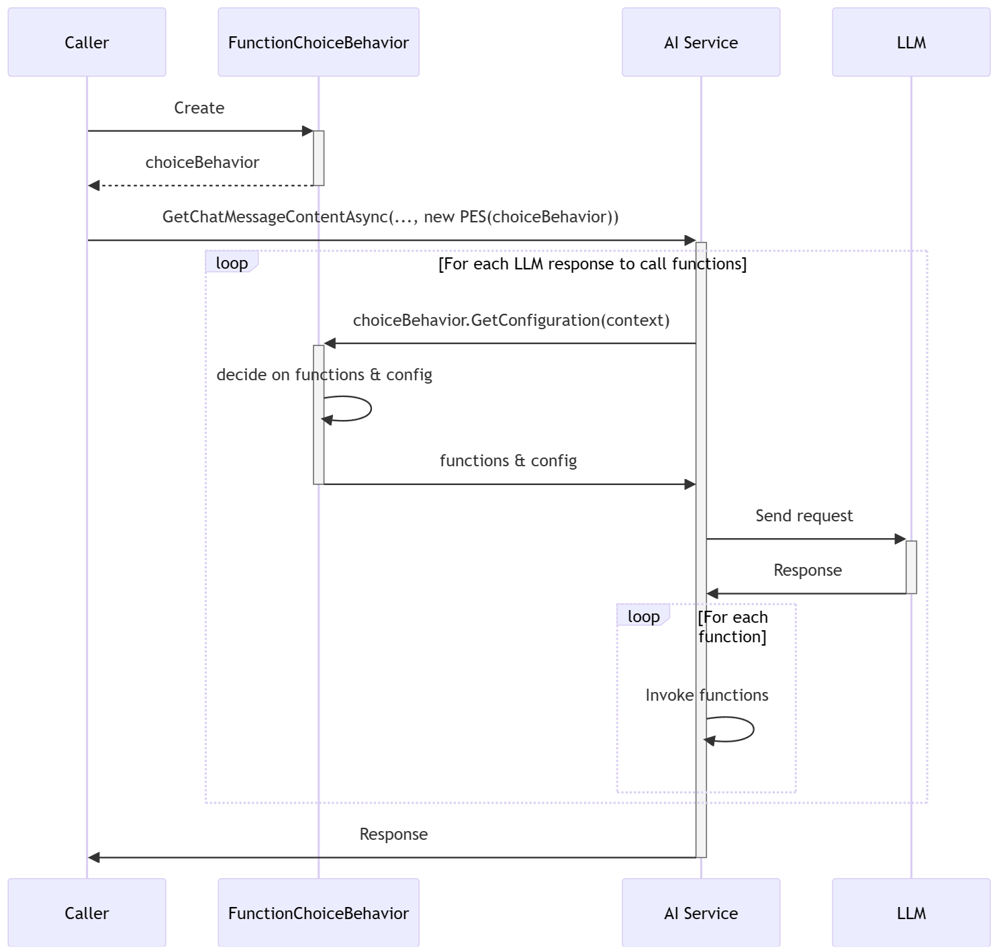

# 函数调用行为

## 上下文和问题陈述

目前，SK 中每个支持函数调用的 AI 连接器都有自己的工具调用行为模型类实现。
这些类用于配置连接器通告和调用函数的方式。
例如，行为类可以指定连接器应将哪些函数公布给 AI 模型，以及函数
应由连接器自动调用，或者连接器调用方将手动调用它们。

所有工具调用行为类在描述所需的函数调用行为方面都是相同的。
但是，这些类具有映射功能，可将函数调用行为映射到特定于连接器的模型类
这就是使函数调用类在连接器之间不可重用的原因。例如
[ToolCallBehavior 类的构造函数](https://github.com/microsoft/semantic-kernel/blob/aec65771c8c2443db2c832aed167bff566d4ab46/dotnet/src/Connectors/Connectors.OpenAI/ToolCallBehavior.cs#L172) 引用
[OpenAIFunction](https://github.com/microsoft/semantic-kernel/blob/main/dotnet/src/Connectors/Connectors.OpenAI/Core/OpenAIFunction.cs) 类，该类位于
`Microsoft.SemanticKernel.Connectors.OpenAI` 命名空间 `Connectors.OpenAI` 。
因此，这些类不能被其他连接器（如 Mistral AI 连接器）重用，而不会在项目之间引入不需要的显式项目依赖项 `Connectors.Mistral` `Connectors.OpenAI` 。  

此外，目前无法在 YAML 或 JSON 提示符中以声明方式指定函数调用行为。  

## 决策驱动因素
- 应该有一组与连接器/模型无关的函数调用行为类，使所有支持函数调用的 SK 连接器都能使用它们。  
- 函数调用行为应在基类中指定 `PromptExecutionSettings` ，而不是在其特定于连接器的派生类中指定。  
- 以当前支持的所有提示格式定义函数调用行为应该是可能且直接的，包括 YAML （Handlebars， Prompty） 和 JSON （SK config.json）。  
- 用户应该能够使用代码中定义的提示执行设置覆盖提示中指定的提示执行设置。

## 现有函数调用行为模型 - ToolCallBehavior
如今，SK 利用 `ToolCallBehavior` 抽象类及其衍生类： `KernelFunctions`、 `EnabledFunctions`和 `RequiredFunction` 来定义 OpenAI 连接器的函数调用行为。
此行为是通过属性指定的 `OpenAIPromptExecutionSettings.ToolCallBehavior` 。该模型在其他连接器之间是一致的，仅在函数调用行为类的名称上有所不同。  

```csharp
OpenAIPromptExecutionSettings settings = new() { ToolCallBehavior = ToolCallBehavior.AutoInvokeKernelFunctions };

or

GeminiPromptExecutionSettings settings = new() { ToolCallBehavior = GeminiToolCallBehavior.AutoInvokeKernelFunctions };
```

考虑到函数调用行为自 SK v1 版本以来就已经存在，并且可能会被广泛使用，因此必须引入新的函数调用抽象，以便与现有的函数调用模型共存。这种方法将防止中断性变更，并允许消费者逐渐从当前模型过渡到新模型。

## [新型号] 选项 1.1 - 每个函数选择一个类
为了满足“无中断性变更”要求和“连接器/模型不可知”设计原则，需要引入一组新的连接器不可知类。

### 函数选择类 
该 `FunctionChoiceBehavior` 类是所有 *FunctionChoiceBehavior 派生类的抽象基类。

```csharp
public abstract class FunctionChoiceBehavior
{
    public static FunctionChoiceBehavior Auto(IEnumerable<KernelFunction>? functions = null, bool autoInvoke = true, FunctionChoiceBehaviorOptions? options = null) { ... }
    public static FunctionChoiceBehavior Required(IEnumerable<KernelFunction>? functions = null, bool autoInvoke = true, FunctionChoiceBehaviorOptions? options = null) { ... }
    public static FunctionChoiceBehavior None(IEnumerable<KernelFunction>? functions = null, FunctionChoiceBehaviorOptions? options = null)

    public abstract FunctionChoiceBehaviorConfiguration GetConfiguration(FunctionChoiceBehaviorConfigurationContext context);
}
```

该类的所有衍生`FunctionChoiceBehavior`产品都必须实现 abstract `GetConfiguration` 方法。此方法使用 `FunctionChoiceBehaviorConfigurationContext` 连接器提供的 a 调用。它将一个 `FunctionChoiceBehaviorConfiguration` 对象返回给连接器，指示它们如何根据相应类定义的有关函数调用和调用的特定函数调用选择行为进行行为。 


```csharp
public class FunctionChoiceBehaviorConfigurationContext
{
    public Kernel? Kernel { get; init; }
    public ChatHistory ChatHistory { get; }
    public int RequestSequenceIndex { get; init; }
}

public class FunctionChoiceBehaviorConfiguration
{
    public FunctionChoice Choice { get; internal init; }
    public IReadOnlyList<KernelFunction>? Functions { get; internal init; }
    public bool AutoInvoke { get; set; } = true;
    public FunctionChoiceBehaviorOptions Options { get; }
}
```

该 `AutoFunctionChoiceBehavior` 类可以通告所有内核函数或指定的函数子集，这些函数可以通过其构造函数或属性进行定义 `Functions` 。此外，它还指示 AI 模型是否调用函数，如果是，则指示要调用哪些特定函数。  
```csharp
public sealed class AutoFunctionChoiceBehavior : FunctionChoiceBehavior
{
    [JsonConstructor]
    public AutoFunctionChoiceBehavior() { }
    public AutoFunctionChoiceBehavior(IEnumerable<KernelFunction>? functions, bool autoInvoke, FunctionChoiceBehaviorOptions? options) { }

    [JsonPropertyName("functions")]
    public IList<string>? Functions { get; set; }

    [JsonPropertyName("options")]
    public FunctionChoiceBehaviorOptions? Options { get; set; }

    public override FunctionChoiceBehaviorConfiguration GetConfiguration(FunctionChoiceBehaviorConfigurationContext context)
    {
        var functions = base.GetFunctions(this.Functions, context.Kernel, this._autoInvoke);

        return new FunctionChoiceBehaviorConfiguration(this.Options ?? DefaultOptions)
        {
            Choice = FunctionChoice.Auto,
            Functions = functions,
            AutoInvoke = this._autoInvoke,
        };
    }
}
```
   
与`RequiredFunctionChoiceBehavior`类一样，该类 `AutoFunctionChoiceBehavior` 可以通告所有内核函数或指定的函数子集，这可以通过其构造函数或属性进行定义 `Functions` 。但是，它的不同之处在于强制要求模型必须调用提供的函数。 
```csharp
public sealed class RequiredFunctionChoiceBehavior : FunctionChoiceBehavior
{
    [JsonConstructor]
    public RequiredFunctionChoiceBehavior() { }
    public RequiredFunctionChoiceBehavior(IEnumerable<KernelFunction>? functions, bool autoInvoke, FunctionChoiceBehaviorOptions? options) { }

    [JsonPropertyName("functions")]
    public IList<string>? Functions { get; set; }

    [JsonPropertyName("options")]
    public FunctionChoiceBehaviorOptions? Options { get; set; }

    public override FunctionChoiceBehaviorConfiguration GetConfiguration(FunctionChoiceBehaviorConfigurationContext context)
    {
        // Stop advertising functions after the first request to prevent the AI model from repeatedly calling the same function.
        // This is a temporary solution which will be removed after we have a way to dynamically control list of functions to advertise to the model.
        if (context.RequestSequenceIndex >= 1)
        {
            return new FunctionChoiceBehaviorConfiguration(this.Options ?? DefaultOptions)
            {
                Choice = FunctionChoice.Required,
                Functions = null,
                AutoInvoke = this._autoInvoke,
            };
        }

        var functions = base.GetFunctions(this.Functions, context.Kernel, this._autoInvoke);

        return new FunctionChoiceBehaviorConfiguration(this.Options ?? DefaultOptions)
        {
            Choice = FunctionChoice.Required,
            Functions = functions,
            AutoInvoke = this._autoInvoke,
        };
    }
}
```

与其他 `NoneFunctionChoiceBehavior` 行为类一样，该类可以通告所有内核函数或指定的函数子集，这可以通过其构造函数或属性进行定义 `Functions` 。此外，它还指示 AI 模型利用提供的函数，而无需调用它们来生成响应。当您想要查看模型将调用哪些函数而不实际调用它们时，此行为对于试运行可能很有用。  
```csharp
public sealed class NoneFunctionChoiceBehavior : FunctionChoiceBehavior
{
    [JsonConstructor]
    public NoneFunctionChoiceBehavior() { }
    public NoneFunctionChoiceBehavior(IEnumerable<KernelFunction>? functions, FunctionChoiceBehaviorOptions? options) { }

    [JsonPropertyName("functions")]
    public IList<string>? Functions { get; set; }

    [JsonPropertyName("options")]
    public FunctionChoiceBehaviorOptions? Options { get; set; }

    public override FunctionChoiceBehaviorConfiguration GetConfiguration(FunctionChoiceBehaviorConfigurationContext context)
    {
        var functions = base.GetFunctions(this.Functions, context.Kernel, autoInvoke: false);

        return new FunctionChoiceBehaviorConfiguration(this.Options ?? DefaultOptions)
        {
            Choice = FunctionChoice.None,
            Functions = functions,
            AutoInvoke = false,
        };
    }
}
```

为了满足 'connector/model-agnnostic' 驱动程序的要求，函数选择行为应该在与模型无关的类中配置 `PromptExecutionSettings` ，而不是像当前那样在特定于模型的提示执行设置类中配置`OpenAIPromptExecutionSettings`。

```csharp
PromptExecutionSettings settings = new() { FunctionChoiceBehavior = FunctionChoiceBehavior.Required() };
```
   
上面描述的所有函数选择行为类都包含 `Functions` type `IList<string>` 为 的属性。
函数可以指定为格式为 . `pluginName.functionName`此属性的主要用途是允许用户声明他们希望向其公布的函数列表
YAML、Markdown 或 JSON 提示中的 AI 模型。但是，它也可以用于在代码中指定函数，尽管通常通过
Function Choice 行为类的构造函数，它们接受实例列表 `KernelFunction` 。 
   
此外，函数选择行为类具有 `Options` type 为 ， `FunctionChoiceBehaviorOptions`的属性，该属性可以通过构造函数提供，也可以直接在类实例上设置。
此属性使用户能够配置函数选择行为的各个方面，例如 AI 模型是否应首选并行函数调用而不是顺序函数调用。
目的是让此类随着时间的推移而发展，并结合与大多数 AI 模型相关的属性。
如果特定 AI 模型需要其他模型不支持的独特属性，则可以创建特定于模型的衍生期权类。
该模型的 SK AI 连接器可以识别此类，从而允许它读取特定属性。

### 序列图


### 支持 Prompts 中的行为
鉴于选择行为模型类的分层性质，对于需要在 JSON 和 YAML 提示符中配置功能选择行为的情况，应启用多态反序列化。
```json
{
    ...
    "execution_settings": {
        "default": {
            "temperature": 0.4,
            "function_choice_behavior": {
                "type": "auto", //possible values - auto, required, none
                "functions": [
                    "plugin1.function1",
                    "plugin1.function2",
                ],
                "options": {
                    "allow_concurrent_invocation": true
                }
            }
        }
    }
}
```
```yaml
execution_settings:
  default:
    temperature: 0.4
    function_choice_behavior:
      type: auto
      functions:
      - plugin1.function1
      - plugin1.function2
      options:
        allow_concurrent_invocation: true
```
System.Text.Json.JsonSerializer 支持多态反序列化，并且需要提前注册将用于多态反序列化的所有类型，然后才能使用它们。
这可以通过使用 JsonDerivedType 属性注释基类以指定基类型的子类型来完成，也可以通过在 TypeInfoResolver 中注册子类型来完成。
需要通过 JsonSerializerOptions 提供，以便在反序列化期间使用。
更多详细信息可在此处找到： [序列化多态类型](https://learn.microsoft.com/en-us/dotnet/standard/serialization/system-text-json/polymorphism?pivots=dotnet-8-0)。

要支持自定义函数选择行为，应为多态反序列化注册自定义类型。
显然，使用 JsonDerivedType 属性的方法不可行，因为用户无法注释 `FunctionChoiceBehavior` SK 类。
但是，如果他们有权访问 JsonSerializer 在反序列化期间使用的 JsonSerializerOptions，他们可以注册其自定义类型解析器，该解析器将注册其自定义类型。
不幸的是，SK 今天没有公开这些选项。即使有，也有由 YamlDotNet 库反序列化的 YAML 提示，这些提示需要通过 YAML 特定的反序列化程序扩展机制 - YamlTypeConverter 提供的相同自定义类型。
这意味着，如果用户希望在 YAML 和 JSON 提示符中使用相同的自定义函数调用选项，他们将必须注册相同的自定义类型两次 - 对于 JSON
通过自定义类型解析器，对于 YAML 通过自定义 YamlTypeConverter。这还需要一种机制，为所有 SK 扩展方法提供自定义解析器/转换器 `CreateFunctionFrom*Prompt` 。


多态反序列化受支持 `System.Text.Json.JsonSerializer` ，并要求提前注册用于多态反序列化的所有类型。
这可以通过使用属性注释基类 `JsonDerivedType` 以指定基类型的子类型，或者通过使用  ，`TypeInfoResolver`
必须通过 提供 `JsonSerializerOptions` ，以便在反序列化期间使用。
更多详细信息可在此处找到：[序列化多态类型](https://learn.microsoft.com/en-us/dotnet/standard/serialization/system-text-json/polymorphism?pivots=dotnet-8-0)。 

### 函数选择行为节点的位置
SK 提示可能包含一个或多个条目，每个条目对应一个服务，这些条目指定执行设置以描述提示中特定于服务的配置。
由于每个部分都被反序列化为类的一个实例 `PromptExecutionSettings` ，该实例由相应的服务使用，
在每个 Service Configuration 部分中定义函数行为是合乎逻辑的。
但是，此方法可能会导致不必要的重复，因为所有服务可能需要相同的选择行为。
此外，在某些情况下，三个服务中的两个共享相同的选择行为配置，而其余服务使用不同的服务。

```json
"function_choice_behavior":{
    ...
},
"execution_settings": {
   "default": {
     "temperature": 0,
     "function_choice_behavior":{
        ...
     }
   },
   "gpt-3.5-turbo": {
     "model_id": "gpt-3.5-turbo-0613",
     "temperature": 0.1,
     "function_choice_behavior":{
        ...
     }
   },
   "gpt-4": {
     "model_id": "gpt-4-1106-preview",
     "temperature": 0.3,
     "function_choice_behavior":{
        ...
     }
   }
 }
```
为了解决上述情况，建议实现一种继承机制，该机制允许服务继承父函数 choice 行为配置（如果指定）。
无论父级是否定义了函数选择行为配置，都应该可以在每个服务入口级别指定或覆盖父级的配置。

### 破碎玻璃支架
上述选择类列表可能不足以涵盖用户可能遇到的所有方案。
为了解决这个问题， `FunctionCallChoice.Configure` 该方法接受内部使用的模型连接器实例，使用户能够从自定义函数调用选项的配置方法中访问和修改它。
```csharp
// Custom function call choice
public sealed class NewCustomFunctionChoiceBehavior : FunctionChoiceBehavior
{
    public override FunctionChoiceBehaviorConfiguration GetConfiguration(FunctionChoiceBehaviorContext context)
    {
        var model = context.Model;

        // The CompletionsOptions, ChatCompletionsToolChoice, etc are data model classes used by the OpenAIChatCompletionService connector internally.
        ((CompletionsOptions)model).ToolChoice = new ChatCompletionsToolChoice(new FunctionDefinition("NEW-TOOL-CHOICE-MODE"));
        ((CompletionsOptions)model).Tools.Add(new ChatCompletionsFunctionToolDefinition(<functions-to-advertise>);
 
        return new FunctionChoiceBehaviorConfiguration()
        {
            Model = model; // Return the model back to the calling connector to indicate that we control the function call choice ourselves, and there is no need to apply the mapping logic connector side that would be applied otherwise.
            MaximumAutoInvokeAttempts = this.MaximumAutoInvokeAttempts,
            MaximumUseAttempts = this.MaximumUseAttempts,
            AllowAnyRequestedKernelFunction = false
        };
    }
}
...

// Registering the custom choice
PromptExecutionSettings settings = new() { FunctionChoiceBehavior = new NewCustomFunctionChoiceBehavior() };
```

## [新型号] 选项 1.2 - 备选设计
探索在后反序列化阶段在可以访问内核实例的位置解析特定类型的可能性，从而消除对多态反序列化的需求。
此方法将启用用户在内核服务集合中注册的自定义函数选择行为类的解析。用户可以注册他们的自定义类，然后在提示渲染期间或需要信息时自动选择这些类，而不管提示格式是 JSON 还是 YAML。  

## 2. 函数调用选择和函数调用配置的分离
新模型应适应以下情况：一个人设计提示，而另一个人执行或调用提示。
实现此目的的一种方法是将函数选择行为配置（如 auto、enabled 和 none）与函数调用配置（包括 AllowParallelCalls 等设置）分开。
函数选择行为配置仍可通过 PromptExecutionSettings 提供，但需要确定提供函数调用配置的适当位置。
此外，应该可以直接从代码覆盖函数选择行为。以下是通过代码提供函数调用配置的潜在位置的几个选项：

### 选项 2.1 - 调用配置作为 `IChatCompletionService.GetChatMessageContentsAsync` 方法及其流式对应项的参数。
优点：  
- 可以为每个作指定函数调用配置，而不是局限于整个 AI 服务配置。
   
缺点：  
- 向接口方法引入新参数将产生重大变化，这些变化将影响接口的所有非 SK 自定义实现。
- 这种方法与当前的开发体验不同，后者允许通过特定于连接器的提示执行设置来提供这两种配置。

### 选项2.2 — 调用配置作为接口的每个实现的构造函数参数 `IChatCompletionService` 。
优点：  
- 无需更改接口方法签名，这意味着不会破坏任何非 SK 自定义实现。
   
缺点：  
- 函数调用配置将在服务注册阶段应用于服务级别。如果某些作需要不同的配置，则需要注册具有不同配置的新服务。
- 这种方法与当前的开发体验不同，在当前的开发体验中，这两种配置都是通过特定于连接器的提示执行设置提供的。

### 选项 2.3 — 作为属性的调用配置 `Kernel.FunctionInvocationConfig` 。
优点：
- 无重大更改： `IChatCompletionService` 成员及其实现构造函数的签名保持不变。

缺点：
- 每次需要不同的配置时，必须创建新内核，或者必须克隆现有内核。
- 内核将包含更多特定于 AI 连接器的逻辑。
- 这种方法与当前的开发体验不同，在当前的开发体验中，这两种配置都是通过特定于连接器的提示执行设置提供的。

### 选项 2.4 - 将调用配置作为集合中的项 `Kernel.Data` 。
优点：  
- 无重大更改： `IChatCompletionService` 成员及其实现构造函数的签名保持不变。
- 没有将特定于 AI 连接器的 logic 添加到内核中。
   
缺点：  
- 需要一个编译器不强制执行的 magic 常量。
- 每次需要不同的配置时，都必须创建一个新内核，或者必须克隆一个现有内核。
- 这种方法与当前的开发体验不同，在当前的开发体验中，这两种配置都是通过特定于连接器的提示执行设置提供的。

### 选项 2.5 - `PromptExecutionSettings.FunctionChoiceBehavior` 函数调用选择配置和调用配置的属性
优点：
- 这种方法在选项 #1.1 中提出，其中两种配置都是通过与连接器无关的提示执行设置提供的。
- 无重大更改： `IChatCompletionService` 成员及其实现构造函数的签名保持不变。

缺点：
- 必须在内核中实现并注册新的服务选择器，以将通过提示提供的执行设置与开发人员在调用步骤中提供的执行设置合并

## 决策结果
在 ADR 审查期间做出了一些决定：
- 选项 1.1 被选为新函数调用行为模型的首选选项。
- 决定推迟允许服务继承父函数 choice 行为配置的继承机制的实现。
- 已决定 Breaking Glass 支持目前不在范围之内，但如有必要，稍后可能会将其包括在内。
- 选项 2.5 假定通过提示执行设置提供函数调用选项和函数调用配置，由于其简单性、没有中断性变更和熟悉的开发人员体验，因此比其他选项更受欢迎。
